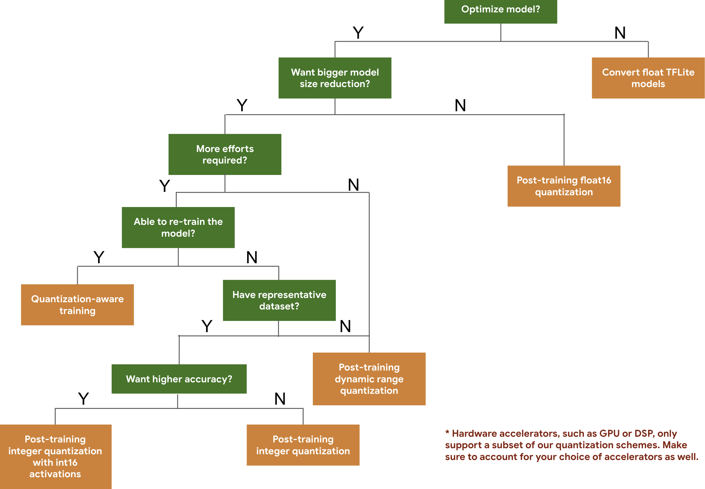

# TensorFlow Model Quantization

量化是 TensorFlow 中的一個強大功能，可以在減少模型大小和提高推理速度的同時，將精度損失降到最低。

## Why models should be optimized

量化是將浮點數 (如 FP32) 表示的權重和激活函數轉換為更低精度的數據類型 (如 INT8) 的過程。這可以：

- 減少模型大小
- 降低內存和計算需求
- 加速推理速度，尤其在資源受限的設備上（如手機和嵌入式設備）。

---

## Optimization Methods

TensorFlow Lite 提供了多種後訓練量化技術，您可以根據需求選擇適合的技術來優化模型大小與性能。以下是各種量化技術的摘要表：

| **Technique**                  | **Benefits**                                    | **Supported Hardware**          |
| ------------------------------ | ----------------------------------------------- | ------------------------------- |
| **Dynamic Range Quantization** | - 4x smaller model size <br> - 2x-3x speedup    | CPU                             |
| **Full Integer Quantization**  | - 4x smaller model size <br> - 3x+ speedup      | CPU, Edge TPU, Microcontrollers |
| **Float16 Quantization**       | - 2x smaller model size <br> - GPU acceleration | CPU, GPU                        |

### decision tree



## 實作教學

### 1. 準備模型

先準備好 TensorFlow 模型（例如 `.h5` 或 `SavedModel` 格式）。

```python
import tensorflow as tf

# 加載模型
model = tf.keras.applications.MobileNetV2(weights="imagenet", input_shape=(224, 224, 3))
model.save("mobilenet_v2_saved_model")
```

---

### 2. dynamic range quantization

適合對性能和準確性要求不高的應用。

```python
import tensorflow as tf

# 加載 SavedModel
converter = tf.lite.TFLiteConverter.from_saved_model("mobilenet_v2_saved_model")

# 啟用動態範圍量化
converter.optimizations = [tf.lite.Optimize.DEFAULT]
tflite_model = converter.convert()

# 保存量化後的模型
with open("mobilenet_v2_dynamic_range.tflite", "wb") as f:
    f.write(tflite_model)
```

---

### 3. integer quantization

需要提供校準數據集，讓量化過程計算激活函數的範圍。

```python
def representative_dataset():
    for _ in range(100):
        # 提供校準數據（例如 224x224 的隨機數據）
        yield [tf.random.uniform([1, 224, 224, 3], 0, 255)]

converter = tf.lite.TFLiteConverter.from_saved_model("mobilenet_v2_saved_model")
converter.optimizations = [tf.lite.Optimize.DEFAULT]
converter.representative_dataset = representative_dataset
converter.target_spec.supported_ops = [tf.lite.OpsSet.TFLITE_BUILTINS_INT8]

# 全整數量化(optional) -> 將輸入和輸出設為 int8
# converter.inference_input_type = tf.int8
# converter.inference_output_type = tf.int8

tflite_model = converter.convert()

with open("mobilenet_v2_integer_quant.tflite", "wb") as f:
    f.write(tflite_model)
```

---

### 4. float16 quantization

```python
import tensorflow as tf

# 加載模型
# 這裡假設您已經有一個 SavedModel 格式的模型
converter = tf.lite.TFLiteConverter.from_saved_model("mobilenet_v2_saved_model")

# 啟用 FP16 優化
converter.optimizations = [tf.lite.Optimize.DEFAULT]

# 設置目標類型為 FP16
converter.target_spec.supported_types = [tf.float16]

# 轉換模型
tflite_fp16_model = converter.convert()

# 保存 FP16 量化模型
with open("mobilenet_v2_fp16.tflite", "wb") as f:
    f.write(tflite_fp16_model)

```

---

### 5. 測試量化後的模型

使用 TensorFlow Lite 進行推理。

```python
import numpy as np
import tensorflow as tf

# 加載量化模型
interpreter = tf.lite.Interpreter(model_path="mobilenet_v2_full_integer_quant.tflite")
interpreter.allocate_tensors()

# 獲取輸入和輸出的細節
input_details = interpreter.get_input_details()
output_details = interpreter.get_output_details()

# 構建測試數據
input_data = np.random.randint(0, 255, size=(1, 224, 224, 3), dtype=np.uint8)

# 設定輸入
interpreter.set_tensor(input_details[0]['index'], input_data)

# 推理
interpreter.invoke()

# 獲取輸出
output_data = interpreter.get_tensor(output_details[0]['index'])
print("模型輸出：", output_data)
```

---

## 常見問題

1. **如何選擇量化方式？**

   - 資源有限的設備上：使用全整數量化。
   - 精度敏感的應用：嘗試動態範圍量化或整數量化。

2. **代表數據集需要多少數據？**
   通常數百條數據即可，這些數據不需要標籤。

3. **如何檢查模型是否被成功量化？**
   使用 TensorFlow Lite 的工具檢查模型的權重格式。

---

## Reference

- [google ai 模型最佳化](https://ai.google.dev/edge/litert/models/model_optimization?hl=zh-tw)
- [tensorflow 量化(未驗證)](https://blog.csdn.net/QFire/article/details/111302317)
- [tensorflow 量化(未驗證)](https://blog.csdn.net/huachao1001/article/details/103164836)