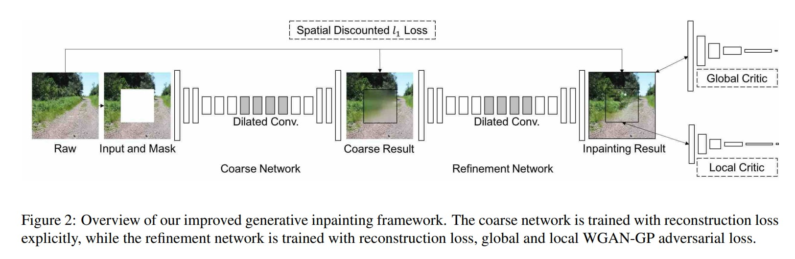

# Generative Image Inpainting

這篇關於 AI 影像處理的論文主要探討了影像修復（image inpainting）技術，並提出了一種基於生成對抗網絡（GAN）的新型影像修復框架。以下是論文的詳細內容：

## 1. 引言

影像修復是指在圖像中填補缺失或損壞部分的技術，應用廣泛，包括圖像編輯、超分辨率、圖片渲染等。現有的方法雖然能夠產生可接受的結果，但在處理複雜場景或高分辨率圖像時仍存在挑戰。

## 2. 相關工作

論文回顧了影像修復領域的相關研究，包括基於傳統方法的影像修復技術和基於深度學習的方法。特別是生成對抗網絡（GAN）在影像生成和修復中的應用，並介紹了 Wasserstein GAN（WGAN）和改進的 WGAN-GP 的優勢。

## 3. 方法

提出了一種新的影像修復框架，包含兩個主要部分：基線模型和具有上下文注意力模塊的完整模型。

### 3.1 基線模型

基線模型基於兩階段的方法，首先進行粗略修復，然後進行細緻修復。這種方法能夠生成與現有最先進技術相當的結果。

### 3.2 上下文注意力模塊

上下文注意力模塊是論文的核心創新點，通過學習特徵表示來顯式匹配並關注相關的背景區域。這種方法顯著提高了影像修復的效果，生成的圖像更加真實，且具有更少的伪影。

## 4. 實驗

論文在多個數據集上進行了實驗，包括 Places2、CelebA、CelebA-HQ、DTD 和 ImageNet 數據集。

### 4.1 定性比較

實驗結果顯示，提出的基線模型在沒有後處理的情況下，已經能夠生成與現有最先進技術相當的結果。而完整模型在上下文注意力的幫助下，生成的圖像更具真實感，且伪影更少。

### 4.2 定量比較

影像生成任務缺乏良好的定量評估指標，論文通過視覺效果和注意力圖的可視化來展示模型的優越性。

## 5. 結論

論文提出了一種由粗到細的生成影像修復框架，並引入了一種新穎的上下文注意力模塊。實驗結果表明，這種方法能顯著改善影像修復效果。未來的工作計劃包括將該方法擴展到超高分辨率影像修復應用中。

## 具體技術細節

### 網路架構

論文中的 Figure 2 展示了這個生成影像修復框架的概覽，具體如下：

- **粗略網路**：使用重建損失進行訓練。
- **細緻網路**：使用重建損失和全局、局部 WGAN-GP 對抗損失進行訓練。

這種由粗到細的網路架構，結合上下文注意力模塊，有效地提升了影像修復的效果，能夠生成更加真實且一致的修復圖像。

#### 1. 粗略預測網路（Coarse Network）

- **輸入**：包含白色填充洞的圖像和二進制遮罩（binary mask），用於指示洞的位置。
- **輸出**：初步的粗略修復圖像。
- **訓練目標**：主要使用重建損失（reconstruction loss）進行訓練。

#### 2. 細緻修復網路（Refinement Network）

- **輸入**：粗略預測網路的輸出（初步修復圖像）和原始輸入圖像。
- **輸出**：最終的修復圖像。
- **訓練目標**：使用重建損失（reconstruction loss）、全局和局部的 WGAN-GP 對抗損失（global and local WGAN-GP adversarial loss）進行訓練。

#### 3. 網路細節

- **鏡像填充**：所有卷積層使用鏡像填充（mirror padding）。
- **激活函數**：使用指數線性單元（ELUs）作為激活函數，而不是 ReLU。
- **輸出剪裁**：輸出過濾值使用剪裁（clip）而不是`tanh`或`sigmoid`函數。
- **WGAN-GP 損失**：在細緻修復網路的全局和局部輸出上使用 WGAN-GP 損失，以強化全局和局部的一致性。

#### 4. 上下文注意力模塊（Contextual Attention Module）

- **雙編碼器結構**：引入兩個平行的編碼器，一個專注於逐層（擴張）卷積來生成內容，另一個專注於關注背景特徵。
- **特徵聚合**：來自兩個編碼器的輸出特徵進行聚合，並輸入到單個解碼器中以獲得最終輸出。
- **注意力可視化**：使用顏色來表示每個前景像素最感興趣的背景區域的位置。

#### 5. 訓練過程

1. **輸入圖像與遮罩生成**：從原始圖像中隨機選取一個區域作為遮罩，生成損壞圖像。
2. **生成網絡預測**：使用生成網絡對損壞圖像進行修復，輸出與輸入圖像相同大小的修復圖像。
3. **損失計算與更新**：計算損失函數並更新生成網絡和判別網絡。

## Reference

- [Paper - Generative Image Inpainting with Contextual Attention](https://openaccess.thecvf.com/content_cvpr_2018/papers/Yu_Generative_Image_Inpainting_CVPR_2018_paper.pdf)
- [Paper - Free-Form Image Inpainting with Gated Convolution](https://openaccess.thecvf.com/content_ICCV_2019/papers/Yu_Free-Form_Image_Inpainting_With_Gated_Convolution_ICCV_2019_paper.pdf)
- [github](https://github.com/JiahuiYu/generative_inpainting)
- [youtube demo](https://www.youtube.com/watch?v=xz1ZvcdhgQ0&ab_channel=JiahuiYu)
- [Gated Convolution 圖像修復任務 - Free-Form Image Inpainting with Gated Convolution](https://xiaosean5408.medium.com/gated-convolution-%E5%9C%96%E5%83%8F%E4%BF%AE%E5%BE%A9%E4%BB%BB%E5%8B%99-deepfillv2-free-form-image-inpainting-with-gated-convolution-b84a44a3cf5b)
- [github - Ayaa17/DeepFillv2_Pytorch (unofficial ver.)](https://github.com/Ayaa17/DeepFillv2_Pytorch)
- [github - vrindaprabhu/deepfillv2_colab (unofficial ver.)](https://github.com/vrindaprabhu/deepfillv2_colab)
- [github - zhaoyuzhi/deepfillv2 (unofficial ver.)](https://github.com/zhaoyuzhi/deepfillv2)
- [DeepFillv2 一个用于生成图像修复任务的开源框架](https://blog.csdn.net/hahabeibei123456789/article/details/104597174)
