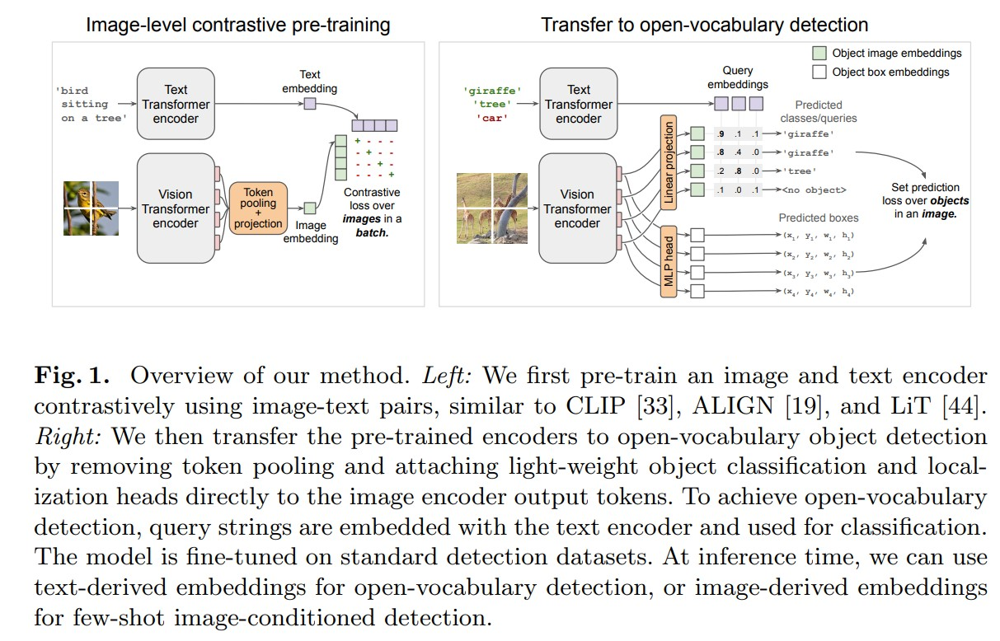
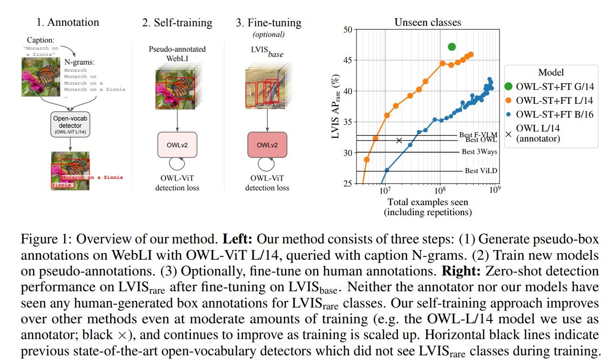

# OWLv2

OWLv2 擴展了先前的 OWLVit 模型，利用自我訓練的方法，通過使用現有的檢測器在圖像-文本對上生成偽框標註，從而擴大檢測數據的規模。這使其在零樣本物體檢測任務中達到了更高的性能。

## 論文摘要

### [論文連結](https://arxiv.org/pdf/2306.09683)

該論文中提到，開放詞彙物體檢測受益於預訓練的視覺-語言模型，但仍受到可用檢測訓練數據量的限制。研究者們提出了 OWLv2 模型及其自我訓練方法，解決了標籤空間的選擇、偽標註過濾和訓練效率等挑戰。

### 模型架構

OWLv2 模型基於 OWLv1（Open World Learning v1）進行擴展，主要使用了視覺-文本預訓練模型（如 CLIP）作為其多模態骨幹，並採用 ViT（Vision Transformer）架構來提取視覺特徵。

視覺部分 ：使用 ViT 來處理圖像數據，通過將圖像切割成小塊（patches）並進行嵌入來提取特徵。
文本部分 ：使用 CLIP 模型來處理文本輸入，通過文本嵌入來獲取語言特徵。
物體檢測頭 ：在模型的最後，增加了一個物體性分類器，用於預測每個預測框中是否包含物體，這使得模型能夠更好地區分背景和物體。

### 訓練方法

OWLv2 使用自我訓練（self-training）方法來擴展訓練數據集。這一過程包括以下步驟：

使用已有的檢測器來生成圖像-文本對的偽框標註。
將這些偽標註用作新的訓練數據，從而增加可用的訓練樣本數量。
通過這種方式，OWLv2 可以從 Web 上獲取的圖像-文本對中學習，從而擴展其檢測能力。

### 性能

OWLv2 在多個基準測試中表現出色，特別是在零樣本物體檢測任務上。具體的性能數據如下：

在 LVIS 數據集的稀有類別上，AP（平均精度）從 31.2%提升到 44.6%，顯示出 43%的相對提升。
OWLv2 能夠在超過 1B 的樣本上進行訓練，這使得其在開放世界定位任務中的性能得到了顯著提升。

- **優勢**: OWLv2在zero-shot目標檢測方面表現出色，顯著減少了人工標註的需求。模型的自我訓練能力使其能夠擴展到網路規模的資料集，進一步增強了其實用性和應用潛力。

- **限制**: 儘管OWLv2代表了顯著的進步，但對大規模資料集的依賴以及其transformers架構的複雜性可能會在運算資源和客製化最佳化方面帶來挑戰。

## 主要特點

- 自我訓練 ：使用自我訓練擴展檢測數據，並在超過 10M 示例的訓練規模下超越了之前的狀態。
- 開放詞彙檢測 ：能夠處理未見過的類別，並進行零樣本物體檢測。

## 具體包括以下三種應用

1. 檢測目標影像中`可能存在的目標`。
1. 利用`查詢文字`在目標影像上進行目標偵測（文字引導偵測）。
1. 利用`查詢影像`在目標影像上進行目標偵測（影像引導偵測）。

## 使用方法

OWLv2 模型可以通過 Hugging Face 的 Transformers 庫輕鬆使用。可參考以下連結:

### [sample code](https://github.com/Ayaa17/owl2-object-dection)

## Reference

- [OWLv2 - Scaling Open-Vocabulary Object Detection](https://arxiv.org/pdf/2306.09683)
- [OWLVit](https://arxiv.org/pdf/2205.06230)
- [transformers - OWLv2](https://huggingface.co/docs/transformers/main/en/model_doc/owlv2)
- [huggingface model - owlv2](https://huggingface.co/google/owlv2-base-patch16-ensemble)
- [github - owl-vit](https://github.com/google-research/scenic/tree/main/scenic/projects/owl_vit)