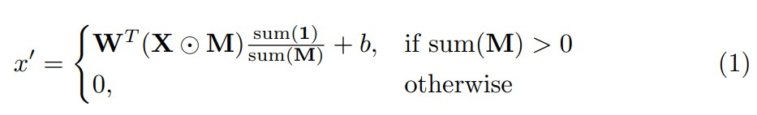
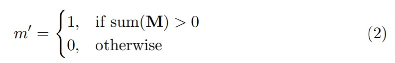
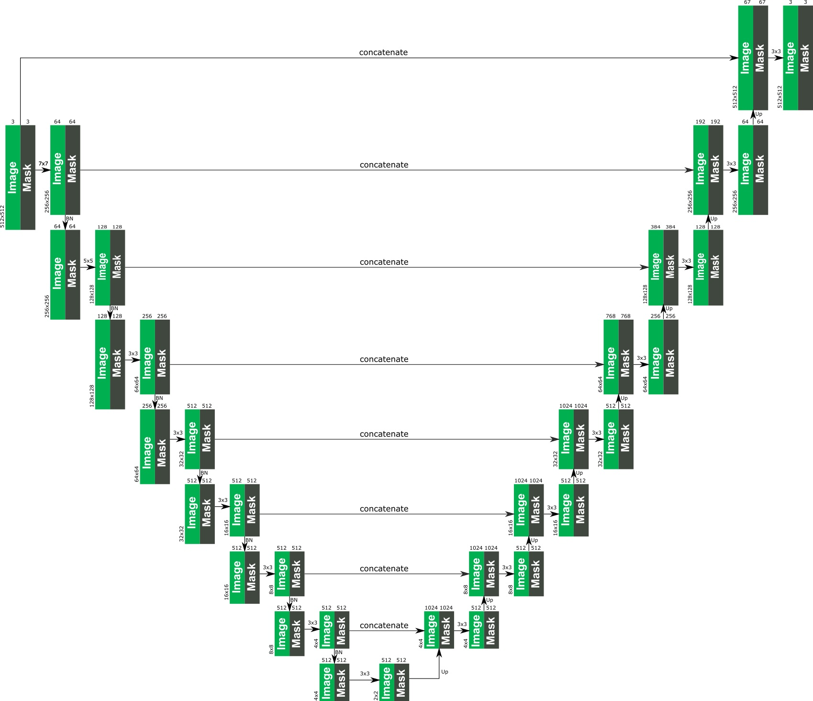

# Image Inpainting for Irregular Holes Using Partial Convolutions

ECCV 2018 paper, Nvidia 團隊提出

## 摘要

本文提出了一種基於`Partial Convolutions`的新型影像修復方法，專門用於處理影像中非規則形狀的空洞。與先前的使用標準卷積的方法相比，部分卷積能夠有效避免顏色不一致和模糊等常見偽影問題。關鍵貢獻如下：

- **Partial Convolutions** 圖層僅在有效像素上操作。
- 自動遮罩更新機制，逐層減少遮罩區域。
- 對非規則遮罩的修復效果超越了現有方法，且無需後處理。

## 介紹

影像修復旨在填補影像中缺少的部分，廣泛應用於影像編輯、物件移除等任務。傳統方法依賴影像統計資訊（如**PatchMatch**演算法），而基於深度學習的方法則使用卷積濾波器來處理，通常會導致修復區域存在固定值依賴，產生紋理缺失、顏色對比強烈或邊緣偽影等問題。現有方法大多僅適用於中心位置的矩形掩碼，且往往需要昂貴的後處理步驟來消除這些偽影。

本文提出的模型使用**部分卷積層**和遮罩更新機制，能夠獨立於空洞初始化值，產生與影像其餘部分平滑結合的語意合理預測結果，且無需額外的後處理。

## 相關工作

1. **非學習型方法**：傳統的影像修復方法透過擴散鄰近像素的顏色和紋理資訊來填滿空洞，但通常只能處理較窄的孔洞區域。
2. **基於深度學習的方法**：現有的深度學習方法通常使用影像的固定值初始化空洞，經過卷積網路處理後往往需要後處理來減少偽影，但仍無法有效解決非規則掩碼的修復問題。
3. **部分卷積的優點**：部分卷積層使用遮罩操作，確保卷積只在有效像素上進行。遮罩會隨著網路層的增加而逐漸減少，最終消失，使得模型能夠對任意形狀的空洞進行修復。

## 方法

### Partial Convolutions Layer

**Partial Convolutions**是本文的核心，定義為在每個位置僅對未被遮罩覆蓋的像素進行卷積操作。具體步驟如下：

1. **卷積操作**：只對未被掩蓋的像素進行卷積計算，其他位置值為 0。
2. **遮罩更新**：每層卷積後，遮罩會自動更新，對於被填滿的有效像素，遮罩值會變成 1。

公式如下：

- 卷積操作：
  
  其中，$X$ 為卷積輸入，$M$ 為二值掩碼，$W$ 為卷積核權重，$b$ 為偏壓。

- 遮罩更新：
  

### 網路結構

網路採用類似**U-Net**的結構，所有捲積層均替換為部分卷積層，並在解碼階段使用最近鄰插值進行上取樣。跳躍連接傳遞特徵圖和掩碼，確保修復過程中遮罩的正確更新。

### 損失函數

為最佳化模型，本文使用了多種損失函數，包括：

- **L1 損失**：計算輸出影像與真實影像在空洞區域和非空洞區域的差異。
- **感知損失**：透過 VGG-16 預訓練模型擷取特徵，並計算輸出與真實影像在高層特徵空間中的差異。
- **風格損失**：計算特徵圖的 Gram 矩陣差異，確保風格一致性。
- **總變差損失**：用於減少修復區域的噪聲，確保平滑過渡。

## 實驗

本文進行了大量實驗，驗證了模型在**ImageNet**、**Places2**和**CelebA-HQ**等資料集上的表現。

### 資料集

為處理非規則形狀的空洞，本文建構了一個包含超過 5 萬張非規則遮罩的訓練資料集，並產生了 6 個不同的孔洞面積比例類別的資料進行測試。

### 結果對比

與**PatchMatch**、Iizuka 等人提出的**GL**方法、Yu 等人的**Generative Inpainting**方法進行了對比。結果顯示，部分卷積模型在定量和定性上都優於這些方法，尤其在處理非規則空洞時。

## 討論與擴展

本文提出了使用部分卷積和遮罩更新機制來處理影像修復任務，尤其是對於不規則形狀的空洞具有強大的適應能力。儘管如此，在一些結構稀疏的圖像（如門上的欄桿）上，模型仍然存在一定的限制。

## Reference

- [Paper](https://openaccess.thecvf.com/content_ECCV_2018/papers/Guilin_Liu_Image_Inpainting_for_ECCV_2018_paper.pdf)
- [nvidia - New AI Imaging Technique Reconstructs Photos with Realistic Results](https://developer.nvidia.com/blog/new-ai-imaging-technique-reconstructs-photos-with-realistic-results/?ncid=nv-twi-37107/)
- [MathiasGruber/PConv-Keras (Unofficial)](https://github.com/MathiasGruber/PConv-Keras)
- [Partial Convolution 圖像修復任務 PConv 簡介 - Image Inpainting for Irregular Holes Using Partial Convolutions](https://xiaosean.github.io/deep%20learning/computer%20vision/2018-09-17-Partial-Conv-Inpainting/)
- [Partial Convolution 圖像修復任務 PConv 簡介 — Image Inpainting for Irregular Holes Using Partial Convolutions](https://xiaosean5408.medium.com/partial-convolution-%E5%9C%96%E5%83%8F%E4%BF%AE%E5%BE%A9%E4%BB%BB%E5%8B%99pconv%E7%B0%A1%E4%BB%8B-image-inpainting-for-irregular-holes-using-partial-convolutions-81e6259b8e5f)
- [【论文阅读笔记】Image Inpainting for Irregular Holes Using Partial Convolutions](https://blog.csdn.net/qq_19784349/article/details/119893351)