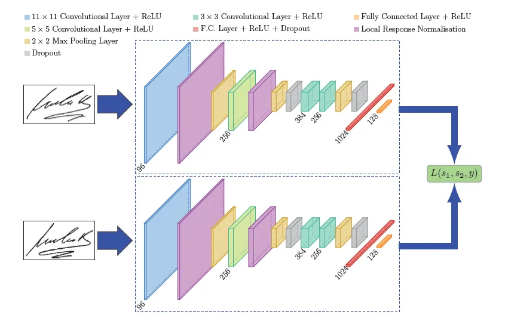

# Siamese Network

Siamese Network（暹邏網絡）是一種深度學習架構，主要用於比較兩個輸入的相似性。這種網絡的設計使得它能夠有效地學習相似性度量，常見於圖像檢索、面部識別、文本相似性等應用。

## 模型架構

**基本結構**：

   - **雙分支網絡**：Siamese Network 由兩個相同的神經網絡組成，通常是 CNN 或 RNN。這兩個子網絡接收不同的輸入（例如，兩張圖像或兩段文本）並生成各自的特徵向量。
   - **特徵提取**：每個子網絡的輸出是高維的特徵向量，這些向量捕捉了輸入數據的關鍵特徵。

## 使用情境

1. **面部識別**：

   - 在安全系統中，Siamese Network 可以用於比較實時捕捉的面部圖像與數據庫中的圖像，判斷身份。

2. **圖像檢索**：

   - 在電子商務平台中，用戶上傳的圖像可以與產品庫中的圖像進行比較，以找到相似產品。

3. **文本相似性**：

   - 在自然語言處理中，Siamese Network 可以用來評估兩段文本或詞彙的相似性，幫助進行語義分析、問答系統或推薦系統。

4. **生物信息學**：

   - 比較 DNA 序列或蛋白質結構，以找到相似的基因或蛋白質。

5. **手寫辨識**：

   - Siamese Network 可用於手寫字元的辨識，特別是在一樣本學習（one-shot learning）情境下。透過比較新手寫字元與已知字元的相似性，網絡能夠判斷它們是否為同一字元。

6. **人臉辨識**：

   - 在面部識別中，Siamese Network 可以比較兩張面部圖像的相似性，從而判斷是否為同一個人。這種方法在安全系統和社交媒體中廣泛應用。

7. **瑕疵檢測**：

   - 在工業檢測中，Siamese Network 可以用來比較正常產品與檢測到的產品，識別出瑕疵或異常。這對於質量控制非常重要。

8. **物件追蹤**：
   - 雖然 Siamese Network 本身不直接用於物件追蹤，但它可以用於相似性度量，幫助在視頻中確定物體是否為同一個物體，進而支持物件追蹤任務。

## 優缺點

**優點**：

- **高效性**：能夠在有限的標記數據上進行有效學習，特別適合一樣本學習（one-shot learning）。
- **靈活性**：可以擴展到多種數據類型，並且能夠通過調整距離度量來適應不同的任務。

**缺點**：

- **訓練數據需求**：需要大量的相似和不相似樣本，數據準備過程可能耗時。
- **計算成本**：在推斷時，對每對輸入都要計算特徵向量，可能導致效率低下。

## 論文

1. **Koch, G., Zemel, R. S., & Salakhutdinov, R. (2015).** "Siamese Neural Networks for One-shot Image Recognition." 這篇論文提出了 Siamese Network 的基本概念，並展示了其在單樣本圖像識別中的應用。
2. **Chopra, S., Hadsell, R., & LeCun, Y. (2005).** "Learning a Similarity Metric Discriminatively, with Application to Face Verification." 這篇論文進一步探討了相似性度量的學習，並提出了對比損失函數。

## Reference
- [【深度學習】另一個簡單而神奇的結構：孿生神經網路](https://jason-chen-1992.weebly.com/home/siamese-network)
- [One Shot Learning and Siamese Networks in Keras](https://sorenbouma.github.io/blog/oneshot/)
- [nevoit/Siamese-Neural-Networks-for-One-shot-Image-Recognition](https://github.com/nevoit/Siamese-Neural-Networks-for-One-shot-Image-Recognition)
- [tensorfreitas/Siamese-Networks-for-One-Shot-Learning](https://github.com/tensorfreitas/Siamese-Networks-for-One-Shot-Learning)
- [sohaib023/siamese-pytorch](https://github.com/sohaib023/siamese-pytorch)
- [A friendly introduction to Siamese Networks](https://towardsdatascience.com/a-friendly-introduction-to-siamese-networks-85ab17522942)