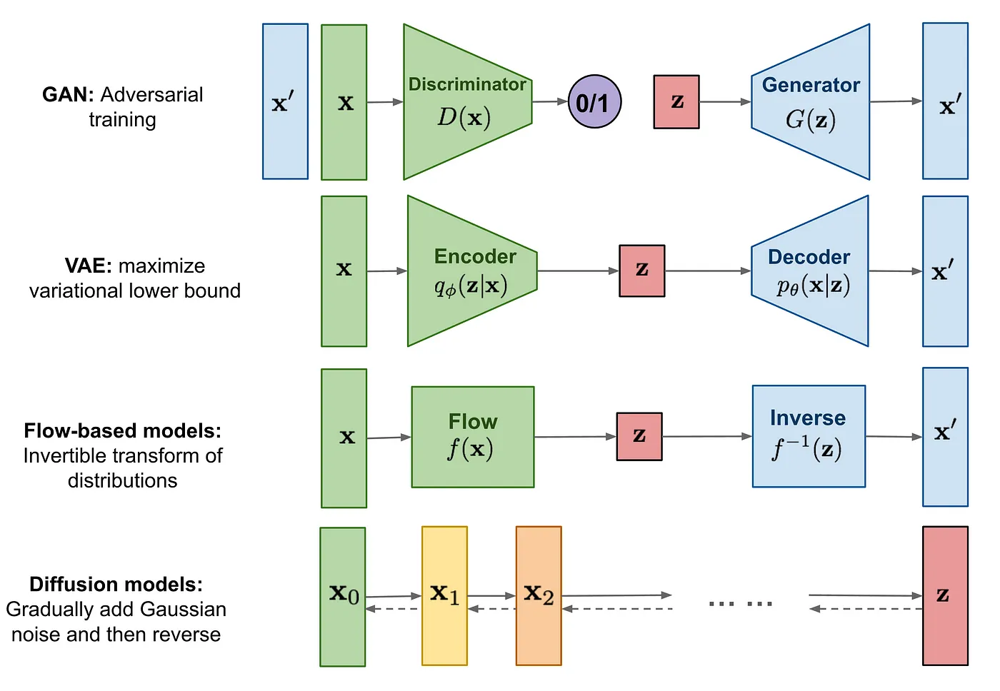
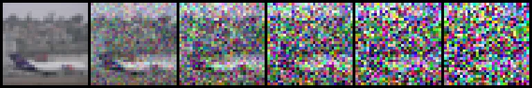

# 擴散模型（Diffusion Models）完整介紹

## **簡介**

擴散模型（Diffusion Models）是一種基於概率的生成模型，其主要思想是通過模擬數據逐漸添加噪聲的過程（稱為前向擴散），並訓練一個模型來學習如何從噪聲還原數據（稱為反向生成）。擴散模型在圖像生成、視頻生成和其他數據生成任務中取得了非常優秀的效果。

擴散模型的理論基礎可以追溯到以下經典論文：

### **關鍵概念**

Diffusion Modeling 的關鍵概念在於，如果我們能夠建立一個學習模型，能夠學習由於噪聲而導致的信息系統性衰減，那麼就應該能夠反轉這個過程，從噪聲中恢復信息。這個概念與 VAE 相似，它嘗試通過首先將數據投影到潛在空間，然後將其恢復到初始狀態來優化目標函數。然而，系統的目標不是學習數據分佈，而是在 Markov 鏈中建模一系列噪聲分佈，並通過分層方式來解碼數據，從而撤消/消除數據中的噪聲。

## **技術基礎**

### **1. 前向擴散過程（Forward Diffusion Process）**

前向擴散是一個馬爾可夫過程，將數據逐漸添加高斯噪聲，直到完全成為純噪聲。

#### **公式**

前向擴散過程可表示為：

$$
x_t = \sqrt{1 - \beta_t} \cdot x_{t-1} + \sqrt{\beta_t} \cdot \epsilon,\quad \epsilon \sim \mathcal{N}(0, I)
$$

- $x_t$：時間 $t$ 時的數據狀態
- $\beta_t$：控制噪聲添加的時間步參數，通常是設計為遞增的小值

透過反覆添加噪聲，數據最終接近於高斯分布：

$$
x_T \sim \mathcal{N}(0, I)
$$

### **2. 反向生成過程（Reverse Diffusion Process）**

反向過程試圖逐步去除噪聲，還原原始數據。這個過程是前向擴散的逆過程，但直接建模是困難的，因此依賴神經網絡來學習去噪函數。

#### **公式**

反向生成過程的目標是學習一個參數化模型 $\epsilon_\theta(x_t, t)$，用於估計加入噪聲的分布：

$$
x_{t-1} = \frac{1}{\sqrt{1 - \beta_t}} \left( x_t - \frac{\beta_t}{\sqrt{1 - \bar{\alpha}_t}} \epsilon_\theta(x_t, t) \right) + \sqrt{\beta_t} \cdot z
$$

- $\bar{\alpha}_t$：累積乘積，$\bar{\alpha}_t = \prod_{s=1}^t (1 - \beta_s)$
- $z$：隨機噪聲，$z \sim \mathcal{N}(0, I)$

### **3. 損失函數**

模型的訓練目標是最小化去噪誤差，通常使用均方誤差（MSE）：

$$
\mathcal{L}(\theta) = \mathbb{E}_{x, \epsilon, t} \left[ ||\epsilon - \epsilon_\theta(x_t, t)||^2 \right]
$$

這意味著模型學習如何預測每一步的噪聲分量。

---

## **擴散模型的優化與改進**

### **1. DDIM（Denoising Diffusion Implicit Models）**

Ho et al. 提出的 DDIM 改進了標準擴散模型，能在更少的步數中完成生成，極大地提高了生成效率。

#### **主要特點**

- 不改變數據分布的前提下，直接優化生成路徑。
- 支持非馬爾可夫過程，顯著降低計算成本。

參考論文：
**"Denoising Diffusion Implicit Models"** (Song et al., 2020)  
[原論文連結](https://arxiv.org/abs/2010.02502)

### **2. 潛在擴散模型（Latent Diffusion Models, LDM）**

LDM 通過將擴散過程應用於數據的潛在空間（latent space），進一步降低計算需求。

#### **優勢**

- 高效處理高維數據（如高解析度圖像）。
- 通過潛在變量的壓縮表示，提升模型生成效率。

參考論文：
**"High-Resolution Image Synthesis with Latent Diffusion Models"** (Rombach et al., 2022)  
[原論文連結](https://arxiv.org/abs/2112.10752)

---

## **應用案例**

### **1. 圖像生成**

- **Dall-E 2**（OpenAI）：生成文本驅動的高質量圖像。
- **Imagen**（Google）：基於自然語言描述生成高解析度圖像。

### **2. 視頻生成**

擴散模型也可應用於視頻生成，通過時間序列的去噪來合成平滑的視頻。

### **3. 音訊生成**

- **DiffWave**：一個基於擴散的神經網絡，用於語音合成。

### **4. 數據修復與填補**

- 圖像修補（Inpainting）：用於修復缺損圖像或填補被遮擋的區域。

---

## **挑戰與未來發展**

### **挑戰**

1. **生成速度慢**：反向生成需要多步迭代，導致計算開銷大。
2. **高維數據處理**：對高解析度圖像的生成仍然有較高的計算成本。

### **未來發展方向**

1. **加速生成過程**：例如結合 DDIM 或其他高效算法，降低生成步數。
2. **跨模態生成**：結合多模態數據（如文本、圖像、聲音），提升多元生成能力。
3. **適應性學習**：開發更靈活的模型結構以適應不同類型的數據分布。

---

## **結論**

擴散模型作為生成模型的一個重要分支，已經展現出強大的生成能力，並在圖像、語音、視頻等多個領域取得突破性成果。隨著技術的進一步發展，它有望在生成速度、多模態應用以及高效學習方面取得更多進展。

## Reference

-
- [Deep Unsupervised Learning using Nonequilibrium Thermodynamics](https://arxiv.org/abs/1503.03585)
- [Denoising Diffusion Probabilistic Models](https://arxiv.org/abs/2006.11239)
- [擴散模型](https://zh.wikipedia.org/zh-tw/%E6%89%A9%E6%95%A3%E6%A8%A1%E5%9E%8B)
- [Diffusion Models](https://medium.com/image-processing-and-ml-note/diffusion-models-b4609ff05ae6)
- [基於 Diffusion Models 的生成圖像演算法](https://d246810g2000.medium.com/%E5%9F%BA%E6%96%BC-diffusion-models-%E7%9A%84%E7%94%9F%E6%88%90%E5%9C%96%E5%83%8F%E6%BC%94%E7%AE%97%E6%B3%95-984212710610)
