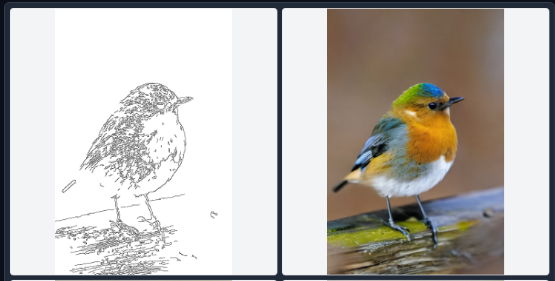
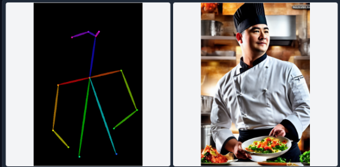
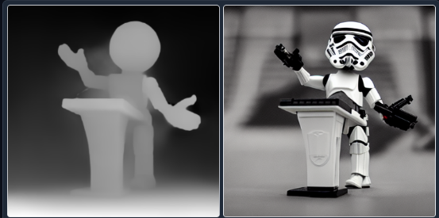
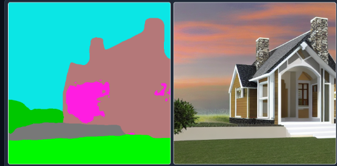
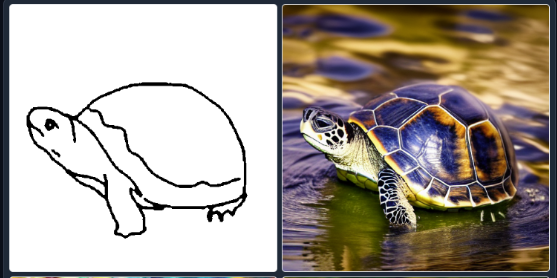
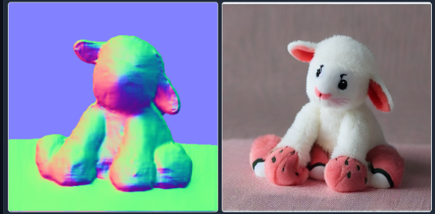

# ControlNet

ControlNet is a neural network structure to control diffusion models by adding extra conditions.

## ControlNet for Stable Diffusion WebUI

[sd-webui-controlnet](https://github.com/Mikubill/sd-webui-controlnet)

This extension is for AUTOMATIC1111's Stable Diffusion web UI, allows the Web UI to add ControlNet to the original Stable Diffusion model to generate images. The addition is on-the-fly, the merging is not required.

ControlNet 的關鍵思想是在 Stable Diffusion 的基礎上，添加了一個額外的控制分支，用來處理「結構提示」（control hints）並與模型的原有權重共享基礎參數。

## 控制模式

`ControlNet` 提供了多種控制模式，可以基於不同的結構提示來生成圖像。以下是常見的控制類型及其應用場景：

### **1. 邊緣檢測 (Edge Detection)**

- **控制模式**：Canny Edge Detection、HED (Holistically-nested Edge Detection)
- **用途**：
  - 基於圖像邊緣輪廓生成圖像。
  - 適合生成保持結構一致性的內容，例如建築、物體輪廓等。
- **工具支持**：
  - Canny（最常用），HED（更細緻的邊緣檢測）。

### **2. 姿勢估計 (Pose Estimation)**

- **控制模式**：OpenPose
- **用途**：
  - 基於人體姿勢生成動作特定的角色或場景。
  - 適合設計角色動作和動態場景。
- **工具支持**：
  - OpenPose 是主流姿勢估計工具，可以輸出骨骼結構作為控制提示。

### **3. 深度圖 (Depth Map)**

- **控制模式**：MiDaS
- **用途**：
  - 基於圖像深度信息生成帶有空間感的圖像。
  - 適合表現景深、空間結構明確的場景。
- **工具支持**：
  - MiDaS 是主流深度估計模型，可以生成高質量的深度圖。

### **4. 分割圖 (Segmentation Map)**

- **控制模式**：Semantic Segmentation
- **用途**：
  - 基於圖像中不同區域的分割信息進行生成。
  - 適合生成精確控制區域的圖像內容。
- **工具支持**：
  - 使用 Segmentation 工具（如 ADE20K）生成分割圖。

### **5. Scribble（手繪草稿）**

- **控制模式**：Scribble 模式
- **用途**：
  - 基於簡單的手繪草稿生成完整圖像。
  - 適合快速構圖和創意表達。
- **工具支持**：
  - 手繪工具或其他線條輸出。

### **6. 正常圖 (Normal Map)**

- **控制模式**：Normal Map 模式
- **用途**：
  - 基於物體的表面法線生成具有三維感的圖像。
  - 適合需要細節紋理的場景（如雕塑、建築表面）。
- **應用場景**：
  - 3D 模型生成與貼圖設計。
  - 紋理豐富的表面生成。
- **工具支持**：
  - Blender、Unity 等工具生成 Normal Map。

### **7. 光流圖 (Optical Flow)**

- **控制模式**：Flow 模式
- **用途**：
  - 基於動態視頻中的光流圖生成圖像。
  - 適合表現動態效果或動作連貫性的場景。
- **應用場景**：
  - 動態視頻的增強。
  - 生成連續動畫幀。
- **工具支持**：
  - Optical Flow 工具（如 RAFT）。

### **8. 深度+正規圖 (Depth + Normal Map)**

- **控制模式**：Depth 和 Normal 的結合
- **用途**：
  - 同時使用深度信息和表面法線來生成更加精確的三維感圖像。
  - 適合複雜的場景結構生成。
- **應用場景**：
  - 高細節的室內設計或場景模擬。
  - 增強細節表現的景觀圖。

### **9. 邏輯參數圖 (Logic Input)**

- **控制模式**：基於自定義邏輯參數。
- **用途**：
  - 用戶自定義控制機制，用於非結構化的控制。
  - 適合進行實驗性生成和創意設計。

### **10. 文字提示結合控制圖 (Hybrid Prompt + Control Image)**

- **控制模式**：結合文字提示和控制圖像。
- **用途**：
  - 同時使用語義提示和結構提示生成圖像。
  - 提供更多的生成自由度。
- **應用場景**：
  - 在給定結構下生成多樣化的結果。

## Reference

- [lllyasviel/ControlNet](https://github.com/lllyasviel/ControlNet)
- [Adding Conditional Control to Text-to-Image Diffusion Models](https://arxiv.org/abs/2302.05543)
- [The WebUI extension for ControlNet and other injection-based SD controls.](https://github.com/Mikubill/sd-webui-controlnet)
