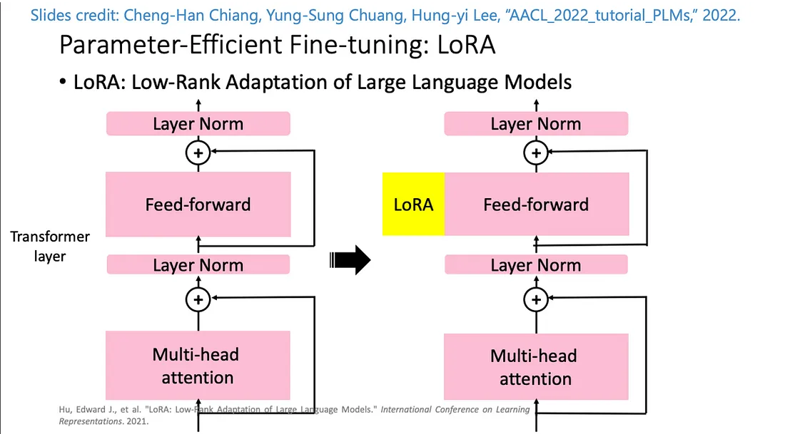
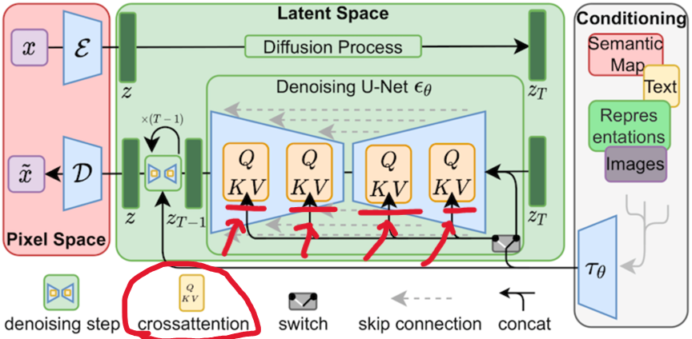
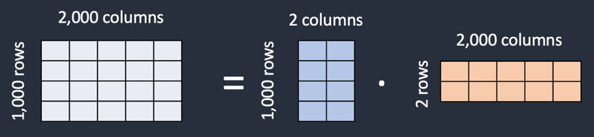
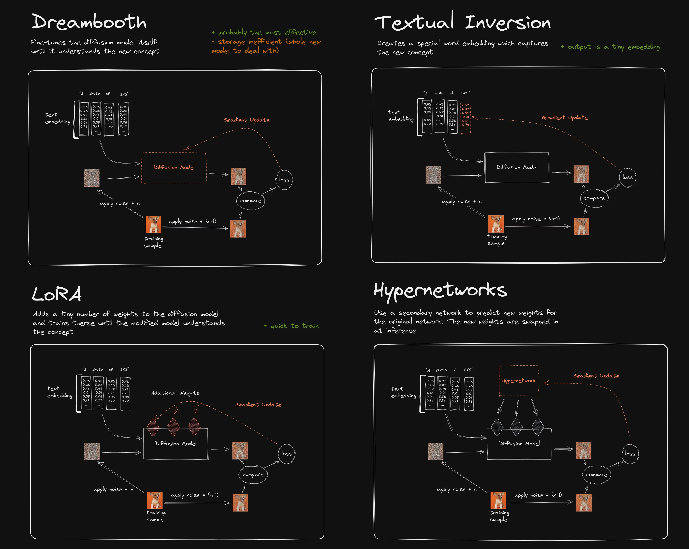

# LoRA (Low-Rank Adaptation)

是一種輕量化的模型調整技術，廣泛應用於大模型（如 **Stable Diffusion** 或 Transformer 類模型）的微調，尤其在資源有限或需要快速適配新任務的情況下。



## **LoRA 的核心概念**

LoRA 的核心目標是通過引入低秩矩陣分解的方式，實現對模型的參數高效調整，而無需微調整個模型的全部參數。

`cross-attention層`裡的權重保存在矩陣中，而 LoRA 模型做 fine-tune 時，便是將其自身的權重加到這些矩陣上。



1. **權重分解**：

   - 原始模型的權重矩陣 $ W $ 被分解為兩個小矩陣 $ A $ 和 $ B $：
     $$
     W' = W + \Delta W = W + A \cdot B
     $$
     - $ W $: 原始模型權重。
     - $ \Delta W $: 引入的微小更新。
     - $ A $: $ r \times d $ 的矩陣（其中 $ r \ll d $）。
     - $ B $: $ d \times r $ 的矩陣。
   - 通過分解，微調所需的參數數量大幅減少，從而降低計算和存儲開銷。

   

2. **只更新 LoRA 層**：
   - LoRA 方法固定了原始模型的參數，僅更新插入的 $ A $ 和 $ B $ 矩陣，實現對模型能力的增強。

## **LoRA 的特性與優勢**

1. **輕量化**：

   - 大幅減少參數量，降低顯存佔用和訓練成本。
   - 在大型模型上（如 Stable Diffusion 或 GPT-3），無需重新微調所有參數。

2. **靈活性**：

   - 支持針對多個不同任務或風格快速適配，不需要重新訓練整個模型。

3. **可疊加性**：

   - 多個 LoRA 層可以組合使用，以實現複雜的功能，如在不同風格之間進行轉換。

4. **效率高**：
   - LoRA 的引入幾乎不影響推理速度，因為權重的修改可以與原始模型並行計算。

## **LoRA 在 Stable Diffusion 中的應用**

1. **風格訓練與微調**：

   - LoRA 可以用來將 Stable Diffusion 模型微調到特定的藝術風格、角色、物品或場景。
   - 例如：訓練一個特定畫家的風格，或者生成某種類型的服裝設計。

2. **資源高效的定制**：

   - 不需要重新訓練整個 Stable Diffusion 模型，只需引入少量 LoRA 層即可達到微調效果。

3. **控制多樣性**：
   - 通過調節 LoRA 層的權重，可以控制生成圖像中 LoRA 訓練效果的強弱，從而靈活適配不同需求。

## **LoRA 的使用示例**

### 1. **訓練 LoRA**

- 收集特定風格或角色的數據集。
- 使用適當的工具（如 `kohya-ss/sd-scripts` 或 `DreamBooth` 的 LoRA 支持）進行訓練。
- 訓練過程中僅更新 LoRA 層，節省資源。

### 2. **使用 LoRA**

- 在 Stable Diffusion WebUI 中，載入 LoRA 模型。
- 在 Prompt 中調用 LoRA，如：
  ```
  <lora:my_style:0.8>
  ```
  - `my_style`: LoRA 模型名稱。
  - `0.8`: LoRA 層的影響權重（範圍通常為 0.1–1.0）。

### 3. **調整權重**：

- 使用較高權重（如 1.0）以更強的 LoRA 效果生成圖像。
- 使用較低權重（如 0.3–0.5）以保持模型的通用性，同時加入微量 LoRA 效果。

## **LoRA 的優化建議**

1. **數據集準備**：

   - 確保數據集質量高，樣本數量適中（數十到數百張圖片通常足夠）。
   - 進行數據增強（如旋轉、縮放等）以提高泛化能力。

2. **低秩維度選擇**：

   - $ r $ 的值通常選擇在 4–16 範圍內，以平衡性能和效果。

3. **調節權重**：
   - 避免過高的權重，因為可能導致圖像風格或結構出現失真。

## **與 DreamBooth 的對比**

| 特性         | **LoRA**                 | **DreamBooth**               |
| ------------ | ------------------------ | ---------------------------- |
| **參數量**   | 少量新增參數（低秩矩陣） | 調整整個模型參數             |
| **顯存需求** | 低                       | 高                           |
| **生成效果** | 適合特定風格微調         | 更適合精確還原個人或特定內容 |
| **適用場景** | 快速適配，低資源環境     | 高品質微調，但需更多資源     |

## **總結**

LoRA 是一種高效的模型微調技術，通過引入低秩矩陣分解，能夠在大幅減少資源需求的同時，實現強大的圖像生成效果。在 Stable Diffusion 中，LoRA 尤其適合快速適配新風格或內容生成需求，是當前模型微調的一個重要工具。

## 各個模型的原理差異



## Reference

- [Hung-yi Lee - Recent Advances in Pre-trained Language Models:Why Do They Work and How to Use Them](https://d223302.github.io/AACL2022-Pretrain-Language-Model-Tutorial/lecture_material/AACL_2022_tutorial_PLMs.pdf)
- [SD fine-tuning 常見 QA](https://hackmd.io/@mnsU_qVcTcmtFbnuyVyP8A/Hkd-MeDg2?ref=blog.hinablue.me)
- [Stable Diffusion（三）Dreambooth finetune 模型](https://www.cnblogs.com/zackstang/p/17324331.html)
- [微調大型語言模型 LLM 的技術 LoRA 及生成式 AI-Stable diffusion LoRA](https://xiaosean5408.medium.com/%E5%BE%AE%E8%AA%BF%E5%A4%A7%E5%9E%8B%E8%AA%9E%E8%A8%80%E6%A8%A1%E5%9E%8Bllm%E7%9A%84%E6%8A%80%E8%A1%93lora%E5%8F%8A%E7%94%9F%E6%88%90%E5%BC%8Fai-stable-diffusion-lora-61a41d636772)
- [Stable Diffusion AI 算圖使用手冊（4-1）：透過 LoRA 小模型收束角色特性](https://www.techbang.com/posts/105902-stable-diffusion-lora)
- [How To Do Stable Diffusion LORA Training By Using Web UI On Different Models - Tested SD 1.5, SD 2.1](https://www.youtube.com/watch?v=mfaqqL5yOO4&ab_channel=SECourses)
- [(請改用 kohya)Stable Diffusion-LoRA 模型訓練-安裝及基礎概念篇-舊版](https://www.youtube.com/watch?v=gFBmIL51x-M&ab_channel=%E6%9D%B0%E5%85%8B%E8%89%BE%E7%B1%B3%E7%AB%8B)
