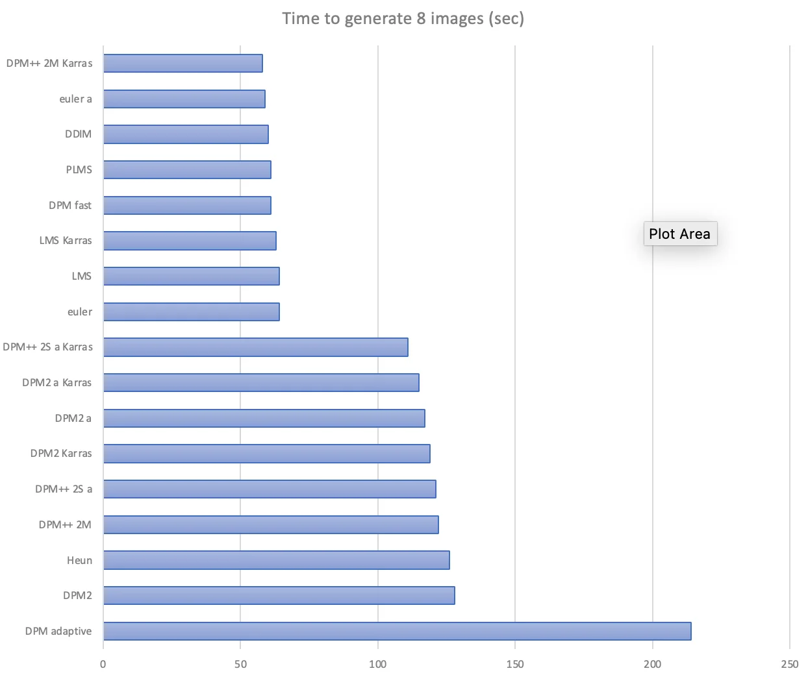
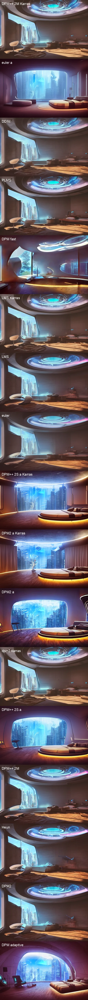
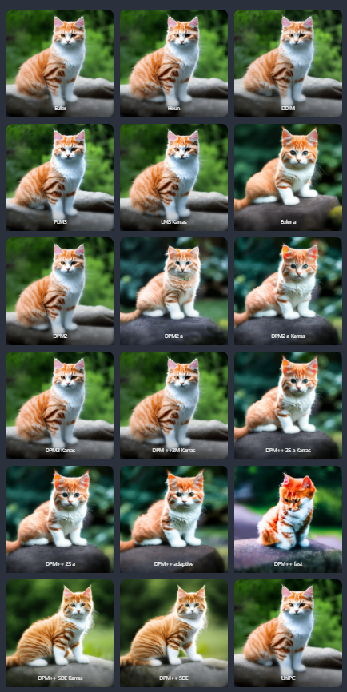
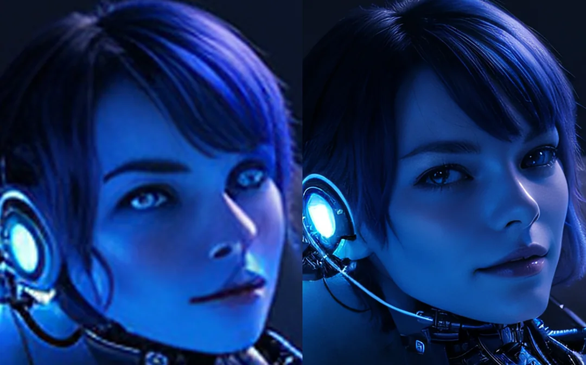

# Stable Diffusion WebUI

A web interface for Stable Diffusion, implemented using Gradio library.


Stable Diffusion Web UI 提供了一個直觀的網頁界面，讓用戶可以方便地操作 Stable Diffusion 模型，而無需直接使用程式碼。以下是其主要功能的詳細介紹：

## **Features**

1. **文本到圖像生成 (Text-to-Image Generation)**  
   輸入文本提示生成高品質圖像。

2. **圖像到圖像生成 (Image-to-Image Generation)**  
   透過上傳圖像與文本提示，生成基於參考圖像的變體或修改後圖像。

3. **外擴繪圖 (Outpainting)**  
   將圖像擴展到超出其邊界的新區域。

4. **圖像修補 (Inpainting)**  
   使用遮罩功能編輯或修補特定區域的圖像。

5. **色彩草圖 (Color Sketch)**  
   通過文本或草圖生成色彩豐富的圖像。

6. **提示矩陣 (Prompt Matrix)**  
   同時生成多種不同提示文本的圖像。

7. **超分辨率生成 (Stable Diffusion Upscale)**  
   提高圖像解析度，細化細節。

8. **關注點控制 (Attention Control)**  
   調整模型對文本中特定部分的關注程度，例如：

   - `a man in a ((tuxedo))`：強調「tuxedo」。
   - `a man in a (tuxedo:1.21)`：更細緻的強調設定。

9. **循環生成 (Loopback)**  
   多次處理圖像以生成進一步變化。

10. **X/Y/Z 參數繪圖 (X/Y/Z Plot)**  
    創建多維度參數的圖像對比圖。

## **進階功能**

1. **文本嵌入 (Textual Inversion)**

   - 可使用多種嵌入並自訂名稱。
   - 支援低精度浮點運算，節省資源。

2. **附加工具 (Extras Tab)**

   - **GFPGAN**：修復面部細節。
   - **CodeFormer**：替代 GFPGAN 的人臉修復工具。
   - **RealESRGAN/ESRGAN**：多種神經網絡升級模型。
   - **SwinIR/Swin2SR**：高效圖像超分辨率技術。
   - **LDSR**：基於潛在擴散的超分辨率升級。

3. **生成參數記錄**

   - 生成的圖像會保存所用參數，方便日後檢索和複製。

4. **負面提示 (Negative Prompt)**

   - 指定不希望出現在圖像中的內容。

5. **風格保存 (Styles)**

   - 保存提示的一部分作為風格，便於後續快速應用。

6. **CLIP 探測器 (CLIP Interrogator)**

   - 根據圖像自動生成文本提示。

7. **提示編輯 (Prompt Editing)**

   - 在生成過程中修改提示，例如從「西瓜」切換為「動漫角色」。

8. **高分辨率修復 (Highres Fix)**
   - 一鍵生成無失真的高解析度圖像。

## Install

1. Install `Python 3.10.6` (Newer version of Python does not support torch), checking "Add Python to PATH".
1. Download the stable-diffusion-webui repository, for example by running `git clone https://github.com/AUTOMATIC1111/stable-diffusion-webui.git`
1. Run `webui-user.bat` from Windows Explorer as normal, non-administrator, user.

## Stable Diffusion Model Download

將 model 下載至 `..\diffustion\stable-diffusion-webui\models\Stable-diffusion\`中

### 推薦網站

- [official stable-diffusion model - stabilityai/stable-diffusion-xl-base-1.0](https://huggingface.co/stabilityai/stable-diffusion-xl-base-1.0)
- [huggingface Models](https://huggingface.co/models?pipeline_tag=text-to-image&sort=downloads&source=post_page-----12cbeeee7430--------------------------------)
- [civitai](https://civitai.com)

### 推薦模型

- **Stable Diffusion**: 大多模型都基於 Stable Diffusion 模型訓練而來。原版模型適合畫真人、動物、自然、科技、建築的圖像，亦學習過歷史上許多畫家的畫風。

  - stable Diffusion v1.5 : 簡稱 SD1.5，使用 512x512 像素的圖片訓練的，因此高於此尺寸的生圖品質會變差。
  - Stable Diffusion XL : 簡稱 SDXL，可用於生成 1024x1024 的大圖。後來還衍生出了 SDXL Turbo、SDXL-Lightning 等生成速度更快的版本。
  - Stable Diffusion 3.5 : 提供 Medium、Large、Large Turbo 版本。

- **寫實風 Stable Diffusion 模型**

  - RealVisXL：基於 SDXL，寫實風人物與動物模型。
  - Chilloutmix：基於 SD-1.5 模型，寫實風格的模型，適合畫出 2.5 次元，融合日韓真人與動漫風格的圖像。
  - Deliberate：基於 SD-1.5 模型，適合生成精緻寫實風格的人物、動物、自然風景。

- **動漫風 Stable Diffusion 模型**

  - Anything 萬象熔爐，基於 SDXL。適合畫動漫圖，作者宣稱不需要打一堆提示詞也能出漂亮的圖。
  - Pony Diffusion：基於 SDXL，作者花了大把時間訓練的模型，手動標註圖片讓 AI 懂得生成高品質圖片，還能依照提示詞控制生成品質。雖然名字叫做彩虹小馬，但用來生成其他動漫人物也是 OK 的。
  - DreamShaper，基於 SDXL，生成精細動漫人物與油畫風格的模型。

- **FLUX** : Stability AI 前員工建立的公司 Black Forest Labs 所發表的模型，生成圖片品質比 Stable Diffusion XL 要好，但 VRAM 要求也相應提高許多。

  - FLUX 分為 Pro、Dev、Schnell 版，其中可自由使用的版本為 Flux.1 Schnell

## Parameter Meaning

### **Sampling method** :

Sampling Method 是指選擇圖像生成過程中使用的采样算法（Sampling Algorithm）。這些方法會直接影響生成圖像的質量、細節、風格和生成速度。

// Todo: put list here

- A list
- B list

#### Below are rendering times and images of the same seed after 20 steps.



#### Compare Result





#### 如何選擇 Sampling Method

- 追求速度：選擇 Euler 或 DDIM。
- 追求創意：選擇 Euler a 或 DPM2 a。
- 追求穩定性和高細節：選擇 DPM++ 系列（如 DPM++ 2M Karras）。
- 生成藝術風格圖像：選擇 DPM2 a 或 LMS。

#### 備註:

- a：名字帶 a 的，去噪點並不集中，關鍵詞識別度能力稍低
- karras：去噪點能力很快
- DDIM、LMS、PLMS：這些都是 Stable Diffusion 早期開發版舊有的早期採樣法，以現在來說十分過時，不建議使用這幾個了。
- DPM 推薦使用 DPM++ SDE Karras 是當前大家最常使用的採樣方式，去噪速度與關鍵詞精準度都很宜人。
  而新版 UniPC 也具備上述採樣器優點，可以算是新秀!

### **Sampling Steps** :

大多數情況下，20~40 步即可獲得理想效果。

- 低於 20 步：速度快但質量低，適合快速測試。
- 高於 50 步：僅在極高細節要求的場合使用。

### **Restore Faces** :

專門用來修復生成圖像中人物面部的細節和品質。由於 AI 模型生成的圖像有時可能會導致面部變形、不對稱或細節缺失，這個功能可以通過專用的面部修復算法對生成的圖像進行優化和修正。

- GFPGAN 修復：面部得到快速優化，呈現較高細節但可能稍微誇張。
- CodeFormer 修復：修復後的面部更加平滑、自然，且整體質感更好。

### **Tiling** :

通過調整模型生成圖像的方式，對圖像邊緣進行特別處理，使其左右、上下的像素在接壤處能夠無縫對接。

- 材質紋理：用於遊戲中的地板、牆壁、布料等重複紋理。例如：木紋、磚塊、石材。
- 背景設計：適用於網站背景、壁紙或視覺效果設計。
- 圖案設計：例如重複的幾何圖形、花紋或裝飾性圖案。

**圖像風格限制**：不建議用於寫實或複雜的場景，因為無縫拼接可能破壞原始構圖。高解析度圖像可能需要更多的運算資源；確保 GPU 有足夠的性能支持。

### **Hires. fix** :

主要用於生成高解析度圖像時改善圖像的細節和品質，特別是解決低解析度生成後放大圖像時可能出現的模糊、細節丟失或變形問題。

- 提升圖像細節：在生成高解析度圖像時，通過分階段處理（第一階段:低解析度生成，第二階段 img2img:放大 + 重繪），讓圖像的細節更清晰、更準確。

- 避免圖像模糊或失真：直接生成高解析度圖像時，AI 模型容易無法很好地處理細節，Hires. Fix 通過兩步法修正這些問題。

- 改善構圖：高解析度生成中，物體比例可能會因像素密度而錯亂，Hires. Fix 可以幫助修正物體形狀和結構。

- 適合高品質輸出：適用於需要高解析度輸出的場景，例如海報、插畫、桌布或其他需要放大的作品。



### **CFG scale(Classifier Free Guidance)** :

控制圖像生成對 Prompt 的依賴程度，用於平衡生成圖像時對提示（Prompt）的遵循程度與生成圖像的多樣性或創造性。

- 高 CFG Scale 值時，模型更傾向於強烈地遵循提示詞。通常能提升圖像的細節與品質，但過高可能導致圖像出現過於生硬的特徵或不自然的結果。
- 低 CFG Scale 值時，模型更傾向於生成更具多樣性或意外的結果。
- 適中的 CFG Scale 值能產生平衡的結果，保留細節並具有一定的創意性。

#### **CFG Scale 的工作原理**

在技術層面上，CFG Scale 的核心原理是基於 **Classifier-Free Guidance（無分類器引導）**。該方法在生成圖像時，將模型生成的兩種結果進行權衡：

1. **有提示生成的結果**（Prompt Guidance）：
   - 模型根據提示詞生成的圖像方向。
2. **無提示生成的結果**（Unconditioned Guidance）：
   - 模型在不考慮提示詞時的圖像方向，通常為通過隨機噪聲生成的結果。

CFG Scale 的作用是通過數學運算將這兩種生成結果進行調和：

$$
\text{Output} = \text{Unconditioned Output} + \text{CFG Scale} \times (\text{Conditioned Output} - \text{Unconditioned Output})
$$

#### **CFG Scale 的調節建議**

1. **常見範圍**：

   - 通常建議在 **5 到 15** 之間調整，具體取決於生成任務和需求：
     - **5-7**：生成的圖像更加自然且多樣，適合探索和創意性需求。
     - **8-12**：平衡提示詞準確性與創造性，是最常用的範圍。
     - **13-20+**：生成結果與提示詞高度相關，但可能導致圖像過於生硬或細節出現扭曲。

2. **視具體情況調整**：
   - 如果提示詞細節多、描述準確，可以適當提高 CFG Scale。
   - 如果需要更自然或更具創意的結果，可以降低 CFG Scale。

### **Denosing strength**

輸出圖片的變動程度。在 img2img 的第一步，Stable Diffusion 會將噪訊加進輸入圖片中，然後依照提示詞的內容來產生圖片。

數值越大的話，第一步加入的噪訊就會越多，輸出圖片會差異越大。例如 0.1 到 0.2 時，只會在細微的圖樣，陰影產生變化。
到了 0.4 以上，就會對畫面中的小物品產生明顯變化，
到了 0.6 以上會對整張圖的組成產生很明顯的影響，例如人物姿勢與位置，甚至整個構圖都會不一樣。
到了 1 就會產生一個跟輸入圖毫無關聯的圖，其實就等於純粹的文生圖。

## LoRA

LoRA (Low-Rank Adaptation) 是一種輕量化的模型調整技術，廣泛應用於大模型（如 Stable Diffusion 或 Transformer 類模型）的微調，尤其在資源有限或需要快速適配新任務的情況下。主要功能，在於可以搭配現有的 Checkpoint 模型，並介入 AI 推論的運算過程，發揮控制生成畫面內容的效果。

在 Stable Diffusion 的應用範圍中，LoRA 可以發揮控制人物特色、服裝、指定角色、改變畫面風格等效果。舉個例子來說，Checkpoint 就像是 AI 畫家的「基本畫功」，而 LoRA 則是要求 AI 畫家「照這個風格」產生圖片。

### **使用 LoRA**

1. 將 LoRA 文件放入 WebUI 的 `models/Lora` 資料夾。
2. 在 `Prompt` 中引用：
   ```
   <lora:my_lora_model:0.8>
   ```
   - `0.8` 是 LoRA 權重，通常設置在 0.6-1.0。

使用許多 LoRA 時將權重降低至 0.6~0.8 會有比較好的效果，使用過高的權重容易造成畫面錯亂，尤其在混用多組 LoRA 時狀況更顯著。

#### 提示詞範例

```sh
# 正面提示詞
(masterpiece, top quality, best quality, official art, beautiful and aesthetic:1.2), (1girl), extreme detailed,colorful, ((solo)),
steampunk city, china dress, (small breast),
<lora:taeTakemiPersona5_v10:0.8>, (Tae Takemi), necklace, choker, <lora:personaCatherineSoejima_1:0.6>
# 負面提示詞
(worst quality, low quality:2), monochrome, zombie,overexposure, watermark,text,bad anatomy,bad hand,extra hands,extra fingers,too many fingers,fused fingers,bad arm,distorted arm,extra arms,fused arms,extra legs,missing leg,disembodied leg,extra nipples, detached arm, liquid hand,inverted hand,disembodied limb, small breasts, loli, oversized head,extra body,completely nude, extra navel,easynegative,(hair between eyes),sketch, duplicate, ugly, huge eyes, text, logo, worst face, (bad and mutated hands:1.3), (blurry:2.0), horror, geometry, bad_prompt, (bad hands), (missing fingers), multiple limbs, bad anatomy, (interlocked fingers:1.2), Ugly Fingers, (extra digit and hands and fingers and legs and arms:1.4), ((2girl)), (deformed fingers:1.2), (long fingers:1.2),(bad-artist-anime), bad-artist, bad hand, extra legs ,(ng_deepnegative_v1_75t)
```

## Add Extension

1. Open "Extensions" tab.
1. Open "Install from URL" tab in the tab.
1. Enter https://github.com/xxxxxx/xxxxxxxxx to "URL for extension's git repository".
1. Press "Install" button.
1. Wait for 5 seconds, and you will see the message "Installed into stable-diffusion-webui\extensions\xxxxxxxxx. Use Installed tab to restart".
1. Go to "Installed" tab, click "Check for updates", and then click "Apply and restart UI".
1. Completely restart A1111 webui including your terminal. (If you do not know what is a "terminal", you can reboot your computer to achieve the same effect.)
1. Download models (see below).
1. After you put models in the correct folder, you may need to refresh to see the models. The refresh button is right to your "Model" dropdown.

## 自訂

## Reference

- [stable-diffusion-webui github](https://github.com/AUTOMATIC1111/stable-diffusion-webui)
- [如何下載 Stable Diffusion 相關的 AI 生圖模型＆網站分享](https://ivonblog.com/posts/download-stable-diffusion-models/)
- [Stable Diffusion WebUI 介紹](https://ivonblog.com/posts/stable-diffusion-webui-introduction/)
- [為何要訓練自訂模型？｜ Stable Diffusion WebUI 使用手冊](https://ivonblog.com/posts/stable-diffusion-webui-training/)
- [Best sampling method in A1111 GUI](https://www.reddit.com/r/StableDiffusion/comments/yyqi67/best_sampling_method_in_a1111_gui/)
- [Stable Diffusion Samplers: A Comprehensive Guide](https://stable-diffusion-art.com/samplers/)
- [sd 采样方法详解\_sd 采样方法有什么区别-CSDN 博客](https://blog.csdn.net/lizhong2008/article/details/132278253)
- [This is why u should use hi-res fix-reddit](https://www.reddit.com/r/StableDiffusion/comments/17oy893/this_is_why_u_should_use_hires_fix/)
- [微調大型語言模型 LLM 的技術 LoRA 及生成式 AI-Stable diffusion LoRA](https://xiaosean5408.medium.com/%E5%BE%AE%E8%AA%BF%E5%A4%A7%E5%9E%8B%E8%AA%9E%E8%A8%80%E6%A8%A1%E5%9E%8Bllm%E7%9A%84%E6%8A%80%E8%A1%93lora%E5%8F%8A%E7%94%9F%E6%88%90%E5%BC%8Fai-stable-diffusion-lora-61a41d636772)
- [Stable Diffusion AI 算圖使用手冊（4-1）：透過 LoRA 小模型收束角色特性](https://www.techbang.com/posts/105902-stable-diffusion-lora)
- [How To Do Stable Diffusion LORA Training By Using Web UI On Different Models - Tested SD 1.5, SD 2.1](https://www.youtube.com/watch?v=mfaqqL5yOO4&ab_channel=SECourses)
- [(請改用 kohya)Stable Diffusion-LoRA 模型訓練-安裝及基礎概念篇-舊版](https://www.youtube.com/watch?v=gFBmIL51x-M&ab_channel=%E6%9D%B0%E5%85%8B%E8%89%BE%E7%B1%B3%E7%AB%8B)
