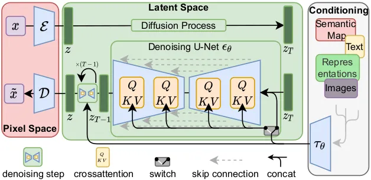

# Stable Diffusion

Stable Diffusion 是一種基於 Latent Diffusion Models (LDM) 的高效擴散模型，專注於生成高解析度的圖像，並在計算效率與生成質量之間實現了良好的平衡。

## **核心特性**

1. **基於潛在空間的擴散過程**：

   - 圖像在壓縮的潛在空間中進行擴散操作，而非像素空間。
   - 顯著降低運算資源需求。

2. **可控生成**：

   - 允許用戶使用文本提示、語義標籤或其他條件來指導生成過程。
   - 使用 CLIP（Contrastive Language–Image Pretraining）嵌入來實現文本到圖像生成。

3. **擴展性與開放性**：
   - 提供開放源代碼，便於研究者和開發者進一步開發和改進。

## **應用場景**

1. **文本到圖像生成（Text-to-Image Generation）**
   - 基於自然語言描述生成高度真實的圖像。
2. **圖像編輯（Image Editing）**
   - 通過添加條件約束（如遮罩或引導），實現局部圖像修補與修改。
3. **藝術創作與內容生成**
   - 應用於創意設計、數碼藝術與媒體生成。

## **High-Level Overview of Latent Diffusion**

### **模型架構**

- **自編碼器 (VAE)**: 將圖像映射到低維潛在空間，再解碼回像素空間。
- **擴散模型**: 在潛在空間中進行去噪訓練，學習數據分佈。
- **條件模塊**: 提供額外的條件約束以控制生成內容（如文本到圖像生成）。

### **訓練框架**

- **潛在壓縮模型**：通過自編碼器（Autoencoder）對輸入圖像進行壓縮，得到低維的潛在表示。
- **擴散模型**：在潛在空間中執行前向擴散與反向生成。

### **損失函數**

Stable Diffusion 使用標準的去噪損失（如均方誤差，MSE）來訓練模型。

$$
\mathcal{L}_{stable} = \mathbb{E}_{z, \epsilon, t} \left[ ||\epsilon - \epsilon_\theta(z_t, t)||^2 \right]
$$

- $z$：潛在空間中的表示
- $\epsilon_\theta$：去噪模型的預測

### **重大突破**

1. 計算效率提升:

   - 傳統擴散模型需要在高維像素空間中執行擴散和反向過程，導致高計算成本。
   - LDM 通過壓縮圖像表示，使生成過程更加輕量化，實現了高效推理。
   - 通過引入如 DDIM 的改進，Stable Diffusion 可以在更少的步數中完成高質量的生成。

1. 生成質量和靈活性:

   - 在保持高分辨率圖像質量的同時，提供了多種條件生成的可能性（如文本到圖像）。
   - 在圖像生成與編輯等應用中展現了極大的潛力。

1. 可擴展性和實用性:

   - 開源後，研究者和開發者可利用其框架進行模型的改進和創新。
   - 應用範圍廣泛，包括藝術創作、數碼內容生成、醫療影像分析等。

## **參考論文與資源**

- [High-Resolution Image Synthesis with Latent Diffusion Models](https://arxiv.org/abs/2112.10752)
- [Stable Diffusion GitHub](https://github.com/CompVis/stable-diffusion)
- [論文閱讀 High-Resolution Image Synthesis with Latent Diffusion Models](https://blog.csdn.net/weixin_57974242/article/details/134180461)
- [Stable diffusion — High-Resolution Image Synthesis with Latent Diffusion Models](https://medium.com/image-processing-and-ml-note/stable-diffusion-high-resolution-image-synthesis-with-latent-diffusion-models-926576f8df26)
- [[论文阅读] High-Resolution Image Synthesis with Latent Diffusion Models](https://www.cnblogs.com/lichunlei/p/18521616)
