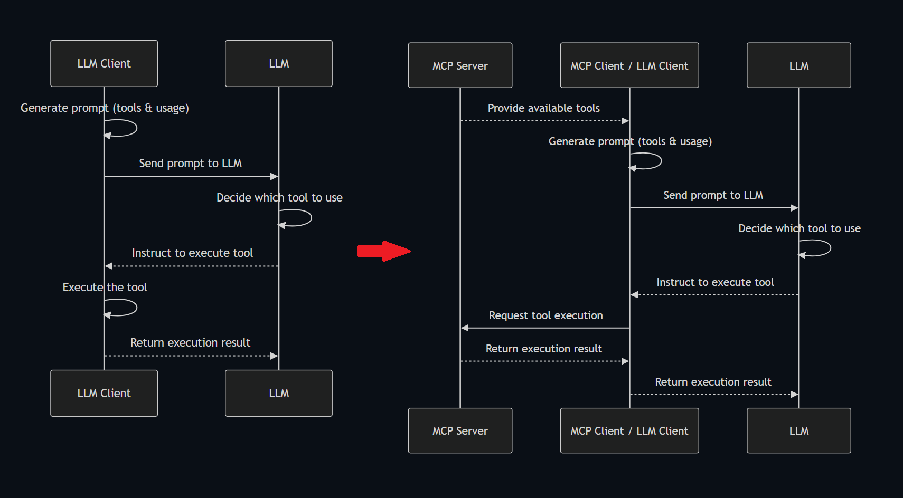

# MCP Server

This repository is a collection of reference implementations for the [Model Context Protocol (MCP)](https://modelcontextprotocol.io/introduction), as well as references to community built servers and additional resources.

The servers in this repository showcase the versatility and extensibility of MCP, demonstrating how it can be used to give Large Language Models (LLMs) secure, controlled access to tools and data sources. Each MCP server is implemented with either the Typescript [MCP SDK](https://github.com/modelcontextprotocol/typescript-sdk) or [Python MCP SDK](https://github.com/modelcontextprotocol/python-sdk).

## Difference between ToolCall

MCP is built on top of tool calling. The tool calls need to be executed somewhere, and MCP represents the first major attempt at a “portable tool interface”
MCP 就是把 `執行工具的階段` 抽離出來，改由 MCP Server 來執行



## MCP Server transport mode

當前 **MCP (Model Context Protocol) Server** 支援的三種常見 **transport mode（傳輸模式）** 各有特點，主要用於處理「模型與使用者之間」的雙向資訊流，特別是在**持續性回應、串流生成**的場景中非常重要。以下是三種模式的介紹與比較：

### 1. `stdio`（標準輸入/輸出）

使用 OS 的標準輸入（stdin）與標準輸出（stdout）來與模型或下游元件通訊。這種模式通常用於嵌入式環境、CLI 工具，或與子行程（subprocess）互動的情境。

#### ✅ 優點

- **簡單穩定**：不需 HTTP server，系統資源消耗低。
- **適用子行程架構**：例如與 LLM binary 互動（如 llama.cpp）。
- **易於除錯**：直接查看 stdout/stderr 訊息。

#### ⚠️ 缺點

- 無原生串流：需透過 buffer 或分段處理。
- 不適合多人並發：每個實例只支援單一通道。
- 跨平台處理略為複雜。

### 2. `sse`（Server-Sent Events）

基於 HTTP 的單向事件串流標準，由伺服器持續推送訊息到用戶端，常用於 LLM 文字生成的逐字回傳（類似 OpenAI 的 `stream: true`）。

#### ✅ 優點

- **即時串流**：支援逐字、逐段輸出。
- **相容性好**：瀏覽器與主流前端框架原生支援。
- **建立成本低**：使用 HTTP/1.1，無需 WebSocket。

#### ⚠️ 缺點

- 單向通訊（伺服器 ➜ 客戶端），不支援用戶端主動回覆。
- 對於錯誤/重連處理需自訂機制。

### 3. `streamable`（類似雙向流：gRPC 或自定義流式封包）

泛指**支援雙向或持續資料流**的通訊協定，如：

- gRPC Stream（雙向流）
- WebSocket
- HTTP/2 + chunked transfer
- 自定義 framing protocol（如 LangChain's `Streamable` interface）

此模式允許模型與客戶端在推理過程中持續交換訊息（例如傳輸語音片段、畫面 frame、交錯控制指令等）。

#### ✅ 優點

- **雙向通訊**：支援 client ↔ server 的互動。
- **適用複雜任務**：如語音轉文字、遊戲環境控制。
- **延展性高**：支援多模態與異步資料流。

#### ⚠️ 缺點

- 開發較複雜：需處理訊息 framing、連線中斷與重連。
- 相依於底層協定（如 HTTP/2、gRPC、WebSocket）。

### 📊 模式比較表

| 模式         | 串流支援 | 雙向通訊   | 輕量性 | 適合用途                        |
| ------------ | -------- | ---------- | ------ | ------------------------------- |
| `stdio`      | ❌ 限制  | ✅（同步） | ✅     | CLI, 子行程模型                 |
| `sse`        | ✅ 單向  | ❌         | ✅     | Web 前端文字串流                |
| `streamable` | ✅ 雙向  | ✅         | ⚠️     | 多模態任務、語音、互動 AI Agent |

---

[!WARNING]  
Generated from AI

## MCP Server 開發語言與執行方式

- 💻 Use [modelcontextprotocol](https://github.com/modelcontextprotocol) SDKs to start building:

  - [TypeScript SDK](https://github.com/modelcontextprotocol/typescript-sdk)
  - [Python SDK](https://github.com/modelcontextprotocol/python-sdk)
  - [Java SDK](https://github.com/modelcontextprotocol/java-sdk)
  - [Kotlin SDK](https://github.com/modelcontextprotocol/kotlin-sdk)
  - [C# SDK](https://github.com/modelcontextprotocol/csharp-sdk)

- Use [FastMCP](https://github.com/jlowin/fastmcp):
  - FastMCP is the standard framework for working with the Model Context Protocol. FastMCP 1.0 was incorporated into the official low-level Python SDK, and FastMCP 2.0 (this project) provides a complete toolkit for working with the MCP ecosystem.
  - openai-agent 有包 FastMCP v1

### MCP server sample code

#### stdio example

```python
from fastmcp import FastMCP

mcp = FastMCP("Demo 🚀")

@mcp.tool
def add(a: int, b: int) -> int:
    """Add two numbers"""
    return a + b

if __name__ == "__main__":
    mcp.run()
```

#### sse example

[server.py](https://github.com/openai/openai-agents-python/blob/main/examples/mcp/sse_example/server.py)

```python
import random

import requests
from mcp.server.fastmcp import FastMCP

# Create server
mcp = FastMCP("Echo Server")


@mcp.tool()
def add(a: int, b: int) -> int:
    """Add two numbers"""
    print(f"[debug-server] add({a}, {b})")
    return a + b


@mcp.tool()
def get_secret_word() -> str:
    print("[debug-server] get_secret_word()")
    return random.choice(["apple", "banana", "cherry"])


@mcp.tool()
def get_current_weather(city: str) -> str:
    print(f"[debug-server] get_current_weather({city})")

    endpoint = "https://wttr.in"
    response = requests.get(f"{endpoint}/{city}")
    return response.text


if __name__ == "__main__":
    mcp.run(transport="sse")
```

#### streamablehttp example

[server.py](https://github.com/openai/openai-agents-python/blob/main/examples/mcp/streamablehttp_example/server.py)

```python
import random
import requests
from mcp.server.fastmcp import FastMCP

# Create server
mcp = FastMCP("Echo Server")


@mcp.tool()
def add(a: int, b: int) -> int:
    """Add two numbers"""
    print(f"[debug-server] add({a}, {b})")
    return a + b


@mcp.tool()
def get_secret_word() -> str:
    print("[debug-server] get_secret_word()")
    return random.choice(["apple", "banana", "cherry"])


@mcp.tool()
def get_current_weather(city: str) -> str:
    print(f"[debug-server] get_current_weather({city})")

    endpoint = "https://wttr.in"
    response = requests.get(f"{endpoint}/{city}")
    return response.text


if __name__ == "__main__":
    mcp.run(transport="streamable-http")
```

## MCP Servers

These servers aim to demonstrate MCP features and the TypeScript and Python SDKs.

- **[Everything](src/everything)** - Reference / test server with prompts, resources, and tools
- **[Fetch](src/fetch)** - Web content fetching and conversion for efficient LLM usage
- **[Filesystem](src/filesystem)** - Secure file operations with configurable access controls
- **[Git](src/git)** - Tools to read, search, and manipulate Git repositories
- **[Memory](src/memory)** - Knowledge graph-based persistent memory system
- **[Sequential Thinking](src/sequentialthinking)** - Dynamic and reflective problem-solving through thought sequences
- **[Time](src/time)** - Time and timezone conversion capabilities

MORE SERVERS:

- [modelcontextprotocol/servers](https://github.com/modelcontextprotocol/servers)
- [punkpeye/awesome-mcp-servers](https://github.com/punkpeye/awesome-mcp-servers)

## MCP Server Development and Debug Tool

官方提供了一套非常實用的測試工具 [modelcontextprotocol/inspector](https://github.com/modelcontextprotocol/inspector)。這個工具可以讓你直接與 MCP Server 互動，手動發送請求、查看回應，方便快速 debug。(沒有使用任何 LLM 的部分)

To inspect an MCP server implementation, there's no need to clone this repo. Instead, use npx. For example, if your server is built at build/index.js:

```bash
npx @modelcontextprotocol/inspector node build/index.js

# OR
# Pass arguments only
npx @modelcontextprotocol/inspector node build/index.js arg1 arg2
```

## LLM support (MCP Client)

[Example Clients - Model Context Protocol](https://modelcontextprotocol.io/clients)

## Reference

- [openai/openai-agents-python examples](https://github.com/openai/openai-agents-python/tree/main/examples/mcp)
- [modelcontextprotocol/servers](https://github.com/modelcontextprotocol/servers)
- [MCP 開發實戰手冊：SSE、STDIO、Tool、Resource 一次搞懂](https://oalieno.tw/posts/mcp)
- [reddit - difference_between_mcp_and_traditional_toolcall](https://www.reddit.com/r/mcp/comments/1jphxuu/difference_between_mcp_and_traditional_toolcall/)
- [punkpeye/awesome-mcp-servers](https://github.com/punkpeye/awesome-mcp-servers)
