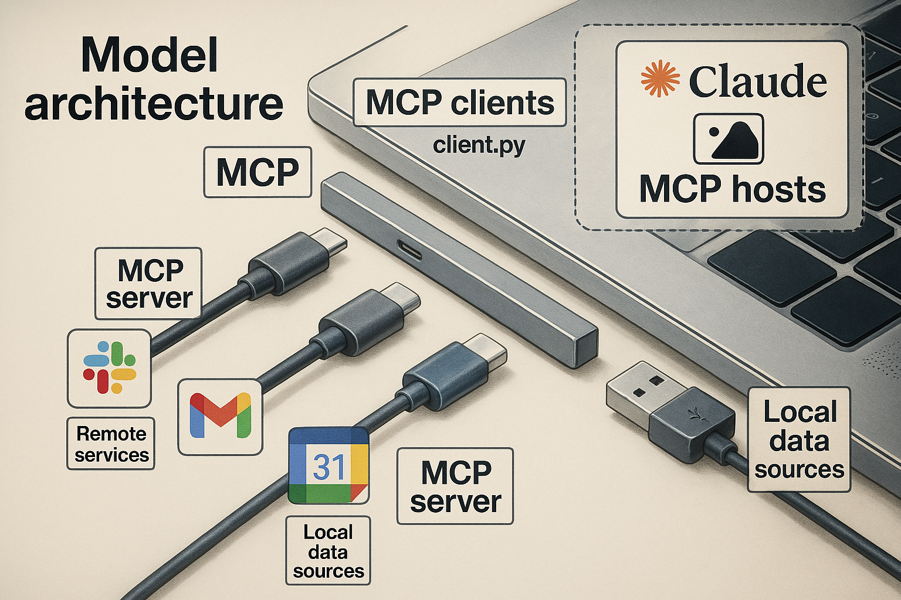

# 模型上下文協議（Model Context Protocol, MCP）概述

## 摘要

#### 要點

- **MCP 是一個開放標準**：它簡化了 AI 模型與數據源和工具的連接，無需為每個數據源構建定制整合。
- **靈活且安全**：提供預建整合、跨 LLM 供應商的靈活性，以及強大的數據安全最佳實踐。
- **類似 USB-C 的設計**：通過標準化協議，MCP 使 LLM 應用能夠輕鬆訪問多種外部資源。
- **由 Anthropic 開發**：MCP 是一個開源項目，得到 Anthropic 的支持，擁有活躍的社區貢獻。

#### 什麼是 MCP？

MCP（模型上下文協議）是一個開放協議，旨在讓大型語言模型（LLM）應用與外部數據源和工具無縫整合。它通過標準化的方式將 AI 模型連接到文件、數據庫或 API 等資源，類似於 USB-C 如何為設備提供通用連接。MCP 由 Anthropic 開發，於 2024 年 11 月發布，旨在解決 AI 模型因數據孤島和傳統系統限制而無法充分發揮潛力的問題。

#### 為什麼需要 MCP？

MCP 幫助開發者構建基於 LLM 的智能代理和複雜工作流程。它提供：

- **預建整合**：LLM 可以直接使用的工具和數據源集合。
- **供應商靈活性**：允許在不同 LLM 提供商之間切換，無需重寫整合代碼。
- **安全最佳實踐**：確保數據在基礎設施中的安全處理。

#### 如何使用 MCP？

MCP 採用客戶端-服務器架構，應用程序（主機）通過客戶端與提供上下文或工具的服務器通信。開發者可以參考官方文檔（[MCP 官網](https://modelcontextprotocol.io)）或 GitHub 倉庫（[MCP GitHub](https://github.com/modelcontextprotocol)）開始構建 MCP 整合。

---

## 引言

模型上下文協議（MCP）是一個開放協議，旨在標準化應用程序如何為大型語言模型（LLM）提供上下文。MCP 可以被視為 AI 應用的「USB-C 端口」：正如 USB-C 為設備與各種外設提供標準化連接方式，MCP 為 AI 模型與不同數據源和工具提供標準化連接方式。該協議由 Anthropic 於 2024 年 11 月發布，是一個開源項目，旨在解決 AI 模型因數據孤島和傳統系統限制而無法充分發揮潛力的問題。



MCP 幫助開發者構建基於 LLM 的智能代理和複雜工作流程。它提供以下優勢：

- **預建整合**：LLM 可以直接使用的工具和數據源集合。
- **供應商靈活性**：允許在不同 LLM 提供商之間切換，無需重寫整合代碼。
- **安全最佳實踐**：確保數據在基礎設施中的安全處理。

## 架構

MCP 基於靈活且可擴展的客戶端-服務器架構，實現 LLM 應用與外部整合之間的無縫通信。其核心組件包括：

- **協議層**：處理消息框架、請求/響應鏈接和高級通信模式。
- **傳輸層**：支持本地進程的 Stdio 和遠程連接的 HTTP（使用服務器發送事件，SSE）。

### 通信方

MCP 的架構涉及以下主要角色：

- **主機（Hosts）**：發起連接的 LLM 應用，例如 Claude Desktop 或 AI 驅動的 IDE。
- **客戶端（Clients）**：主機內的連接器，與服務器保持 1:1 連接。
- **服務器（Servers）**：提供上下文、工具和提示的輕量級程序。

### 消息類型

MCP 支持以下消息類型：

- **請求（Requests）**：期望響應，包含方法和可選參數。
- **結果（Results）**：成功的響應，格式為開放鍵值對。
- **錯誤（Errors）**：包含錯誤代碼、消息和可選數據。
- **通知（Notifications）**：單向消息，無需響應。

### 連接生命周期

- **初始化**：客戶端發送`initialize`請求（包含版本和功能），服務器響應，客戶端發送`initialized`通知，開始正常交換。
- **消息交換**：支持請求-響應和通知。
- **終止**：通過`close()`、傳輸斷開或錯誤條件終止。

## 主要功能

MCP 提供多項功能，實現 LLM 與外部系統的無縫整合：

### 服務器到客戶端

- **資源（Resources）**：為用戶或 AI 模型提供上下文和數據，例如文件或數據庫內容。
- **提示（Prompts）**：模板化消息和工作流程，指導 LLM 的行為。
- **工具（Tools）**：AI 模型可執行的函數，用於執行特定任務。

### 客戶端到服務器

- **採樣（Sampling）**：支持服務器啟動的代理行為和遞歸 LLM 交互，實現更動態的工作流程。

### 附加工具

MCP 還包括以下實用功能：

- 配置管理
- 進度跟踪
- 取消操作
- 錯誤報告
- 日誌記錄

## 安全原則

MCP 在設計時將安全放在首位，特別是考慮到其在連接 AI 模型與外部數據和工具方面的作用。以下是其核心安全原則：

1. **用戶同意和控制**：所有數據共享和操作需明確用戶同意，用戶通過清晰的界面審查和授權操作。
2. **數據隱私**：數據暴露需明確同意，未經同意不得傳輸，並實施適當的訪問控制。
3. **工具安全**：工具可能涉及任意代碼執行，需謹慎處理。除非來自可信服務器，工具描述被視為不可信，調用前需明確同意。
4. **LLM 採樣控制**：用戶對採樣、提示和服務器可見性有明確控制，服務器對提示的可見性受限以保護敏感信息。

## 實現指南

為確保 MCP 的有效和安全實現，開發者應遵循以下最佳實踐：

- **傳輸選擇**：本地使用 Stdio，遠程使用 SSE 並考慮安全性。
- **消息處理**：驗證輸入，使用類型安全的模式，處理錯誤，實現超時，使用進度標記，報告進度，使用適當的錯誤代碼。
- **安全考慮**：
  - **傳輸**：使用 TLS，驗證來源，實現身份驗證。
  - **消息**：驗證和清理輸入，檢查大小限制，驗證 JSON-RPC 格式。
  - **資源**：實施訪問控制，驗證路徑，監控使用情況，設置速率限制。
  - **錯誤**：避免敏感信息洩露，記錄安全錯誤，處理拒絕服務攻擊。
- **調試和監控**：
  - **日誌**：記錄協議事件、消息流、性能和錯誤。
  - **診斷**：執行健康檢查，監控連接狀態、資源使用和性能分析。
  - **測試**：測試不同傳輸、錯誤處理、邊界情況和負載測試。

## 示例實現

以下是一個簡單的 MCP 服務器設置示例，使用 MCP 的 SDK：

```javascript
import { Server } from "@modelcontextprotocol/sdk/server/index.js";
import { StdioServerTransport } from "@modelcontextprotocol/sdk/server/stdio.js";

const server = new Server({
  name: "example-server",
  version: "1.0.0",
  capabilities: {
    /* 定義功能 */
  },
});

server.onRequest("exampleMethod", async (params) => {
  // 處理請求
  return { result: "success" };
});

const transport = new StdioServerTransport(server);
transport.start();
```

此示例展示如何使用 JavaScript SDK 設置 MCP 服務器，處理來自客戶端的請求。

## 資源

欲了解更多詳細信息和實現指南，請參考以下資源：

- **官方網站**：https://modelcontextprotocol.io
- **規範**：https://modelcontextprotocol.io/specification/2025-03-26
- **GitHub 倉庫**：https://github.com/modelcontextprotocol
- **文檔**：https://modelcontextprotocol.io/introduction
- **JSON-RPC 規範**：https://www.jsonrpc.org/
- **BCP 14**：https://datatracker.ietf.org/doc/html/bcp14
- **RFC2119**：https://datatracker.ietf.org/doc/html/rfc2119
- **RFC8174**：https://datatracker.ietf.org/doc/html/rfc8174
- **語言服務器協議**：https://microsoft.github.io/language-server-protocol/

## 貢獻和支持

MCP 是一個開源項目，歡迎各種形式的貢獻，包括修復錯誤、改進文檔或提出新功能。請參閱[貢獻指南](https://modelcontextprotocol.io/development/contributing)以開始參與。

如需支持或反饋：

- **錯誤報告/功能請求**：在 GitHub 上創建問題（[MCP GitHub](https://github.com/modelcontextprotocol)）。
- **規範討論**：參與[規範討論](https://github.com/modelcontextprotocol/specification/discussions)。
- **其他組件討論**：參與[組織討論](https://github.com/orgs/modelcontextprotocol/discussions)。
- **Claude 應用支持**：參見 Anthropic 的[支持頁面](https://support.anthropic.com/en/articles/9015913-how-to-get-support)。

**關鍵引用：**

- [Model Context Protocol Official Introduction Page](https://modelcontextprotocol.io/introduction)
- [Model Context Protocol Specification 2025-03-26](https://modelcontextprotocol.io/specification/2025-03-26)
- [Model Context Protocol Core Architecture](https://modelcontextprotocol.io/docs/concepts/architecture)
- [Model Context Protocol GitHub Repository](https://github.com/modelcontextprotocol)
- [JSON-RPC Official Specification](https://www.jsonrpc.org/)
- [BCP 14: Key Words for RFCs](https://datatracker.ietf.org/doc/html/bcp14)
- [RFC2119: Key Words for Use in RFCs](https://datatracker.ietf.org/doc/html/rfc2119)
- [RFC8174: Ambiguity of Uppercase vs Lowercase in RFC 2119](https://datatracker.ietf.org/doc/html/rfc8174)
- [Language Server Protocol Official Site](https://microsoft.github.io/language-server-protocol/)
