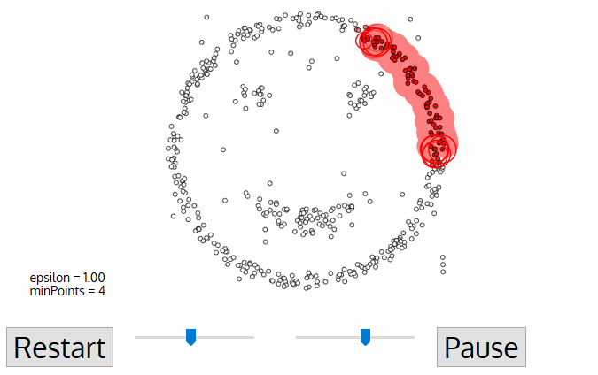
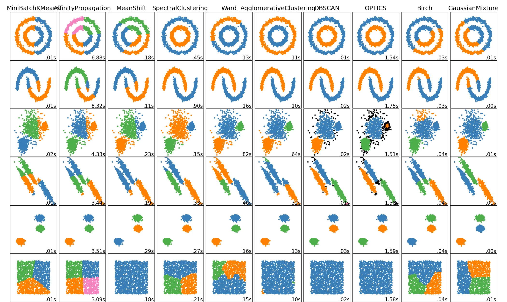

# Density-Based Spatial Clustering of Applications with Noise (DBSCAN)

## 1. 簡介

DBSCAN（Density-Based Spatial Clustering of Applications with Noise）是一種基於密度的聚類算法，適用於發現具有任意形狀的聚類，並能有效處理噪聲數據點。

## 2. 原理

DBSCAN 使用兩個主要參數來進行聚類：

- **Eps（近邻半径）**：決定一個點的鄰域範圍。
- **MinPts（最少核心為基立的點數）**：在 Eps 鄰域內需要至少 MinPts 個點才被認為是核心點。

### 2.1 三種點的類別

1. **核心點（Core Point）**：在其 Eps 鄰域內至少包含 MinPts 個點。
2. **邊界點（Border Point）**：在某個核心點的鄰域內，但自身的鄰域內點數少於 MinPts。
3. **噪聲點（Noise Point）**：既不是核心點，也不是邊界點。

### 2.2 算法步驟

1. 隨機選擇一個未訪問的數據點。
2. 若該點是核心點，則擴展形成一個新簇。
3. 若該點是邊界點，則視為現有簇的一部分或噪聲。
4. 重複步驟 1-3，直到所有點都被訪問過。



## 3. 優勢與劣勢

### 3.1 優勢

- 能夠發現任意形狀的聚類。
- 不需要預先指定聚類數量。
- 能夠有效識別噪聲點。

### 3.2 劣勢

- 參數 Eps 和 MinPts 的選擇較為困難。
- 在高維數據中效果不佳。
- 對於不同密度的聚類表現不理想。

## 4. Python 實現範例

```python
from sklearn.cluster import DBSCAN
import numpy as np
import matplotlib.pyplot as plt

# 生成隨機數據
np.random.seed(0)
data = np.random.rand(100, 2) * 10

# 執行 DBSCAN 聚類
clustering = DBSCAN(eps=1.5, min_samples=5).fit(data)
labels = clustering.labels_

# 可視化結果
plt.scatter(data[:, 0], data[:, 1], c=labels, cmap='viridis', edgecolors='k')
plt.title("DBSCAN Clustering")
plt.show()
```

## 5. 應用場景

- 異常檢測（如信用卡詐欺識別）
- 圖像分割
- 地理數據分析（如客戶群體劃分）
- 社交網絡分析

## 6. 結論

DBSCAN 是一種強大的聚類算法，特別適用於處理具有噪聲的數據和任意形狀的聚類。然而，參數的選擇對於最終結果有較大影響，需要根據數據特性進行調整。

## 7. Cluster 比較



## Reference

- [haifengl/smile ml library](https://github.com/haifengl/smile)
- [不要再用K-means！ 超實用分群法DBSCAN詳解](https://axk51013.medium.com/%E4%B8%8D%E8%A6%81%E5%86%8D%E7%94%A8k-means-%E8%B6%85%E5%AF%A6%E7%94%A8%E5%88%86%E7%BE%A4%E6%B3%95dbscan%E8%A9%B3%E8%A7%A3-a33fa287c0e)
- [DBSCAN java 實作](https://www.cnblogs.com/sunzhenxing19860608/archive/2010/05/30/1747452.html)
- [figure form](https://towardsdatascience.com/the-5-clustering-algorithms-data-scientists-need-to-know-a36d136ef68)
- [2021年資料科學家必備分群法（Clustering）：HDBSCAN簡介](https://axk51013.medium.com/2021%E5%B9%B4%E8%B3%87%E6%96%99%E7%A7%91%E5%AD%B8%E5%AE%B6%E5%BF%85%E5%82%99%E5%88%86%E7%BE%A4%E6%B3%95hdbscan%E7%B0%A1%E4%BB%8B-fba8287e666c)