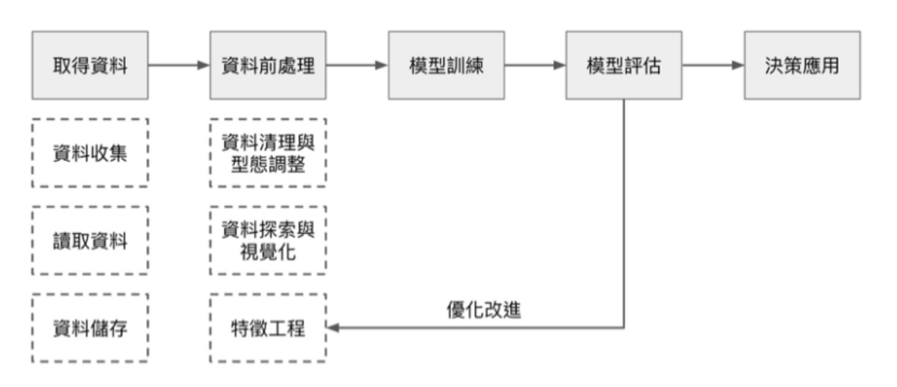

# Data Cleaning

資料清洗（data cleaning）是指對數據集進行處理，以確保其質量和一致性，使其適合用於分析、建模或其他目的。在資料集中檢測和糾正（或刪除）損壞或不準確的記錄進行處理，辨識出資料的不完整、不正確、不準確或不相關部分，然後替換、修改、或刪除髒資料或(raw data)。在人工智慧（AI）和機器學習領域，資料清洗是非常重要的一步，因為高質量的數據是訓練高性能模型的基礎。

正式存入數據庫之前，都要進行「數據清洗」，以確保數據的正確性、一致性、可驗證性、完整性、相依性等等。

## Why Data Cleaning
在強調數據賦能的時代，企業必須開始重視數據資料的可用性。因此在資料蒐集與預先處理上，勢必得花上更多的心力，才能夠進行數據分析，企業才能享有數據所帶來的優勢:

1. **避免資料瑕疵進行誤判**: 在資料的世界中，並沒有想像中的乾淨。常常會出現上述的幾個資料錯誤的情形。因此資料清洗工作就扮演重要的角色，將異常的資料整理過後，確保資料模型有高精準度，提供有意義的分析。
1. **改善決策的過程**: 好的決策是建立在有意義的數據品質上。因此資料清洗的完整度能夠賦予企業更寬廣的決策視野，並且運用高品質的數據分析結果，做出更適合的決定，進而協助企業發展。
1. **開發新的業務與商機**: 資料清洗的最大目的，不外乎是幫助企業從中發現隱藏其中的訊息，或是市場趨勢，找出過往未曾注意到的細節。完整的資料清理有助於企業在市場上開發不同的商機，抑或是將資源重新分配，將效益最大化，進而擴展業務。
1. **提高分析準確性**：清理過的資料更能反映真實情況，有助於提高分析結果的準確性和可靠性。
1. **降低模型錯誤**：輸入質量較高的資料可以減少模型對噪聲的敏感性，降低模型錯誤率。
1. **縮短開發時間**：資料清理有助於減少在後續分析和模型建立過程中遇到的問題，從而縮短開發周期。
1. **提升決策效果**：高品質的資料分析結果可以為決策者提供更可靠的依據，提升決策效果。

## Prepare Data Cleaning
在規劃與處理資料清洗相關作業時，可以注意這七個要素:

1. **確定資料清洗的目標**：首先要評估資料的品質，確定清洗的目標是什麼。前置的工程包含修復缺失或錯誤的資料、去除重複的資料、標準化資料格式等。
1. **制定資料品質標準**：應根據其業務需求和資料使用情境，制定資料品質標準，像是確定資料的準確性、完整性、一致性、唯一性等，並根據這些標準來進行資料清洗。才能確保分析的品質。
1. **建立資料清洗流程**：要建立資料清洗的流程，從資料清洗的順序、方法和技術的選擇，再到不斷修正，展現資料清洗的價值。
1. **選擇適合的工具和技術**：根據對資料分析的需求，選擇合適的工具和技術。常見的資料清洗工具包括OpenRefine、Trifacta、DataWrangler等。
1. **測試和驗證資料清洗結果**：資料清洗作業後，需要進行結果測試和驗證，比對清洗後的資料與原始資料、驗證資料的一致性和準確性，確保符合資料清洗的預期標準。
1. **建立監控機制**：建立資料清洗的監控機制，定期檢查資料的品質，必要時修復和更新資料清洗的步驟和機制，幫助定期維持資料清洗作業的品質。

有了完善的步驟，可以開始規劃資料清洗作業，並挑選合適的工具。

## How Data Cleaning
資料清洗通常包括以下幾個方面：

1. **處理缺失值**：填補或刪除數據集中缺失的值。常用的方法包括平均值填補、中位數填補、眾數填補以及使用更複雜的插值方法。
    - 填充：將缺失值替換為某個常數值，如 0、平均值、中位數、眾數等。
    - 插值：根據已有的資料對缺失值進行估算，如使用時間序列資料中的前後值進行線性插值。
    - 刪除：若缺失值占比較低，且不影響分析結果，可以直接刪除缺失值所在的樣本。
1. **去除重複數據**：刪除數據集中重複的記錄，以防止影響分析結果或訓練模型的準確性。
1. **處理異常值**：識別並處理不合理或極端的數值(離群值)，這些異常值可能是由於數據輸入錯誤或其他原因引起的。常見的方法包括刪除異常值或將其替換為合理的值。
    - 統計方法：如基於標準差或四分位數範圍（IQR）檢測異常值。
    - 機器學習算法：如聚類算法、異常檢測算法等。
    - 在統計學上，資料的分佈超過整體資料的1.5倍標準差（Standard Deviation）即稱為離群值（Outliers），而多數研究人員會優先踢出超過3倍標準差的資料，或使用常態分佈轉換技巧來進行調整
1. **格式統一**：確保所有數據的格式一致，例如日期格式、單位轉換等，以便進行統一處理和分析。
1. **數據標準化**：對數據進行縮放或變換，使其符合某些統計標準，這對於某些機器學習算法非常重要，例如距離度量算法。
1. **處理文本數據**：對文本數據進行清理和預處理，包括去除停用詞、詞幹提取、詞形還原、去除標點符號等。
1. **糾正錯誤數據**：識別並糾正數據中的錯誤，如拼寫錯誤、邏輯錯誤等。
1. **處理分類數據**：將分類數據轉換為數值數據，例如使用獨熱編碼（One-Hot Encoding）將類別變量轉換為二進制變量。
1. **特徵選擇**：從原始特徵中選擇對分析或建模最具有意義的特徵，可以降低計算複雜度，提高模型效果。常用的特徵選擇方法包括:
    - 過濾法（Filter）：根據特徵和目標變數之間的關聯性進行特徵選擇。
    - 包裝法（Wrapper）：將特徵選擇作為搜索問題，通過訓練模型並評估性能來選擇特徵。
    - 嵌入法（Embedded）：利用機器學習算法的特性，自動進行特徵選擇，如正則化方法。

## ref:
- https://tw.alphacamp.co/blog/data-cleaning
- https://tw.alphacamp.co/blog/data-processing-and-data-cleaning
- https://www.nextlink.cloud/news/data-cleansing-introduction/
- https://mattdataadventures.com/data_cleaning_preprocessing/
- https://en.wikipedia.org/wiki/Data_cleansing