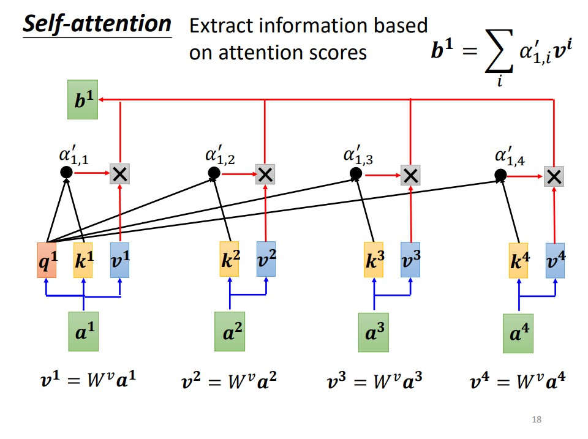

# Self-Attention 機制介紹與實作範例

## Self-Attention 是什麼？

Self-Attention 是一種深度學習中的注意力機制，能夠讓模型聚焦於輸入序列的不同部分，並且依據序列間的相關性調整輸出表示。這一機制在自然語言處理（NLP）和計算機視覺（CV）中有廣泛應用，尤其是 Transformer 架構的核心組件。

---

## Self-Attention 的核心原理



### Query、Key 和 Value 的概念

在 Self-Attention 中，每個輸入元素 $x_i$ 被投影到三個向量空間：
- **Query ($Q$)**：表達當前元素的查詢。
- **Key ($K$)**：表達每個元素的特徵。
- **Value ($V$)**：表達每個元素的值。

這三者可以透過線性變換獲得：

$$
Q = XW_Q, \quad K = XW_K, \quad V = XW_V
$$

其中 $W_Q$, $W_K$, $W_V$ 是可學習的權重矩陣。

---

### Attention Scoring 的計算

對於任意一個輸入元素，其與其他元素的相關性通過 Query 和 Key 的內積計算：

$$
\text{Score}(Q_i, K_j) = Q_i \cdot K_j^T
$$

計算得到的相關性矩陣稱為 **Attention Scores**。


---

### Softmax 的作用

為了將注意力分數轉化為概率分佈，使用 Softmax 函數：

$$
\alpha_{ij} = \frac{\exp(\text{Score}(Q_i, K_j))}{\sum_{k=1}^n \exp(\text{Score}(Q_i, K_k))}
$$

這樣可以保證所有相關性分數的總和為 1。

---

### Scaled Dot-Product Attention

為了防止內積值過大導致梯度不穩定，Attention Score 通常會縮放：

$$
\text{Attention}(Q, K, V) = \text{Softmax}\left(\frac{QK^T}{\sqrt{d_k}}\right)V
$$

其中 $d_k$ 是 Key 的維度。

---

## Self-Attention 架構詳解

### Scaled Dot-Product Attention

Scaled Dot-Product Attention 是 Self-Attention 的基礎計算模塊，步驟如下：
1. 計算 Query 和 Key 的內積，生成相關性矩陣。
2. 使用 Softmax 函數轉化為權重分佈。
3. 將權重分佈乘以 Value 獲得輸出。

### Multi-Head Attention

Multi-Head Attention 是將多個 Scaled Dot-Product Attention 並行計算，每個頭學習不同的特徵分佈：

$$
\text{MultiHead}(Q, K, V) = \text{Concat}(\text{head}_1, \dots, \text{head}_h)W_O
$$


其中每個頭的計算公式為：

$$
\text{head}_i = \text{Attention}(QW_{Q_i}, KW_{K_i}, VW_{V_i})
$$

---

## Self-Attention 的優勢與局限

### 優勢
1. **全局視野**：考慮整個序列的全局關係。
2. **並行性**：相比 RNN，Self-Attention 可以並行計算。

### 局限
1. **計算成本高**：注意力矩陣的計算是 $O(n^2)$。
2. **對長序列不友好**：長序列時內存需求會迅速增加。

---

## 實作範例

### PyTorch 實現 Self-Attention

```python
import torch
import torch.nn as nn

class SelfAttention(nn.Module):
    def __init__(self, embed_size, heads):
        super(SelfAttention, self).__init__()
        self.embed_size = embed_size
        self.heads = heads
        self.head_dim = embed_size // heads

        assert self.head_dim * heads == embed_size, "Embedding size must be divisible by heads"

        self.values = nn.Linear(self.head_dim, self.head_dim, bias=False)
        self.keys = nn.Linear(self.head_dim, self.head_dim, bias=False)
        self.queries = nn.Linear(self.head_dim, self.head_dim, bias=False)
        self.fc_out = nn.Linear(embed_size, embed_size)

    def forward(self, values, keys, queries, mask):
        N = queries.shape[0]
        value_len, key_len, query_len = values.shape[1], keys.shape[1], queries.shape[1]

        values = values.reshape(N, value_len, self.heads, self.head_dim)
        keys = keys.reshape(N, key_len, self.heads, self.head_dim)
        queries = queries.reshape(N, query_len, self.heads, self.head_dim)

        energy = torch.einsum("nqhd,nkhd->nhqk", [queries, keys])
        if mask is not None:
            energy = energy.masked_fill(mask == 0, float("-1e20"))

        attention = torch.softmax(energy / (self.embed_size ** (1/2)), dim=3)
        out = torch.einsum("nhql,nlhd->nqhd", [attention, values])
        out = out.reshape(N, query_len, self.embed_size)
        return self.fc_out(out)
```

---

### TensorFlow 實現 Self-Attention

```python
import tensorflow as tf

class SelfAttention(tf.keras.layers.Layer):
    def __init__(self, embed_size, heads):
        super(SelfAttention, self).__init__()
        self.embed_size = embed_size
        self.heads = heads
        self.head_dim = embed_size // heads

        assert self.head_dim * heads == embed_size, "Embedding size must be divisible by heads"

        self.values = tf.keras.layers.Dense(self.head_dim)
        self.keys = tf.keras.layers.Dense(self.head_dim)
        self.queries = tf.keras.layers.Dense(self.head_dim)
        self.fc_out = tf.keras.layers.Dense(embed_size)

    def call(self, values, keys, queries, mask):
        batch_size = tf.shape(queries)[0]

        values = tf.reshape(values, (batch_size, -1, self.heads, self.head_dim))
        keys = tf.reshape(keys, (batch_size, -1, self.heads, self.head_dim))
        queries = tf.reshape(queries, (batch_size, -1, self.heads, self.head_dim))

        energy = tf.einsum('nqhd,nkhd->nhqk', queries, keys)
        if mask is not None:
            energy += (mask * -1e9)

        attention = tf.nn.softmax(energy / (self.embed_size ** (1/2)), axis=-1)
        out = tf.einsum('nhql,nlhd->nqhd', attention, values)
        out = tf.reshape(out, (batch_size, -1, self.embed_size))
        return self.fc_out(out)
```

---

## Reference

- [Attention is All You Need (Vaswani et al.)](https://arxiv.org/abs/1706.03762)
- [Illustrated Transformer](https://jalammar.github.io/illustrated-transformer/)
- [李宏毅教授 - 自注意力機制 (Self-attention) (上)](https://www.youtube.com/watch?v=hYdO9CscNes&ab_channel=Hung-yiLee)
- [李宏毅教授 - 自注意力機制 (Self-attention) (下)](https://www.youtube.com/watch?v=gmsMY5kc-zw&ab_channel=Hung-yiLee)
- [李宏毅教授 - 自注意力機制 (Self-attention) slides](https://speech.ee.ntu.edu.tw/~hylee/ml/ml2021-course-data/self_v7.pdf)
- [李宏毅教授 - Recurrent Neural Network (Part I)](https://www.youtube.com/watch?v=xCGidAeyS4M&ab_channel=Hung-yiLee)
- [Long Range Arena: A Benchmark for Efficient Transformers](https://arxiv.org/abs/2011.04006)
- [Efficient Transformers: A Survey](https://arxiv.org/abs/2009.06732)