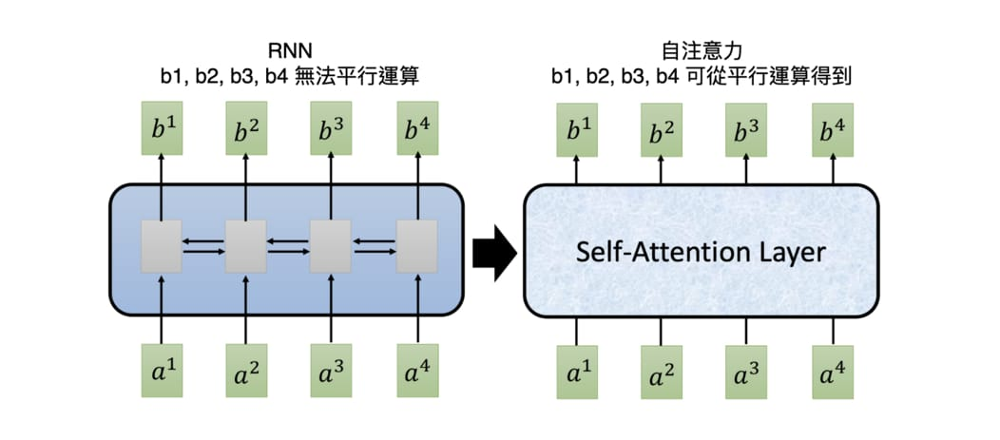
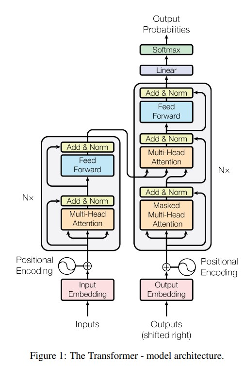

# Transformer

Transformers 是一種基於**注意力機制**的深度學習架構，由 Vaswani 等人在 2017 年提出，最初設計用於自然語言處理（NLP）任務。其核心創新是引入了 **Self-Attention 機制**，使得模型可以在處理文本時同時考慮上下文。

## Transformers 的特性

1. **並行化**：相比於 RNN 的序列處理，Transformers 利用並行處理技術，大幅提高了訓練速度 (參考下圖)。
2. **靈活性**：能夠處理多種輸入數據格式（如文本、圖像、音頻）。
3. **可擴展性**：容易擴展到大規模模型，如 GPT、BERT 等。

## 結構概述

Transformers 的架構由兩個主要部分組成：

- **編碼器（Encoder）**：提取輸入數據的高層次特徵。
- **解碼器（Decoder）**：將這些特徵轉化為目標輸出。

典型的編碼器包含：

- 多頭自注意力（Multi-Head Self-Attention）
- 前饋神經網絡（Feed-Forward Neural Network）

解碼器則在此基礎上引入**編碼器-解碼器注意力（Encoder-Decoder Attention）**。

## Transformer 流程

以 Transformer 實作的 NMT 系統基本上可以分以下步驟：

1. Encoder 為輸入序列裡的每個詞彙產生初始的 repr. （即詞向量），以空圈表示
2. 利用自注意力機制將序列中所有詞彙的語義資訊各自匯總成每個詞彙的 repr.，以實圈表示
3. Encoder 重複 N 次自注意力機制，讓每個詞彙的 repr. 彼此持續修正以完整納入上下文語義
4. Decoder 在生成每個法文字時也運用了自注意力機制，關注自己之前已生成的元素，將其語義也納入之後生成的元素
5. 在自注意力機制後，Decoder 接著利用注意力機制關注 Encoder 的所有輸出並將其資訊納入當前生成元素的 repr.
6. Decoder 重複步驟 4, 5 以讓當前元素完整包含整體語義

## Transformers 的應用

1. **自然語言處理（NLP）**

   - 語言模型（如 GPT-3、BERT）
   - 機器翻譯（如 Google Translate）
   - 聊天機器人（如 ChatGPT）

2. **計算機視覺（CV）**

   - 物體檢測與分割（如 ViT, DETR）
   - 圖像生成（如 DALL·E）

3. **多模態 AI**

   - 文本與圖像生成（如 CLIP）
   - 多模態搜索引擎

4. **其他領域**
   - 生物醫學（如 AlphaFold 預測蛋白質結構）
   - 時序分析（如金融預測）

## References

- [原始論文: Attention Is All You Need](https://arxiv.org/abs/1706.03762)
- [Hugging Face 官方文檔](https://huggingface.co/transformers/)
- [李宏毅教授 - Transformer](https://www.youtube.com/watch?v=ugWDIIOHtPA&ab_channel=Hung-yiLee)
- [淺談神經機器翻譯 & 用 Transformer 與 TensorFlow 2 英翻中](https://leemeng.tw/neural-machine-translation-with-transformer-and-tensorflow2.html)
- [The Illustrated Transformer](https://jalammar.github.io/illustrated-transformer/)
- [跟李沐学AI - Transformer论文逐段精读](https://www.youtube.com/watch?v=nzqlFIcCSWQ&ab_channel=%E8%B7%9F%E6%9D%8E%E6%B2%90%E5%AD%A6AI)
