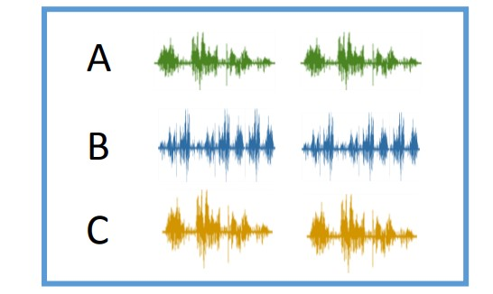

# Speaker Verification

Speaker verification is the verifying the identity of a person from characteristics of the voice.
說話者辨識是根據聲音特徵來辨識一個人。用來回答「誰在說話？」的問題。語音辨識這個名詞可指說話者辨識或語音辨識。說話者驗證（也稱為說話者身份驗證）與識別不同，說話者識別不同於說話者分類（識別同一說話人 ​​ 何時說話）。

## Task Introduction

- Speaker Recognition / Identification
  - 語者識別
  - 一段語音是誰所說的
    
    
- Speaker Verification
  - 語者驗證
  - 兩段語音是否為同一人所說
    
- Speaker Diarization
  - 語者分段標記
  - 在一段語音中，誰在何時說話
    

## speaker diarization

speaker diarization 是記錄不同說話者在一段口語音訊中輪流說話的時間戳的過程。下圖顯示了音訊時間線，並標註了不同揚聲器可聽到的區域。

### Classic diarization approach 問題

說話者分類的經典方法遵循`無人監督的過程`。然而，這種方法存在許多問題。首先，典型的聚類方法（例如譜聚類）利用聚類之間的非重疊假設，這使得重疊檢測成為一個額外的步驟，並使整個演算法變得複雜。其次，需要預先指定簇的總數，這可能具有挑戰性。第三，計算嵌入的過程通常利用特定於語言的線索，例如音訊的轉錄。這種依賴語言的嵌入很難擴展到多種語言。

`二值化的監督演算法`，並且使用標記資料進行端到端訓練。然而，這些演算法也有其自身的挑戰。例如，訓練資料集通常是不平衡的，這可能會導致對特定年齡、性別或種族的偏見，並可能導致不公平的預測。為了解決這個問題，訓練資料集必須平衡說話者的許多屬性（年齡、性別、種族等）。對於播客等現實場景中的二值化應用，還需要針對不同類別和格式的內容平衡訓練資料。平衡是很困難的，因為它會呈指數級增長資料集。最後，由於二值化資料的註釋，準備監督訓練資料集可能既昂貴又耗時。

## Reference

- [speaker-verification paperswithcode](https://paperswithcode.com/task/speaker-verification)
- [李宏毅 Speaker Verification](<https://speech.ee.ntu.edu.tw/~tlkagk/courses/DLHLP20/Speaker%20(v3).pdf>)
- [Unsupervised Speaker Diarization using Sparse Optimization](https://research.atspotify.com/2022/09/unsupervised-speaker-diarization-using-sparse-optimization/)