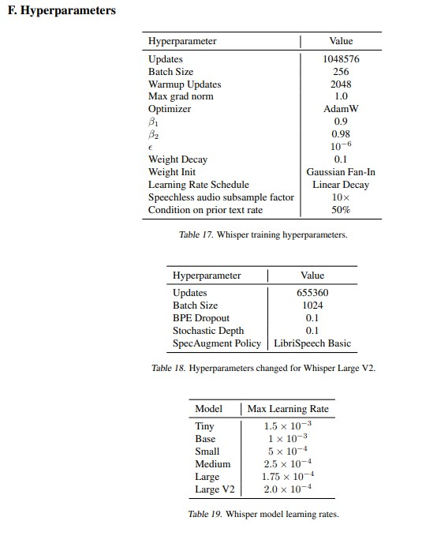
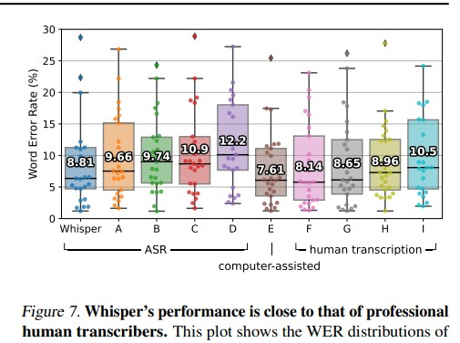
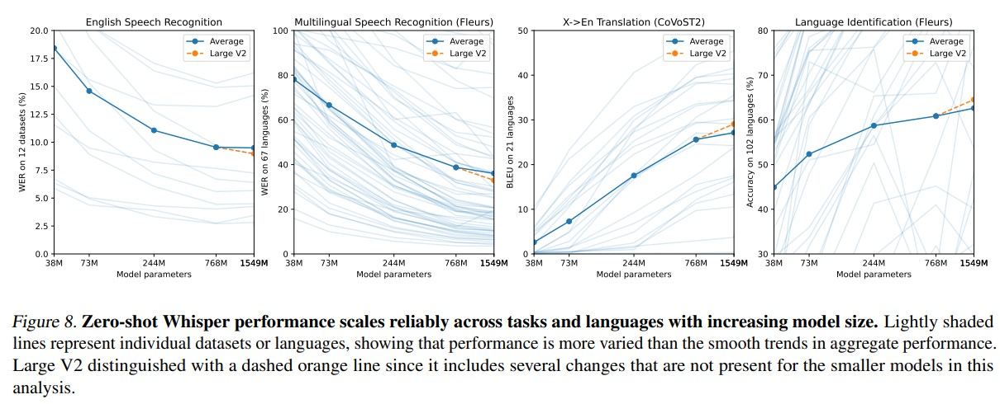
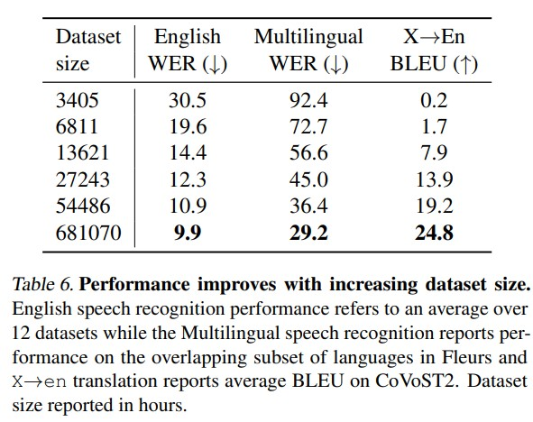
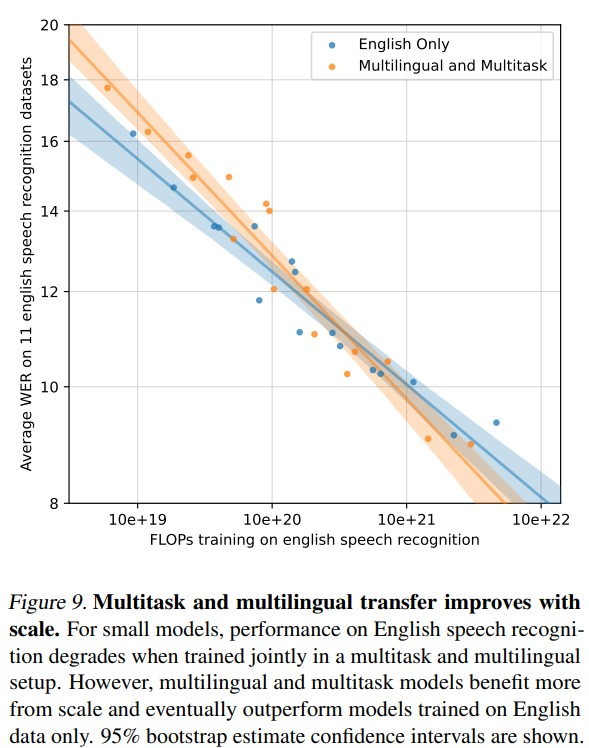
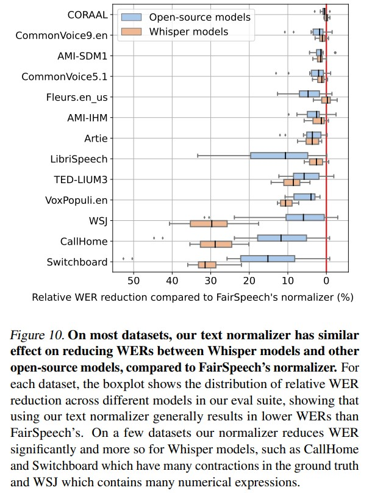
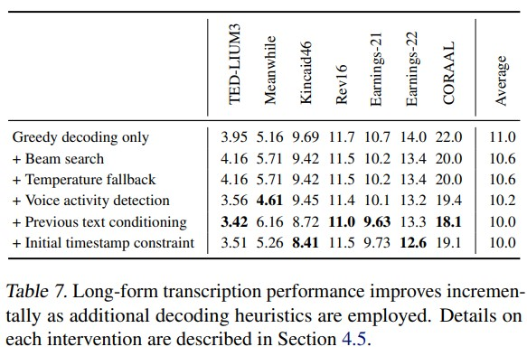

# Robust Speech Recognition via Large-Scale Weak Supervision

## 1. 簡介

目前大規模基於純語音預訓練模型取得了很好的發展。 （wav2vec2, et al.）

但作者的認為語音識別系統的目標應該在通義環境下做到開箱即用，而不是需要針對於每個數據集，設置一個特定的解碼器，來進行帶監督的微調

    “ The goal of a speech recognition system should be to work reliably “out of the box” in a broad range of environments without requiring supervised fine-tuning of a decoder for every deployment distribution “

### 依然存在的挑战
- 缺乏高品質監督資料集：提供給語音辨識系統的監督資料集非常少，拼接起來也只有5000多個小時，很難達到無監督學習那樣的百萬小時等級。

- 已有工作在探索使用帶有噪音的監督語音辨識資料集進行預訓練。說明，權衡品質與數量是一個不錯的探索的方向。 朝著這個方向發散，在電腦視覺中的一些研究也證明了，透過大規模的弱監督的數據集，可以顯著提高模型的穩健性和泛化性。

這篇論文的主題是通過大規模弱監督資料來增強語音識別系統的穩健性。弱監督學習是一種利用部分標註或無標註資料進行訓練的方法，可以有效降低資料標註成本並提升模型的泛化能力。

## 2. 方法
為解決上述問題，所提出的Whisper 突顯出以往的工作都是往往需要收集特定的語音辨識資料集進行有監督的學習，Whisper證明了，不需要做這些複雜的工作，透過足夠大規模的弱監督學習，就可以實現一個非常有強的語音辨識模型。

這部分詳細介紹了所提出的方法，分為資料收集與預處理、模型結構和訓練策略。

### 資料收集與預處理
- 資料來源：研究者從多種來源收集語音資料，包括網絡上的公開數據集。這些資料來源多樣，包含了不同的語言、口音和噪音環境。
一共收集了680,000小時的音訊，Of those 680,000 hours of audio, 117,000 hours cover 96 other languages. The dataset also includes 125,000 hours of X→en translation data.

- 資料預處理：
    
    數據部分是本文最核心的貢獻。由於數據夠多，模型夠強，本文模型直接預測原始文本，而不經過任何標準化（standardization）。而模型的輸出就是最終辨識結果，而無需經過反向的文字歸一化（inverse text normalization）後處理。所謂文字歸一化包括如將所有單字變小寫，所有簡寫展開，所有標點去掉等操作，而反向文字歸一化就是上述操作的反過程。在 Whisper 中，這些操作統統不用，因為資料足夠多，可以覆蓋所有的情況。

    在本文收集的語音數據中，包含了不同環境、不同語言、不同說話者等多樣的數據，這有助於訓練出文件的語音辨識系統。然而，文本標籤的多樣性對模型的學習是一種阻礙。為了解決這個問題，本文使用了幾種自動過濾方法，來提高文字標籤的品質。

    - 過濾機器產生的標籤資料 : 收集自網路的語音辨識數據，很有可能文字標籤就是來自現有的語音辨識系統的辨識結果(ASR)。先前有研究工作表明，在訓練資料中混有機器產生的標籤資料會損害模型的效能。為此，本文根據機器辨識結果的一些特點，過濾掉了這些數據。

    - 過濾語音與文本語言不同 : 對資料中語音所屬語言和文字所屬語言進行偵測。聲音檢測模型為 **"which was created by fine-tuning a prototype model trained on a prototype version of the dataset on VoxLingua107 (Valk & Alumae¨ , 2021)"**。文本檢測模型為 **"CLD2"**。如果文字是非英語的其他語言，則要求語音也必須是同一種語言；如果文字是英語，則語音可以是任何語言（因為本文方法中有一個其他語言到英語的翻譯任務）。

    - 過濾重複資料 : 可能在收集的資料中含有標準語音辨識資料集中的內容，為了避免對測試結果產生影響，這部分資料同樣需要去除。

    - 額外過濾 : 以一個語音辨識模型在收集的數據上進行測試，發現在一些錯誤率極高的數據中，存在音頻資訊不完整、字幕聲音不匹配等低品質數據，這些數據同樣會被過濾掉。

    最後，將音頻切分為 30s 的片段，配上對應文本，得到訓練資料。

### 模型結構
- 模型架構：Whisper 使用的模型改動不大，就是 Transformer 第一次提出時的 encoder-decoder 架構。
- 音頻輸入：All audio is re-sampled to 16,000 Hz, and an 80-channel logmagnitude Mel spectrogram representation is computed on 25-millisecond windows with a stride of 10 milliseconds.
- Input shape： (3000,80) 30S/10ms = 3,000, Zero mean [-1,1]
- 訓練過程： 3000x80 的輸入資料先經過兩個 1D 卷積層，得到 1500x80 的特徵。利用卷積層以保留細微的局部特徵又能降低運算量
後面的處理就是標準的 Transformer encoder-decoder結構了。將這個特徵送入到 Transformer encoder 中，提取處的特徵作為交叉注意力輸入送給 decoder。 decoder 每次預測下一個 token，其輸入是對應多任務學習的一些預設 token 和 prompt。
- tokenizer：use the same byte-level BPE text tokenizer used in GPT2 (Sennrich et al., 2015; Radford et al., 2019) for the Englishonly models and refit the vocabulary (but keep the same size)
for the multilingual models to avoid excessive fragmentation on other languages since the GPT-2 BPE vocabulary is
English only.

- training detail：using FP16, Models were trained with AdamW and gradient norm clipping, batch size of 256 segments was used, between two and three passes over the dataset

- Hyperparameters：
    

### Multitask 
Whisper 模型共處理四個任務，如圖左上所示。
1. language detection
1. voice activity detection(VAD): 給定只有背景音樂的音頻，辨識出無人說話。
1. speech transcribe: 給定該語言語音，轉錄成該語言文本
1. speech translate: 給定語言語音(非英文)，轉錄並翻譯成英文文本

所有這些任務都由解碼器預測的 token 序列表示，這使得一個模型能夠處理多個任務。這幾個任務及模型輸出 token 的關係可以從圖中下方的圖示中的 token 序列看出：在 START OF TRANSCRIPT token 之後，如果當前無人說話，則識別為 NO SPEECH 。如果有人說話，則辨識出目前語音所屬的語言 LANGUAGE TAG 。然後有兩種可能的任務 TRANSCRIBE 還是翻譯任務 TRANSLATE ，這兩種任務又分為兩種形式：帶時間戳的和不帶時間戳的，分別穿插或不穿插時間戳 token ，預測出文本 token。最後到達 EOT token，整個流程結束。

## 3. 實驗與結果
這部分展示了所提方法在不同資料集上的實驗結果，並進行了詳細的分析。

### 資料集與評估指標
Whisper 是沒有在其他人工標註的語音辨識資料集上訓練的，也就是 zero-shot 的設定。而對比的方法都是在這些資料集上訓練過的，因此，要達到與它們持平的效能也是不容易的。

語音辨識常用的評估指標是字詞錯誤率（Word Error Rate, WER）。即預測結果和目標結果的編輯距離除以句長。
為了能更公平的與其他model比較，有針對輸出額外做處理才評估WER(詳細處理於論文附錄C)

### 實驗結果
在各個結果比較中，Whisper顯示出有著較高的robustness，且該架構設計也能符合訓練集越多該語言效果越好的趨勢，且在SNR在15時還是有不錯的表現。

整體Performance大約與人類相同。

## 4. Analysis
此部分解析了模型架構上的各個改變及其效果變化

- Model Scaling
    
- Dataset Scaling
    
- Multitask and Multilingual Transfer
    
-  Text Normalization -> section 4.5
    
-  Strategies for Reliable Long-form Transcription
    

## 5. Limitations and Future Work
- Improved decoding strategies.
- Increase Training Data For Lower-Resource Languages : most languages have
less than 1000 hours of training data.
- Studying fine-tuning
- Studying the impact of Language Models on Robustness
- Adding Auxiliary Training Objectives

## 6. 結論
論文總結了使用大規模弱監督資料進行語音識別的有效性，指出這種方法在提升模型準確性和魯棒性方面具有顯著優勢。這為未來的語音技術研究提供了新的方向和方法。
只要有了數據夠多的情況時，不用特別改變模型架構能夠獲得與其他效果相同。
但計算量太大，沒有進行模型進行優化。
語音內容大多訓練於正確的語音，但實際應用情境中會有口誤、口急、停頓等等情況，在這時候會辨識能力不佳。

## Reference
- [whisper.pdf (paper)](https://cdn.openai.com/papers/whisper.pdf)
- [OpenAI Whisper 精读【论文精读】-跟李沐学AI](https://www.youtube.com/watch?v=gDU43QgvewI)
- [Mel Spectrogram](https://medium.com/analytics-vidhya/understanding-the-mel-spectrogram-fca2afa2ce53)