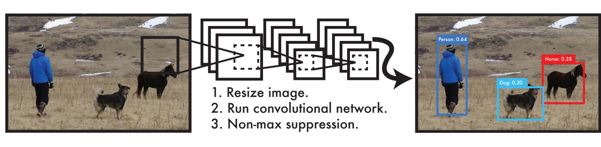
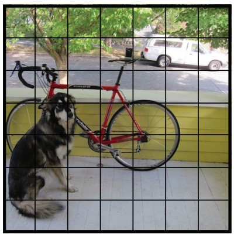
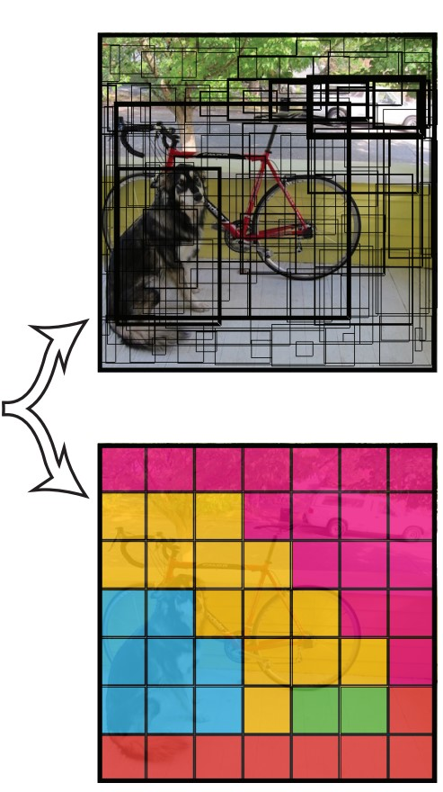
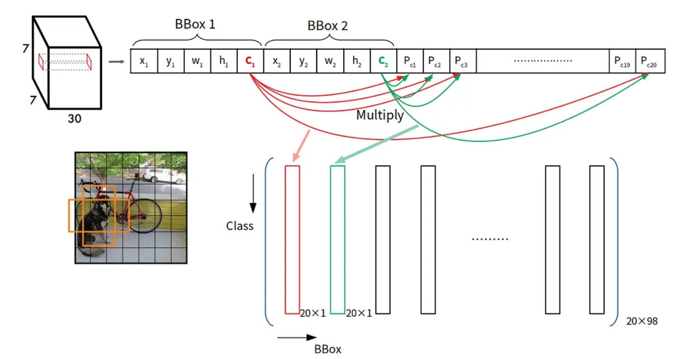

# YOLO: Real-Time Object Detection
You only look once (YOLO) is a state-of-the-art, real-time object detection system. On a Pascal Titan X it processes images at 30 FPS and has a mAP of 57.9% on COCO test-dev.  

[Demo link (YOLOv3)](https://www.youtube.com/watch?v=MPU2HistivI&ab_channel=JosephRedmon)

## YOLO Detection System

### Processing images with YOLO is simple and straightforward.
1. resizes the input image to 448 × 448
1. runs a single convolutional network on the image
1. thresholds the resulting detections by the model’s confidence.

## Unified Detection

    YOLO 將圖像切成 𝑆×𝑆 個網格，如果物件的中心位於某一個網格內，則由此網格負責此物件的偵測。  

    每一個格子各自預測5個邊界框(bounding box)及其對應的信心分數(confidence score)。也會預測該格為何種物體。  

    下圖為例，分別預測出邊界框及該格物體。(邊界框越粗代表信心分數越高)。
  

    輸出矩陣如下

   
    

## YOLO Detection System

## Reference
- https://pjreddie.com/darknet/yolo/
- https://pjreddie.com/media/files/papers/yolo.pdf
- https://hackmd.io/@allen108108/r1-wSTAjS
- https://ivan-eng-murmur.medium.com/object-detection-s4-yolo-v1%E7%B0%A1%E4%BB%8B-f3b1c7c91ed