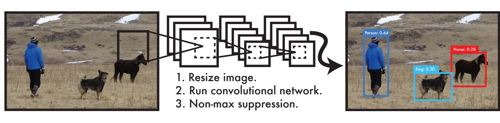
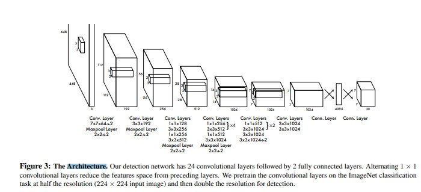
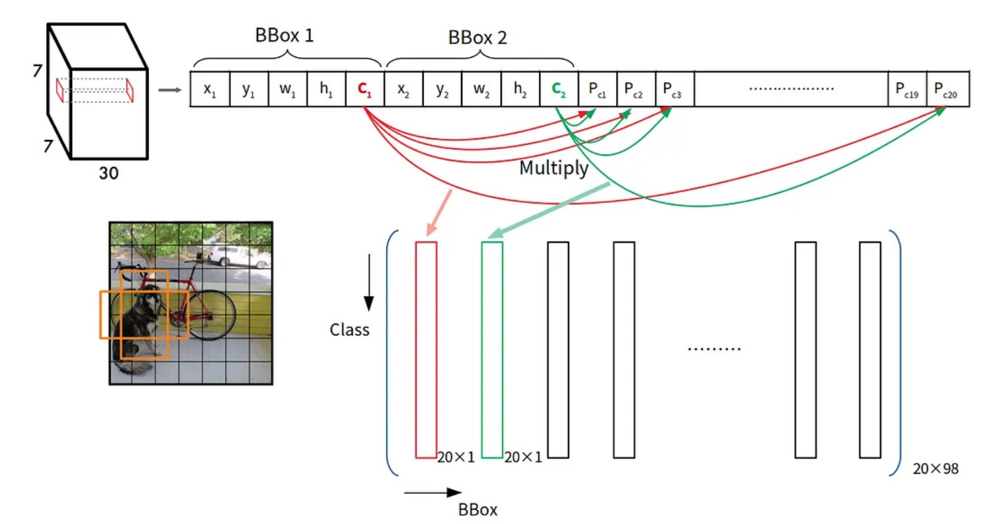
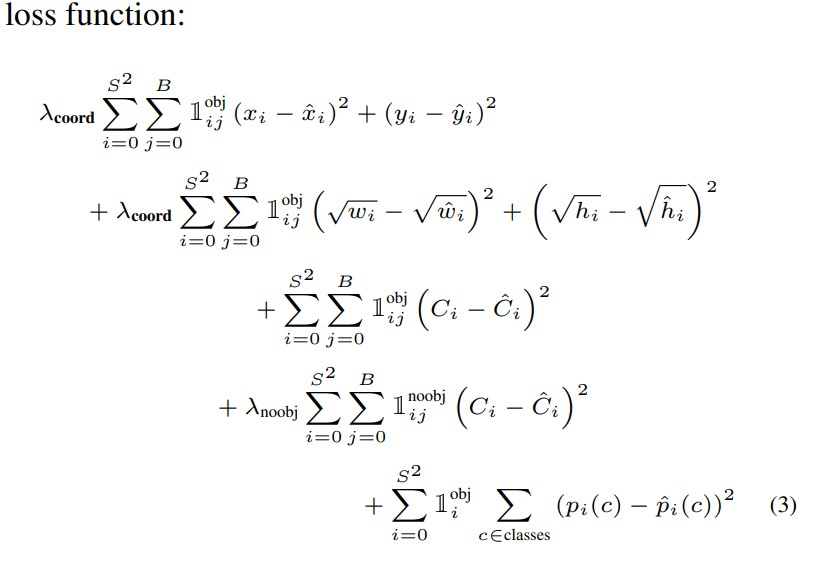

# YOLO: Real-Time Object Detection

You only look once (YOLO) is a state-of-the-art, real-time object detection system. On a Pascal Titan X it processes images at 30 FPS and has a mAP of 57.9% on COCO test-dev.

[Demo link (YOLOv3)](https://www.youtube.com/watch?v=MPU2HistivI&ab_channel=JosephRedmon)

## YOLO Detection System

### Processing images with YOLO is simple and straightforward.

1. resizes the input image to 448 × 448
1. runs a single convolutional network on the image
1. thresholds the resulting detections by the model’s confidence.

## Network Architecture

## Unified Detection

    YOLO 將圖像切成 𝑆×𝑆 個網格，如果物件的中心位於某一個網格內，則由此網格負責此物件的偵測。

    每一個格子各自預測5個邊界框(bounding box)及其對應的信心分數(confidence score)。也會預測該格為何種物體。

    下圖為例，分別預測出邊界框及該格物體。(邊界框越粗代表信心分數越高)。

    輸出矩陣如下

## Training

- **Pretain:**

  YOLO 作者用 ImageNet 1000-class competition dataset 來 pretrain 模型，但作者只訓練前 20 卷積層(paper Figure 3)後面接上一個 average-pooling layer 和一個全連結層(top-5 accuracy 為 88%)。

- **Bounding Box 正規化:**

  YOLO 的最後一層預測的是類別機率和 bounding box 等
  在 YOLO 訓練前會先依據輸入圖的長寬，正規化(normalize)bounding box 的長寬，因此 bounding box 的長寬會介於 0~1 之間。
  Bounding box 的中心座標(x,y)是在特定 grid cell 的偏移(offset)，所以座標也會介於 0~1 之間。

- **Activation function:**

  整個 YOLO 架構除了最後一層用線性輸出為，每一層都會搭配 leaky rectified linear activation (leaky ReLU)

- **Loss function:**

  一般都用平方誤差和(sum-squared error)當作 loss function。作者認為此方法不能完美校正去最大化目標的平均精度(average precision)，主要原因是每項目的 error(比如 bounding box 的定位誤差(localization error)和分類的誤差(class error))都佔有一樣的比重，所以結果不太好(猜作者應該是試過 equal weight，所以他在文章寫 in every image many grid cells do not contain any object.)，而且物件偵測多數情況，大多數的 grid cell 內是沒有物件的(在梯度求解的時候容易將有物件的 cell 壓過去)，所以容易導致 confidence 幾乎趨近於 0，也因為如此容易造成模型不穩定。

  為了解決這個問題:

  1. 增加了在 bounding box 座標預測的 loss 權重 (λcoord=5)
  2. 減低那些不包含物件的 Box，confidence 預測時的權重(λnoobj=0.5)

  

## YOLO 的缺點及問題

以下是對於 YOLO 在目標檢測方面的一些缺點及問題的統整：

1. **空間限制**：

   - YOLO 模型具有強烈的空間限制，每個網格單元最多只能預測兩個邊界框和一個類別。這導致在網格單元中，如果存在兩個以上的物體（例如，聚集的小物件如鳥群），模型將無法有效地檢測到所有物體，從而造成漏檢。

2. **對新物體的泛化能力差**：

   - YOLO 模型依賴於訓練資料來學習邊界框的預測，因此對於未見過的、比例異常的物體（例如，奇怪的長寬比），模型的預測能力會受到限制。這主要是因為 YOLO 模型在多層降維後，使用較粗糙的特徵來進行邊界框的預測，導致對於原始圖像的空間信息的損失。

3. **對不同大小邊界框的損失反應不佳**：
   - YOLO 的損失函數對於小物件和大物件的邊界框使用相同的比重進行計算，但在實際情況下，小物件的定位誤差對 IoU 的影響更為顯著。相較之下，大物件的定位誤差對 IoU 的影響較小，這使得整體誤差的來源主要集中在定位誤差上，未能有效區分不同大小物件的誤差影響。

### 總結

YOLO 雖然是一個高效的實時目標檢測模型，但其在處理聚集小物件、泛化到新物體以及對不同大小邊界框的反應等方面存在明顯的不足。這些缺點限制了其在某些應用場景中的表現，尤其是在需要高準確度和細粒度檢測的情況下。

## Android sample

### [natanielruiz/android-yolo](https://github.com/natanielruiz/android-yolo)

## Tensorflow sample

### [yolo-v1-tensorflow](https://github.com/Ayaa17/yolo-v1-tensorflow)

## Reference

- [yolo website](https://pjreddie.com/darknet/yolo/)

- [Paper - You Only Look Once: Unified, Real-Time Object Detection](https://pjreddie.com/media/files/papers/yolo.pdf)

- [[論文] 概要](https://hackmd.io/@allen108108/r1-wSTAjS)

- [[物件偵測] S4: YOLO v1 簡介](https://ivan-eng-murmur.medium.com/object-detection-s4-yolo-v1%E7%B0%A1%E4%BB%8B-f3b1c7c91ed)

- [YOLO - Tommy Huang](https://chih-sheng-huang821.medium.com/%E6%B7%B1%E5%BA%A6%E5%AD%B8%E7%BF%92-%E7%89%A9%E4%BB%B6%E5%81%B5%E6%B8%AC-you-only-look-once-yolo-4fb9cf49453c)

- [erhwenkuo/deep-learning-with-keras-notebooks](https://github.com/erhwenkuo/deep-learning-with-keras-notebooks)

- [YOLOv1-v4](https://hackmd.io/@ZZ/yolov1-3)