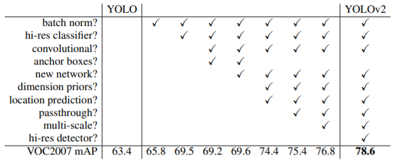
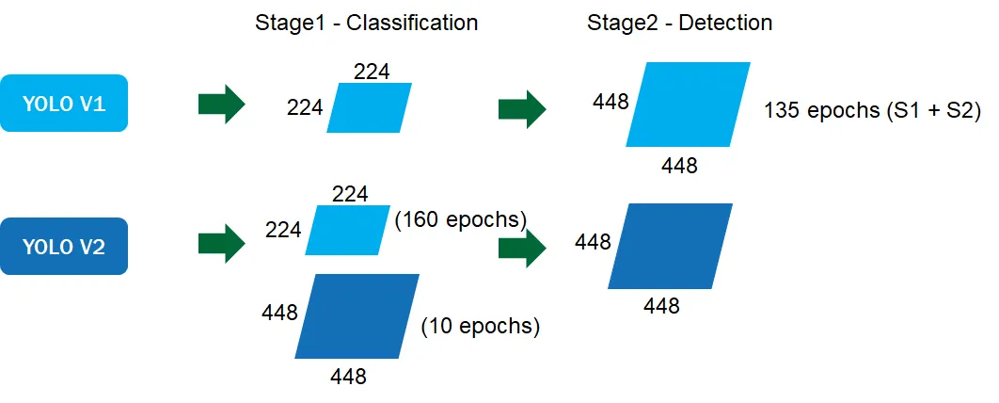
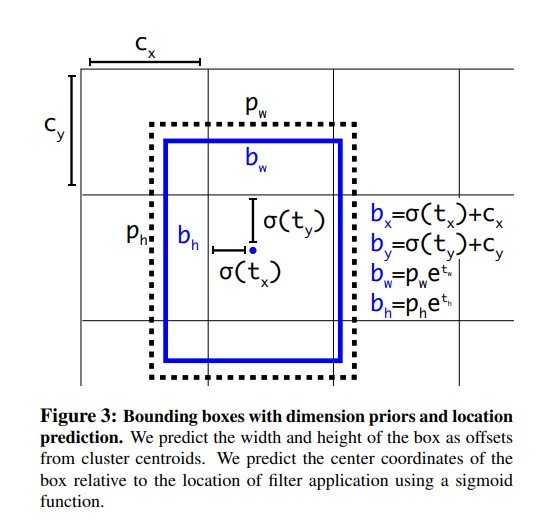
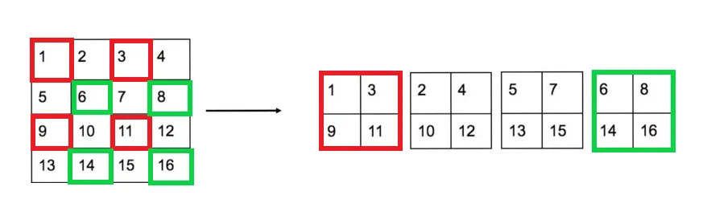
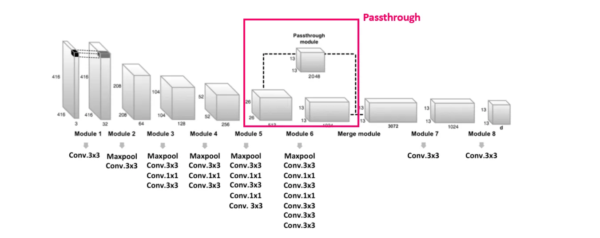
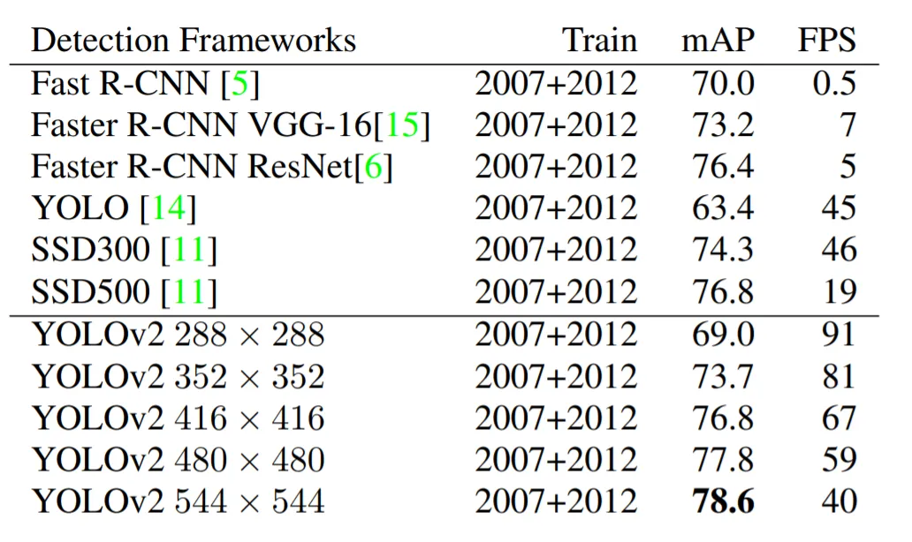
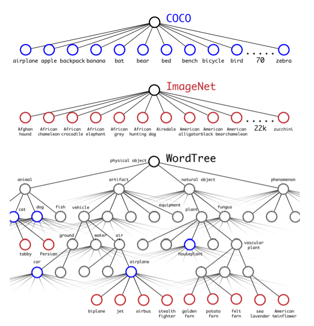
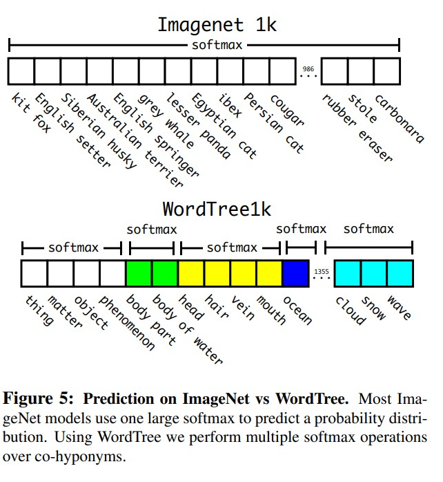
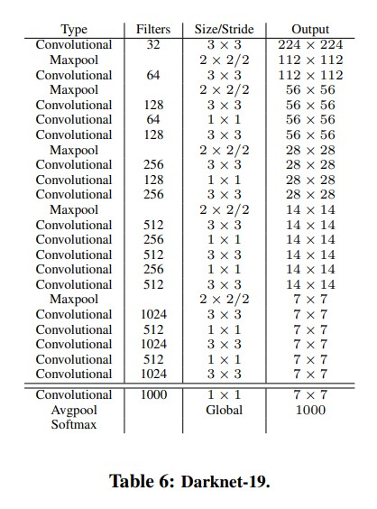
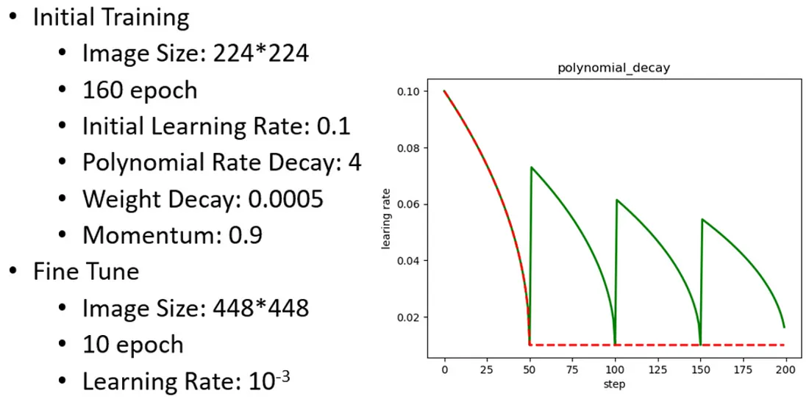

# YOLO-v2

## Introduction

YOLOv2 (You Only Look Once version 2) 是一種即時目標檢測模型，專為在速度與準確率之間達成平衡而設計。該模型延續 YOLOv1 的單階段目標檢測架構，並引入多項技術改進。論文中主要基於 YOLO 模型提出幾點改善方法來提升其的速度與準確率，並可在 VOC2007 取得 67FPS 與 76.8mAP 的成績。除此之外，因為過往的偵測模型僅能偵測少量的物件，因此論文中也提出一訓練方法，可使偵測的物件數量達到 9000 個。

## YOLOv2 Improvements Over YOLOv1 (Better)

### **Batch Normalization**

YOLOv2 中作者為每個卷積層都添加了 BN 層，並且不使用 Dropout，改善模型的收斂同時也取消其他的正規化方法，而在每層 convolutional layers 加入 batch normalization 也使模型提升 2%mAP。

### **High Resolution Classifier**

- **分類器與檢測網絡的解析度不一致 :** 在 YOLOv1 中，分類器（用於提取特徵的部分）是在 `224 * 224` 的解析度下訓練的。但是 YOLO 的檢測任務使用更高的解析度 `448 * 448` 圖像作為輸入。這導致分類器在低解析度上訓練後，直接應用於高解析度場景時表現不穩定。由於訓練過程中未在高解析度進行微調，特徵提取網絡對高解析度圖像的適應能力有限，從而影響檢測性能。

- **在高解析度進行微調 :** 首先使用 ImageNet 數據集，在低解析度 `224 * 224` 上訓練 Darknet-19 主幹網絡 160 個 epoch，獲得預訓練權重。隨後將輸入解析度提升至 `448 * 448`，並用相同的數據集，進一步進行 10 epoch 的微調，使分類器適應高解析度圖像。

這一策略使特徵提取網絡在更高解析度上能夠捕捉到更多細節，提高了模型對小物體和細微特徵的檢測能力。同時，由於微調階段只是基於已有權重進行少量更新，並不會顯著增加訓練成本。

### **Convolutional With Anchor Boxes**

YOLOv2 引入 Faster RCNN 論文中 Anchor box 的概念，首先將 YOLO 的 FC layers 移除，並去掉後面一層池化層以保持輸出層的高解析度，此外，YOLOv2 也將輸入縮減為 `416*416`，經過下採樣 32 倍後，使得最後的輸出層是 `13 x 13` 的 feature map 輸出。

### **Dimension Clusters**

在 Faster R-CNN 中，Anchor Boxes 的大小和比例是根據經驗設定的，並且模型會在訓練過程中調整 Anchor Box 的大小。然而，YOLOv2 引入了一種自動化方法，利採用 K-means 的方式對訓練集的 Bounding Boxes 作聚類，以自動找到最好的先驗框。

傳統上 K-means 的歐幾里德距離會導致較大的 Box 會比較小的 Box 產生更多的 error，聚類可能會偏頗。為了不讓誤差與 Box 的尺寸有太大關係，本文改變了距離函數：

$$
      d(\text{box}, \text{centroid}) = 1 - \text{IOU}(\text{box}, \text{centroid})
$$

論文中對不同的 $k$ 值進行實驗，並繪製具有最接近質心的平均 IOU，發現在 $𝑘=5$ 時的複雜性和 recall 之間有良好的權衡。

### **Direct location prediction**

使用 Anchor Box 還有遇到一個問題預測 Box 的位置會導致模型迭代初期不穩定，因為原本的公式並沒有受到任何的約束，預測出的 Box 可能會出現在圖片的任何位置

YOLO v2 沒有使用這種預測方式反而沿用 YOLO v1 的方法，預測 Bounding Box 中心點相對於網格左上角位置 $(C_x,C_y)$ 的偏移量。

### **Fine-Grained Features**

YOLOv2 使用了一種稱為「特徵融合」的方法，將低層細粒度的特徵整合到高層語義特徵中，從而提升對小物體的檢測能力。

YOLOv2 圖片輸入大小為 416x416，經過 5 次 Maxpooling 後得到 13x13 的特徵圖作預測，雖然對於大目標已經足夠了，但是因為隨著解析度的降低，小目標的檢測變得越來越困難。所以 YOLOv2 把高解析度的淺層特徵連線到低解析度的深層特徵（把特徵圖堆積在不同 Channel 中）而後進行檢測，具體的操作如下。

首先將原本 26×26x512 的 Feature map 進行特徵重排。特徵重排的操作就是分別按行和列隔點取樣，此時每個 Feature map 通道會乘以 4 如下圖所示。

左完特徵重排後輸出就會變成 13x13x2048 拼接到後面 13x13x1024 的層的 Feature map，就會形成 13x13x3072 大小的 Feature map，相當於做了一次特徵融合，這樣就等於在縮小的特徵途中仍然保有其細部特徵，有利於檢測小目標，如下圖所示。

### **Multi-Scale Training**

由於 YOLOv2 下採樣步長為 32，最後特徵圖會為原圖尺寸的 32 分之一 ，所以輸入圖片大小要`選擇 32 的倍數`。

實驗證明，Multi-Scale Training 使得同一個網絡對不同分辨率的圖片都可以更好地進行檢測，提高了網絡性能。可以參考下圖，在 VOC 2007 數據集上可以觀察到，擁有高解析度輸入的圖片 mAp 會比較高雖然速度(FPS)相對較慢。

### **Hierarchical Classification**

主要是作者提出了將 COCO 檢測數據和 ImageNet 分類數據綜合的聯合訓練機制。

數據綜合的聯合訓練會有一個問題，ImageNet 資料有 1000 類，而 COCO 資料只有 80 類，最直覺的想法就是直接增加輸出分類的維度，但是類別關係不一定是互斥，比如一個狗，ImageNet 中分為好多種(哈士奇、狼犬...)，這樣存在包含關係，所以作者根據 WordNet ，將 ImageNet 和 COCO 中的類別一起構建了一種樹資料結構(WordTree)，通過 WordTree 中找到數據的不同標籤直接的關係，找到所有標籤的最上面的根節點，依次往下梳理標籤，添加對應的中間標籤。而添加的原則為:

1.  父節點必須包含子節點的數據范圍（比如父節點是貓，子節點就是波斯貓等貓的種類等）。
2.  如果添加節點的時候有兩條路可以到達，那麼就選擇最短的路徑來添加子節點。
    

YOLO9000 不對所有類別進行，而是對同一層級的每個父節點進行操作，如下圖下半部所示，每一個 Softmax 都代表一個父節點。
而在預測類別概率時是使用條件機率 ，比如說哈士奇的機率是 P(哈士奇) = P(動物)*P(狗|動物)*P(哈士奇|狗)，同一個父節點下的子節點預測概率總和為 1(上面提到的 Softmax)。

預測物體所屬的類別時，從根結點開始往下遍歷，對於每一個節點，選擇其子節點中概率最大的節點往下遍歷，直到到達葉節點或節點的概率小於設定的閾值，那麼就停止遍歷。

YOLO9000 從原本的 5 個 Anchor box 減少到 3 個，以減少計算量。YOLO2 的輸出是 13x13x5x(4+1+20)，現在 YOLO9000 的輸出是 13x13x3x(4+1+9418)。使得 YOLOv2 能夠識別到 9000 多種物體。

---

## YOLOv2 架構

YOLOv2 的網路結構基於 YOLOv1 的架構進行改進，核心為一個全卷積網路，整體架構更加高效且準確。

### 1. **網路主幹 (Backbone Network)**

- **Darknet-19**：
  - 包含 19 層卷積層 + 5 層最大池化層。
  - 捨棄全連接層，完全採用卷積結構。
  - 使用 ReLU 作為激活函數，後續改為 Leaky ReLU。
  - 卷積核配置：
    - 主幹結構逐步增加特徵圖的深度，通過 3x3 和 1x1 卷積交替進行壓縮。
    - 採用 Batch Normalization (BN) 提高收斂速度並減少過擬合。

   

### 2. **高分辨率分類器**

- 在主幹訓練中，採用高分辨率輸入 (448x448) 進行微調，使分類模型適應更高的解析度。

### 3. **檢測層 (Detection Layers)**

- 最終檢測層輸出：
  - 特徵圖大小為 \(13 \times 13 \)。
  - 每個格點預測 5 個 Bounding Boxes，每個框包含：
    - 4 個框參數 (\(t_x, t_y, t_w, t_h\))。
    - 1 個物體置信度。
    - \(C\) 個類別分數。

## **YOLOv2 的損失函數**

YOLOv2 的損失函數由三部分組成：

1. **Bounding Box 損失**：

   - 計算預測框與真值框之間的位置與大小誤差。

2. **置信度損失**：

   - 衡量每個 Anchor Box 中是否包含物體的準確性。

3. **分類損失**：
   - 測量正樣本分類的準確性。

總損失公式如下：

$$
\mathcal{L} = \lambda_{\text{coord}} \sum_{i=0}^{S^2} \sum_{j=0}^{B} \mathbf{1}_{ij}^{\text{obj}} \left[ (x_i - \hat{x}_i)^2 + (y_i - \hat{y}_i)^2 \right]
+ \lambda_{\text{coord}} \sum_{i=0}^{S^2} \sum_{j=0}^{B} \mathbf{1}_{ij}^{\text{obj}} \left[ (\sqrt{w_i} - \sqrt{\hat{w}_i})^2 + (\sqrt{h_i} - \sqrt{\hat{h}_i})^2 \right]
$$

$$
+ \sum_{i=0}^{S^2} \sum_{j=0}^{B} \mathbf{1}_{ij}^{\text{obj}} (C_i - \hat{C}_i)^2
+ \lambda_{\text{noobj}} \sum_{i=0}^{S^2} \sum_{j=0}^{B} \mathbf{1}_{ij}^{\text{noobj}} (C_i - \hat{C}_i)^2
$$

$$
+ \sum_{i=0}^{S^2} \mathbf{1}_i^{\text{obj}} \sum_{c \in \text{classes}} (p_i(c) - \hat{p}_i(c))^2
$$

### 公式參數解釋：

1. **第一部分**：Bounding Box 位置損失

   - \(x, y\)：框的中心點座標。
   - \(w, h\)：框的寬和高。
   - 使用 \(\sqrt{w}\) 和 \(\sqrt{h}\) 減少對大框的懲罰。

2. **第二部分**：置信度損失

   - \(C\)：置信度分數，表示該格點是否包含物體。
   - \(\mathbf{1}\_{ij}^{\text{obj}}\)：指示該框是否包含物體。

3. **第三部分**：分類損失

   - \(p(c)\)：預測的類別概率。

4. **權重參數**：
   - \(\lambda\_{\text{coord}}\)：位置損失的權重。
   - \(\lambda\_{\text{noobj}}\)：背景框損失的權重（通常設置較小）。

### 訓練流程

YOLOv2 的訓練主要包括以下三個階段：

1. 在 ImageNet 分類數據集上用 `224 * 224` 進行訓練，共訓練 160 個 epochs。
2. 將模型的輸入尺寸調整為 `448 * 448`，繼續在 ImageNet 數據集上對分類模型進行微調，訓練 10 個 epochs。
3. 將分類模型改為檢測模
   1. **模型結構的調整**：
      - 移除分類模型的最後三層：
      - 最後一個卷積層。
      - Global Average Pooling 層。
      - Softmax 層。
      - 新增層：
      - 三個 $3 \times 3 \times 1024$ 的卷積層。
      - 一個 Passthrough 層（用於將低層特徵與高層特徵進行融合）。
      - 一個 $1 \times 1$卷積層，用於輸出最終的檢測結果。

   2. **輸出設計**：
      - 輸出通道數為 $ \text{num\_anchors} \times (5 + \text{num\_classes})$，與數據集相關。
      - 以 VOC 數據集（20 種分類）為例：
      - Anchor 數為 5。
      - 輸出的通道數為 $125 = 5 \times (5 + 20)$。

   3. **最終輸出的形狀**：
      - 輸出的預測矩陣 $T$ 的形狀為 $text{batch\_size}, 13, 13, 125)$。
      - 將 $T$ 重新 reshape 為 $text{batch\_size}, 13, 13, 5, 25)$，分別表示：
      - $T[:,:,:,:,0:4]$：邊界框的位置與大小 $(t_x, t_y, t_w, t_h)$。
      - $T[:,:,:,:,4]$：邊界框的置信度。
      - $T[:,:,:,:,5:]$：類別預測值。

## Conclusion

YOLOv2 通過一系列的優化和改進方法優化了 YOLOv1 模型，提高了預測準確率，同時還能繼續保持較快的檢測速度。

- 優點:

   輸出Grid為奇數，可由正中心預測物體
   使用多種方案(Batch Normalize、High Resolution Classifier)，使檢測效果更佳
   改為Anchor Base方法，檢測框更穩定
   使用PassThrough Layer，融合較高解析度之特徵
   多尺度訓練，使Detector適應圖片解析度變化
   可以融合檢測及分類數據集(YOLO9000)，多層級預測label

- 缺點:

   小物體效果依然較差
   YOLO 9000 之訓練方法效果依然差 (mAP:19.7)

## Reference

- [Redmon, J., & Farhadi, A. (2016). YOLO9000: Better, Faster, Stronger.](https://arxiv.org/pdf/1612.08242)
- [Official YOLO Website](https://pjreddie.com/darknet/yolov2/)
- [Darknet GitHub Repository](https://github.com/pjreddie/darknet)
- [YOLOv2 & YOLO9000 — You Only Look Once (Object Detection)](https://medium.com/image-processing-and-ml-note/yolov2-yolo9000-you-only-look-once-object-detection-a0f8949e244d)
- [YOLOv2 論文閱讀](https://hackmd.io/@rayhchs/HyTZSaRdi)
- [YOLOv2 詳細解讀](https://medium.com/@_Xing_Chen_/dyolov2-%E8%A9%B3%E7%B4%B0%E8%A7%A3%E8%AE%80-c62d8868b038)
- [YOLOv2/YOLO9000 深入理解](https://www.cnblogs.com/boligongzhu/p/15075455.html)
- [YOLOV2网络模型](https://blog.csdn.net/qq_36076233/article/details/123083821)
- [DL、ML筆記(15): YOLO v2](https://jianjiesun.medium.com/dl-ml%E7%AD%86%E8%A8%98-15-yolo-v2-83a9e63f5128)
- [https://paperswithcode.com/method/yolov2](https://paperswithcode.com/method/yolov2)
