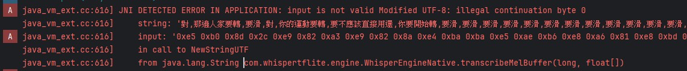

# JNI DETECTED ERROR IN APPLICATION: input is not valid Modified UTF-8: illegal continuation byte 0

log:


## Solutions

### **1. 確保 `std::string` 是有效的 UTF-8**

`env->NewStringUTF()` 只能處理有效的 UTF-8 字符串。如果 `transcribeMelBuffer` 返回的 `std::string` 不是 UTF-8，則應該先進行轉換。例如：

```cpp
std::string result = engine->transcribeMelBuffer(sampleVector);

// 確保 result 是 UTF-8
if (!isValidUTF8(result)) {
    return env->NewStringUTF("Error: Invalid UTF-8 output");
}
return env->NewStringUTF(result.c_str());
```

其中 `isValidUTF8` 可以用來檢查字串是否是有效的 UTF-8：

```cpp
bool isValidUTF8(const std::string &str) {
    int i = 0;
    while (i < str.size()) {
        unsigned char c = str[i];
        int bytes = 0;

        if (c <= 0x7F) {  // 1-byte character (ASCII)
            bytes = 1;
        } else if ((c & 0xE0) == 0xC0) {  // 2-byte character
            bytes = 2;
        } else if ((c & 0xF0) == 0xE0) {  // 3-byte character
            bytes = 3;
        } else if ((c & 0xF8) == 0xF0) {  // 4-byte character
            bytes = 4;
        } else {
            return false;  // Invalid UTF-8
        }

        if (i + bytes > str.size()) return false;

        for (int j = 1; j < bytes; ++j) {
            if ((str[i + j] & 0xC0) != 0x80) return false;
        }

        i += bytes;
    }
    return true;
}
```

### **2. 返回的是 `std::wstring`**

```cpp
#include <locale>
#include <codecvt>

std::wstring result;

// 將 std::wstring 轉換為 UTF-8 std::string
std::wstring_convert<std::codecvt_utf8<wchar_t>> converter;
std::string utf8Result = converter.to_bytes(result);

return env->NewStringUTF(utf8Result.c_str());
```

### **3. 如果 `NewStringUTF` 無法處理某些字元**

`NewStringUTF` 只能處理有效的 UTF-8，但如果有特殊字符（如某些 emoji 或罕見漢字），可能會導致轉換問題。你可以改用 `NewString`，它可以直接處理 UTF-16：

```cpp
jstring toJString(JNIEnv *env, const std::string &utf8Str) {
    std::wstring_convert<std::codecvt_utf8_utf16<char16_t>, char16_t> converter;
    std::u16string utf16Str = converter.from_bytes(utf8Str);
    return env->NewString(reinterpret_cast<const jchar *>(utf16Str.c_str()), utf16Str.length());
}
```

然後在 JNI 方法內部使用：

```cpp
return toJString(env, result);
```

這樣可以避免 `NewStringUTF` 的限制。

### **4. 使用 `NewString (UTF-16)`**

```cpp
#include <locale>
#include <codecvt>

jstring toJString(JNIEnv *env, const std::string &utf8Str) {
    std::wstring_convert<std::codecvt_utf8_utf16<char16_t>, char16_t> converter;
    std::u16string utf16Str = converter.from_bytes(utf8Str);
    return env->NewString(reinterpret_cast<const jchar *>(utf16Str.c_str()), utf16Str.length());
}

```

### **5. 回傳 `byte[]`，在 Java 端轉成 `String`**

```cpp
    
std::string result;

jbyteArray jBytes = env->NewByteArray(result.size());
env->SetByteArrayRegion(jBytes, 0, result.size(), reinterpret_cast<const jbyte *>(result.data()));
return jBytes;
```

## reference

- [cannot-encode-to-utf-8-in-jni](https://stackoverflow.com/questions/38030959/cannot-encode-to-utf-8-in-jni)
- [无效的 UTF-8 字符串在移动端引发的问题](https://code.wandoer.com/note/%E6%97%A0%E6%95%88%E7%9A%84-utf-8-%E5%AD%97%E7%AC%A6%E4%B8%B2%E5%9C%A8%E7%A7%BB%E5%8A%A8%E7%AB%AF%E5%BC%95%E5%8F%91%E7%9A%84%E9%97%AE%E9%A2%98.htm)
