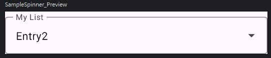

# Jetpack Compose element

## Spinner



<details>

<summary>sample code</summary>

```kotlin
   @Composable
fun SampleSpinner(
    list: List<Pair<String, String>>,
    preselected: Pair<String, String>,
    onSelectionChanged: (selection: Pair<String, String>) -> Unit
) {

    var selected by remember { mutableStateOf(preselected) }
    var expanded by remember { mutableStateOf(false) } // initial value

    Box {
        Column {
            OutlinedTextField(
                value = (selected.second),
                onValueChange = { },
                label = { Text(text = "My List") },
                modifier = Modifier.fillMaxWidth(),
                trailingIcon = { Icon(Icons.Outlined.ArrowDropDown, null) },
                readOnly = true
            )
            DropdownMenu(
                modifier = Modifier.fillMaxWidth(),
                expanded = expanded,
                onDismissRequest = { expanded = false },
            ) {
                list.forEach { entry ->

                    DropdownMenuItem(
                        modifier = Modifier.fillMaxWidth(),
                        onClick = {
                            selected = entry
                            expanded = false
                        },
                        text = {
                            Text(
                                text = (entry.second),
                                modifier = Modifier
                                    .wrapContentWidth()
                                    .align(Alignment.Start)
                            )
                        }
                    )
                }
            }
        }

        Spacer(
            modifier = Modifier
                .matchParentSize()
                .background(Color.Transparent)
                .padding(10.dp)
                .clickable(
                    onClick = { expanded = !expanded }
                )
        )
    }
}


@Preview(showBackground = true)
@Composable
fun SampleSpinner_Preview() {
    MaterialTheme {

        val entry1 = Pair("Key1", "Entry1")
        val entry2 = Pair("Key2", "Entry2")
        val entry3 = Pair("Key3", "Entry3")

        SampleSpinner(
            listOf(entry1, entry2, entry3),
            preselected = entry2,
            onSelectionChanged = { selected -> /* do something with selected */ }
        )
    }
}
```

</details>

## Lazy list (RecyclerView/ListView)


<details>

<summary>sample code</summary>

```kotlin

@Composable
fun ListAnimatedItems(
    items: List<String>,
    modifier: Modifier = Modifier
) {
    LazyColumn(modifier) {
        // Use a unique key per item, so that animations work as expected.
        items(items, key = { it }) {
            ListItem(
                headlineContent = { Text(it) },
                modifier = Modifier
                    .animateItem(
                        // Optionally add custom animation specs
                    )
                    .fillParentMaxWidth()
                    .padding(horizontal = 8.dp, vertical = 0.dp),
            )
        }
    }
}

```

### reference

- [android develop lists](https://developer.android.com/develop/ui/compose/lists?hl=zh-tw)
- [android develop recycler-view](https://developer.android.com/develop/ui/compose/migrate/migration-scenarios/recycler-view?hl=zh-tw)
- [android sample code](https://github.com/android/snippets/blob/b9c07aa82e81dbcf14a515fdc166f1a8ac7e7779/compose/snippets/src/main/java/com/example/compose/snippets/lists/AnimatedOrderedList.kt)
- [Android 推坑 JetpackCompose 之 ListView RecyclerView 篇](https://a0924xxx.medium.com/android-%E6%8E%A8%E5%9D%91-jetpackcompose-%E4%B9%8B-listview-recyclerview-%E7%AF%87-7c1c38b44d7a)

</details>

## Reference

- [Android - create Spinner with Compose](https://stackoverflow.com/questions/65632626/android-create-spinner-with-compose)
