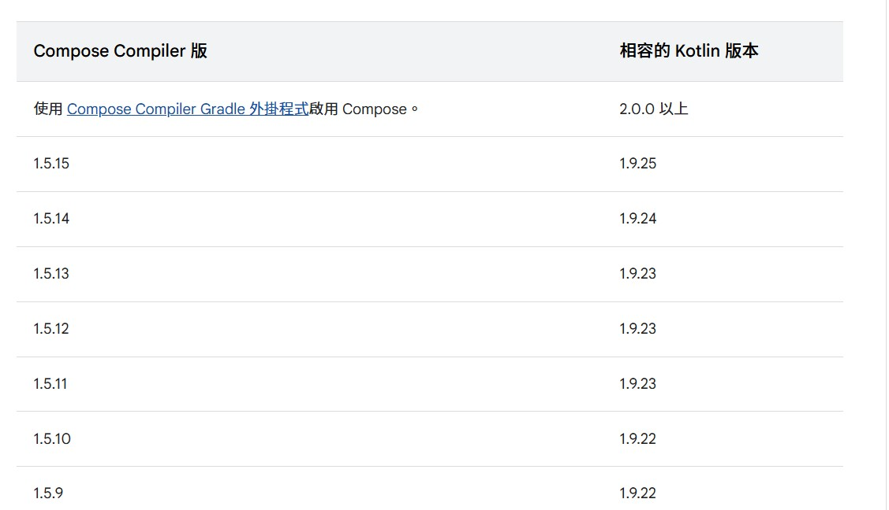

# Jetpack Compose

## 1. 簡介

在 Android 開發的世界中，UI 元件的設計歷來是開發者最重要的工作之一。傳統上，Android 使用 XML 布局來定義界面，然而，這種方法相對繁瑣，且缺乏靈活性。為了解決這些問題，Google 推出了 **Jetpack Compose**，一個基於 Kotlin 語言的 UI 架構，旨在使 UI 開發更加簡單、直觀、和靈活。

Jetpack Compose 的核心概念是“聲明式 UI”，這意味著開發者只需要描述界面應該是什麼樣的，框架會自動處理 UI 的更新和渲染。這種方式使得代碼更加簡潔且易於維護。

### 1.1 聲明式 vs 命令式

#### 聲明式

```kotlin
@Composable
fun HelloWorld() {
    val content by remember {
        mutableStateOf("Hello World!")
    }

    Text(text = content, color = Color.White, fontSize = 12.sp)
}
```

#### 命令式

```xml
<TextView
    android:id="@+id/txtHelloWord"
    android:layout_width="wrap_content"
    android:layout_height="wrap_content"
    android:text="Hello World!"
    android:textColor="@android:color/white"
    android:textSize="12sp"/>
```

### 聲明式 UI 與 命令式 UI 的差異

雖然聲明式 UI 和命令式 UI 看起來在撰寫程式碼的方式上沒有太大區別，但它們最大的差異在於畫面 UI 的更新方式。

在命令式 UI 中，開發者需要手動指定如何更新界面。例如，當我們想要改變某個文字的顯示內容時，我們會透過 `findViewById` 找到對應的 `TextView`，然後執行 `setText` 方法來更新 UI。這一連串的操作需要逐步寫出命令，並且每次 UI 需要變動時都要手動執行相應的程式碼，這就是所謂的「命令式 UI」。

```kotlin
val textView: TextView = findViewById(R.id.textView)
textView.setText("New Text")
```

而在 **聲明式 UI** 中，開發者只需聲明界面應該如何呈現，而不需要指示具體的更新步驟。例如，當我們建立一個 Composable 函數時，只需要將變數狀態與 Composable 函數綁定，並使用 `remember` 和 `mutableStateOf` 來管理狀態。一旦參數（如 `content`）發生變動，Compose 會自動檢測並更新 UI，而開發者無需手動操作視圖元素或調用更新方法。

```kotlin
@Composable
fun Greeting(content: String) {
    var text by remember { mutableStateOf(content) }
    Text(text = text)
}
```

在這裡，`remember` 和 `mutableStateOf` 讓 `content` 變數與 Composable 函數綁定，並且當 `content` 的值發生變化時，界面會自動更新，實現了聲明式的 UI 更新。

總結來說，命令式 UI 需要開發者手動控制每一個更新操作，而聲明式 UI 則是依賴框架自動根據狀態變化來更新 UI，開發者只需要關注界面的“應該是什麼”而非“如何更新”。

---

## 2. 設置環境

在開始寫 Jetpack Compose 應用之前，我們首先需要配置開發環境。以下是設置過程：

### 步驟 1：更新 Android Studio

確保你使用的是 **Android Studio Canary 版本** 或者 **Stable 版本**，並且已經啟用了 Jetpack Compose 支援。進入 **Preferences** > **Plugins**，搜索並安裝 **Jetpack Compose** 插件。

### 步驟 2：添加依賴

在 `build.gradle` 中添加 Jetpack Compose 依賴項：

```gradle
plugins {
    id 'com.android.application'
    id 'kotlin-android'
}

android {
    compileSdk 33

    defaultConfig {
        applicationId "com.example.composeapp"
        minSdk 21
        targetSdk 33
        versionCode 1
        versionName "1.0"
    }

    buildFeatures {
        compose true
    }

    composeOptions {
        kotlinCompilerExtensionVersion '1.4.0'
    }

    kotlinOptions {
        jvmTarget = '1.8'
    }
}

dependencies {
    implementation "androidx.compose.ui:ui:1.4.0"
    implementation "androidx.compose.material:material:1.4.0"
    implementation "androidx.compose.ui:tooling-preview:1.4.0"
    implementation "androidx.lifecycle:lifecycle-runtime-ktx:2.5.0"
    implementation "androidx.activity:activity-compose:1.6.0"
}
```

### Compose 對應 Kotlin 的相容性清單

[官網連結相容性清單](https://developer.android.com/jetpack/androidx/releases/compose-kotlin?hl=zh-tw)



## 3. 基本概念

### Composable 函數

在 Jetpack Compose 中，UI 元素是由 `@Composable` 標註的函數所定義的。這些函數不需要再寫繁瑣的 XML 代碼，直接使用 Kotlin 代碼來構建界面。

```kotlin
@Composable
fun Greeting(name: String) {
    Text(text = "Hello, $name!")
}
```

### State 和 Recomposition

Compose 中的 UI 元素是可重組（Recomposable）的，這意味著當其相關的狀態變化時，UI 會自動更新。這就是為什麼我們需要在 Composable 函數中使用狀態管理。

```kotlin
@Composable
fun Counter() {
    var count by remember { mutableStateOf(0) }

    Button(onClick = { count++ }) {
        Text("You have clicked $count times")
    }
}
```

`remember` 用來在組件重組時保持狀態，而 `mutableStateOf` 則用來創建一個可變的狀態。

## 4. 布局和視圖組件

Compose 提供了多種布局來構建界面。這裡是一些最常用的布局組件：

- **Column**：垂直排列子項目。
- **Row**：水平排列子項目。
- **Box**：堆疊子項目。

```kotlin
@Composable
fun MyColumn() {
    Column {
        Text("Item 1")
        Text("Item 2")
        Text("Item 3")
    }
}
```

### Modifier

在 Jetpack Compose 中，`Modifier` 用於調整視圖屬性，如大小、邊距、顏色等。

```kotlin
@Composable
fun ModifiedButton() {
    Button(
        onClick = { /* Do something */ },
        modifier = Modifier.padding(16.dp)
    ) {
        Text("Click Me")
    }
}
```

## 5. 管理狀態

Compose 中的狀態管理是其核心之一。通常，狀態會以變數形式存在，並與 Composable 函數綁定。當狀態變更時，Compose 會自動更新該函數。

### remember 和 mutableStateOf

- `remember` 用來在組件重組過程中保存狀態。
- `mutableStateOf` 則用來創建可以變化的狀態。

```kotlin
@Composable
fun Counter() {
    var count by remember { mutableStateOf(0) }

    Button(onClick = { count++ }) {
        Text("Clicked $count times")
    }
}
```

## 6. 高級功能

Jetpack Compose 還提供了一些高級功能來處理副作用和異步操作。最常見的有：

- **LaunchedEffect**：用來處理異步任務。
- **SideEffect**：用來執行副作用操作。
- **DisposableEffect**：用來處理資源釋放或取消操作。

```kotlin
@Composable
fun ExampleLaunchedEffect() {
    LaunchedEffect(key1 = true) {
        delay(1000)
        // Perform some task
    }
}
```

## 7. 實戰範例

接下來，我們可以使用 Jetpack Compose 實現一個簡單的計數器應用。

```kotlin
@Composable
fun CounterApp() {
    var count by remember { mutableStateOf(0) }

    Column(
        horizontalAlignment = Alignment.CenterHorizontally,
        verticalArrangement = Arrangement.Center,
        modifier = Modifier.fillMaxSize()
    ) {
        Text("You have clicked $count times")
        Button(onClick = { count++ }) {
            Text("Increase Count")
        }
    }
}
```

## 8. 性能優化

Compose 自動處理重組（Recomposition），但如果不小心，可能會導致不必要的 UI 更新。為了優化性能，可以使用 `key` 標註來控制列表重組，並盡量減少重組的範圍。

```kotlin
LazyColumn {
    itemsIndexed(items = items, key = { index, item -> item.id }) { item ->
        Text(text = item.name)
    }
}
```

## Reference

- [Jetpack Compose 官方範例](https://developer.android.com/codelabs/jetpack-compose-basics?hl=zh-tw#0)
- [Compose 對應 Kotlin 的相容性清單](https://developer.android.com/jetpack/androidx/releases/compose-kotlin?hl=zh-tw)
- [什麼是 Jetpack Compose？](https://blog.twjoin.com/%E4%BB%80%E9%BA%BC%E6%98%AF-jetpack-compose-4c6c34375df4)
- [Jetpack Compose 調整範例](https://tech.pic-collage.com/%E5%88%9D%E6%8E%A2-jetpack-compose-%E4%BB%8B%E7%B4%B9%E7%AF%87-e5ff3f223965)