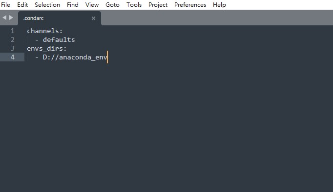

# Anaconda envs path change

1. 找到 `.condarc`,通常在 `C:\Users\XXXX\` 底下
1. 添加
    ``` 
    envs_dirs:
     - D://anaconda_env 
    ```


1. conda env list 確認是否有讀取到環境

## Reference
- [https://blog.csdn.net/weixin_66228584/article/details/133675638](https://blog.csdn.net/weixin_66228584/article/details/133675638)
