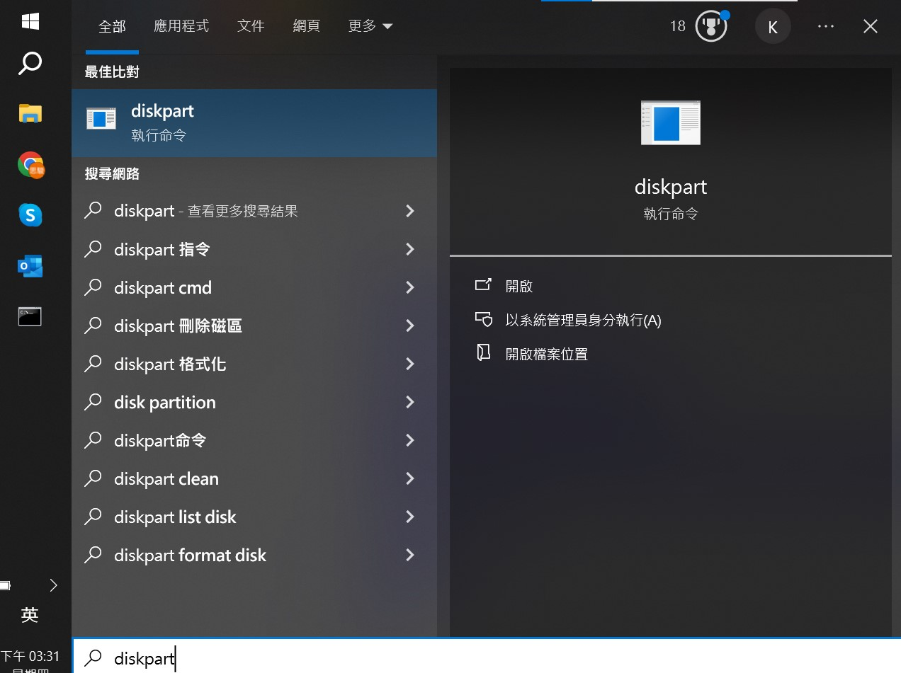

# Docker clean cache

Docker 長時間使用，會殘留許多沒用到的 image、container....，佔用硬碟

## docker 相關指令

Docker 18.09 引進了 BuildKit ，提升了建置流程的效能、安全性、儲存管理等能力。

`docker system df` ，用於查看 Docker 的磁碟使用情況：

```sh
[root@test /]# docker system df
TYPE TOTAL ACTIVE SIZE RECLAIMABLE
Images 34 34 10.1GB 105.6MB (1%)
Containers 60 41 925.2MB 615.9MB (66%)
Local Volumes 40 16 1.481GB 6.402MB (0%)
Build Cache 509 0 17.17GB 17.17GB
```

### TYPE 列出了 Docker 使用磁碟的 4 種類型：

| **類型**          | **說明**                                                                            |
| ----------------- | ----------------------------------------------------------------------------------- |
| **Images**        | 所有鏡像佔用的空間，包括拉取下來的鏡像，和本地建造的。                              |
| **Containers**    | 運作的容器所佔用的空間，表示每個容器的讀寫層的空間。                                |
| **Local Volumes** | 容器掛載本機資料卷的空間。                                                          |
| **Build Cache**   | 映像建置過程中產生的快取空間（只有在使用 BuildKit 時才有，Docker 18.09 以後可用）。 |

最後的 RECLAIMABLE 這一列表示可回收的大小。

### 清除 build cache

```sh
docker builder prune
docker builder prune --filter 'until=24h'  # 添加 --filter 參數實現，例如保留最近 1 天的快取範例命令如下
```

### 清除 container

```sh
docker container prune  # 清掉所有未啟動 container
docker rm -vf (docker ps -aq)  # 強制清掉所有container  *注意：這會把所有啟動中的 container 與 volume 全部清除
```

### 清掉所有沒被分配的 volume

```sh
docker volume prune
```

### 清掉所有沒被分配的 network

```sh
docker network prune
```

### 清除沒有用的 image

```sh
docker image prune  # 清除沒有 tag 的 image
docker image prune --all   # 清除所有沒有在使用中的 image
```

### 清除全部

```sh

$ docker system prune   # 可以用於清理磁盤，刪除關閉的容器、無用的資料捲和網絡，以及 dangling 映像（即無 tag 的映像）。
$ docker system prune --all # 清理得更加徹底，可以將沒有容器使用 Docker 映像都刪除
$ docker system prune --volumes # 額外加清 volume
$ docker system prune --all --volumes   # 全清，額外加清 volume
```

## 清理 WSL2 在 Windows 所佔空間

WSL2 在 Windows 中會建立虛擬硬碟 (Virtual Hard Disk, VHD)，以 ext4.vhdx 檔案形式表示，一開始 WSL2 會先配置空間，而這些空間並非都是目前真正有使用到的。
這種鏡像檔案的特點是支援自動擴容，但是一般不會自動縮容。因此一旦 Docker image 過多，引起映像擴容，即使再使用 docker system prune 清理虛擬機器中的映像文件，也不會釋放出已經佔用的系統磁碟空間。

### 解决方案

1. 打開 CMD 執行`wsl --shutdown`
1. 打開 diskpart
   
1. 依序執行以下命令:
   ```sh
   select vdisk file="C:\Users\…\ext4.vhdx"
   # ext4.vhdx 路徑類似 "C:\Users\<your-username>\AppData\Local\Packages\CanonicalGroupLimited.Ubuntu20.04onWindows_79rhkp1fndgsc\LocalState\ext4.vhdx"
   # 可以用 list vdisk 查到路徑
   attach vdisk readonly
   compact vdisk
   detach vdisk
   exit
   ```
1. 結束後開啟 WSL2

### 替代指令(fail but no trace reason)

上述 diskpart 系列指令也可簡化為:

```sh
Optimize-VHD -Path "path_to_disk.vhdx" -Mode Full
```

## Reference

- [docker docs](https://docs.docker.com/reference/cli/docker/builder/prune/)
- [Docker clean cache 緩存清理](https://blog.51cto.com/u_1472521/5981360)
- [Docker 密技表](https://mileschou.me/docker/cheatsheet/)
- [WSL2 Docker 释放磁盘空间](https://gist.github.com/banyudu/af131c7bb681e8a80b5cbe2047e62d4c)
- [清理 WSL2 在 Windows 所佔空間](https://hackmd.io/@WhitePen/ryphv-Rni)
