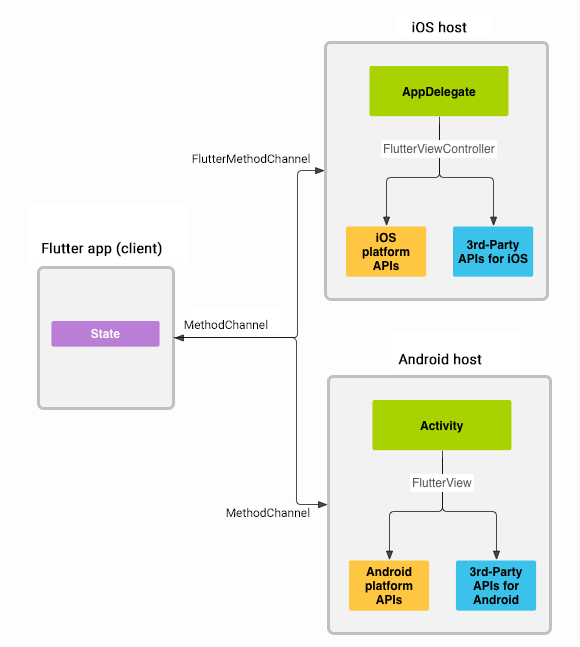

# Flutter Writing custom platform-specific code

Flutter 雖然提供了豐富的 Widget 和 API 來構建跨平台應用，但有時候仍然需要與原生層溝通。以下是需要與原生層溝通的一些主要原因：

1. 訪問平台特定功能
   - 平台 API: 有些功能 Flutter 沒有內建支持，但可以通過平台特定的 API 來實現。例如，訪問相機、傳感器、藍牙、NFC、通知系統、地理位置服務等。
   - 系統設置: 某些應用可能需要訪問或修改設備的系統設置，如亮度、音量、網絡設置等，這些通常需要使用原生 API。
2. 整合現有的原生代碼
   - 現有應用: 如果你有一個現有的原生應用，並想逐步將其轉移到 Flutter，可能需要在過渡期間讓 Flutter 和原生代碼協同工作。
   - 使用第三方 SDK: 有些第三方 SDK 僅提供原生支持（如一些支付 SDK、廣告 SDK），需要通過原生代碼進行集成。
3. 性能優化
   - 高效的 UI 渲染: 某些情況下，使用原生 UI 控件可能會比 Flutter Widget 更高效。比如在需要嵌入高性能原生控件時（如地圖或視頻播放器），可以考慮通過 Platform View 來實現。
   - 高頻率/低延遲操作: 某些需要頻繁、快速交互的操作，可能通過原生代碼會更高效。
4. 處理平台特有的行為
   - 平台差異: Android 和 iOS 之間存在一些差異，例如後台處理、生命周期管理、權限處理等。這些行為可能需要通過原生代碼來處理，以確保在各平台上都有一致的用戶體驗。
   - 原生 UI 風格: 在某些應用中，可能需要遵循平台的設計規範（如 Material Design 和 iOS 的 Human Interface Guidelines），這時可能需要使用原生代碼來達到最佳的設計一致性。
5. 跨平台限制
   - Flutter 尚未支持的功能: 雖然 Flutter 正在快速發展，但它並不支持所有的功能。如果你需要使用一個 Flutter 尚未支持的功能，則需要通過與原生層的溝通來實現。
   - 平台依賴: 有些操作或特性可能強烈依賴於平台本身，這時使用原生代碼會更合適。
6. 繼承和復用
   - 現有的原生邏輯: 在遷移到 Flutter 時，可能有一些業務邏輯、算法或服務已經用原生代碼實現，為了復用這些代碼，可以通過與原生層的溝通來整合這些功能。

總之，與原生層溝通可以幫助克服 Flutter 的限制，使你能夠更靈活地實現應用的全部功能，同時確保應用能夠充分利用底層平台的特性和能力。

## Architectural overview: platform channels

Messages are passed between the client (UI) and host (platform) using platform channels as illustrated in this diagram:



訊息和回應是**非同步傳遞**的，以確保使用者介面保持回應。

## Platform Channels

Flutter 使用 Platform Channels 來實現與原生層（如 Android 和 iOS）之間的通信。這種通信方式允許 Flutter 的 Dart 代碼與原生代碼（如 Java/Kotlin 或 Objective-C/Swift）進行雙向通信。

- Method Channel: 最常用的方式，適合單次的數據傳輸。Flutter 端使用 MethodChannel，原生端通過 MethodChannel 的 handler 來處理來自 Flutter 的請求並返回結果。
- Event Channel: 用於持續傳輸數據流，比如傳感器數據或其他連續性數據。
- Basic Message Channel: 用於傳輸二進制或字符串數據，雙向通信，適合更複雜的通信場景。

### sample

#### Flutter 端:

```dart
MethodChannel platform = MethodChannel('com.example.channel');

Future<void> _getNativeValue() async {
  try {
    final String result = await platform.invokeMethod('getNativeValue');
    print('Native value: $result');
  } on PlatformException catch (e) {
    print("Failed to get native value: '${e.message}'.");
  }
}

```

#### Android 端(Kotlin):

```kotlin
MethodChannel(flutterEngine.dartExecutor.binaryMessenger, "com.example.channel")
    .setMethodCallHandler { call, result ->
        if (call.method == "getNativeValue") {
            result.success("Hello from Android")
        } else {
            result.notImplemented()
        }
    }
```

### iOS 端(Swift):

```swift
let controller : FlutterViewController = window?.rootViewController as! FlutterViewController
let methodChannel = FlutterMethodChannel(name: "com.example.channel",
                                          binaryMessenger: controller.binaryMessenger)
methodChannel.setMethodCallHandler({
  (call: FlutterMethodCall, result: @escaping FlutterResult) -> Void in
  if call.method == "getNativeValue" {
      result("Hello from iOS")
  } else {
      result(FlutterMethodNotImplemented)
  }
})

```

## Platform channel data types support and codecs

Flutter 的標準平台通道使用標準訊息編解碼器，支援簡單的類似 JSON 的值的高效二進位序列化，例如布林值、數字、字串、位元組緩衝區以及這些的列表和映射。

下表顯示了平台端如何接收 Dart 值，反之亦然：
::: tabs

@tab Kotlin

| Dart            | Kotlin        |
| --------------- | ------------- |
| null            | `null`        |
| bool            | `Boolean`     |
| int (<=32 bits) | `Int`         |
| int (>32 bits)  | `Long`        |
| double          | `Double`      |
| String          | `String`      |
| Uint8List       | `ByteArray`   |
| Int32List       | `IntArray`    |
| Int64List       | `LongArray`   |
| Float32List     | `FloatArray`  |
| Float64List     | `DoubleArray` |
| List            | `List`        |
| Map             | `HashMap`     |

@tab Java

| Dart            | Java                  |
| --------------- | --------------------- |
| null            | `null`                |
| bool            | `java.lang.Boolean`   |
| int (<=32 bits) | `java.lang.Integer`   |
| int (>32 bits)  | `java.lang.Long`      |
| double          | `java.lang.Double`    |
| String          | `java.lang.String`    |
| Uint8List       | `byte[]`              |
| Int32List       | `int[]`               |
| Int64List       | `long[]`              |
| Float32List     | `float[]`             |
| Float64List     | `double[]`            |
| List            | `java.util.ArrayList` |
| Map             | `java.util.HashMap`   |

@tab Swift

| Dart            | Swift                                     |
| --------------- | ----------------------------------------- |
| null            | `nil (NSNull when nested)`                |
| bool            | `NSNumber(value: Bool)`                   |
| int (<=32 bits) | `NSNumber(value: Int32)`                  |
| int (>32 bits)  | `NSNumber(value: Int)`                    |
| double          | `NSNumber(value: Double)`                 |
| String          | `String`                                  |
| Uint8List       | `FlutterStandardTypedData(bytes: Data)`   |
| Int32List       | `FlutterStandardTypedData(int32: Data)`   |
| Int64List       | `FlutterStandardTypedData(int64: Data)`   |
| Float32List     | `FlutterStandardTypedData(float32: Data)` |
| Float64List     | `FlutterStandardTypedData(float64: Data)` |
| List            | `Array`                                   |
| Map             | `Dictionary`                              |

@tab Objective-C

| Dart            | Objective-C                                      |
| --------------- | ------------------------------------------------ |
| null            | `nil (NSNull when nested)`                       |
| bool            | `NSNumber numberWithBool:`                       |
| int (<=32 bits) | `NSNumber numberWithInt:`                        |
| int (>32 bits)  | `NSNumber numberWithLong:`                       |
| double          | `NSNumber numberWithDouble:`                     |
| String          | `NSString`                                       |
| Uint8List       | `FlutterStandardTypedData typedDataWithBytes:`   |
| Int32List       | `FlutterStandardTypedData typedDataWithInt32:`   |
| Int64List       | `FlutterStandardTypedData typedDataWithInt64:`   |
| Float32List     | `FlutterStandardTypedData typedDataWithFloat32:` |
| Float64List     | `FlutterStandardTypedData typedDataWithFloat64:` |
| List            | `NSArray`                                        |
| Map             | `NSDictionary`                                   |

@tab C++

| Dart            | C++                                                        |
| --------------- | ---------------------------------------------------------- |
| null            | `EncodableValue()`                                         |
| bool            | `EncodableValue(bool)`                                     |
| int (<=32 bits) | `EncodableValue(int32_t)`                                  |
| int (>32 bits)  | `EncodableValue(int64_t)`                                  |
| double          | `EncodableValue(double)`                                   |
| String          | `EncodableValue(std::string)`                              |
| Uint8List       | `EncodableValue(std::vector<uint8_t>)`                     |
| Int32List       | `EncodableValue(std::vector<int32_t>)`                     |
| Int64List       | `EncodableValue(std::vector<int64_t>)`                     |
| Float32List     | `EncodableValue(std::vector<float>)`                       |
| Float64List     | `EncodableValue(std::vector<double>)`                      |
| List            | `EncodableValue(std::vector<EncodableValue>)`              |
| Map             | `EncodableValue(std::map<EncodableValue, EncodableValue>)` |

@tab C (GObject)

| Dart        | C (GObject)                 |
| ----------- | --------------------------- |
| null        | `FlValue()`                 |
| bool        | `FlValue(bool)`             |
| int         | `FlValue(int64_t)`          |
| double      | `FlValue(double)`           |
| String      | `FlValue(gchar*)`           |
| Uint8List   | `FlValue(uint8_t*)`         |
| Int32List   | `FlValue(int32_t*)`         |
| Int64List   | `FlValue(int64_t*)`         |
| Float32List | `FlValue(float*)`           |
| Float64List | `FlValue(double*)`          |
| List        | `FlValue(FlValue)`          |
| Map         | `FlValue(FlValue, FlValue)` |

:::

## References

- [flutter platform-channels](https://docs.flutter.dev/platform-integration/platform-channels)
- [medium - Flutter Platform Channels](https://medium.com/flutter/flutter-platform-channels-ce7f540a104e)
- [ithelp鐵人賽 - Flutter 和 Native 通訊的原理](https://ithelp.ithome.com.tw/articles/10269598?sc=hot)
- [@yen2 - Flutter 學習筆記](https://hackmd.io/@BzWzq-x9Rb2G4WG03gcyKg/SyeeSXntc)
- [Flutter 如何与原生平台通信](https://blog.51cto.com/sdwml/7180543)

