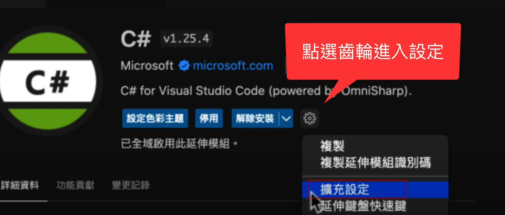
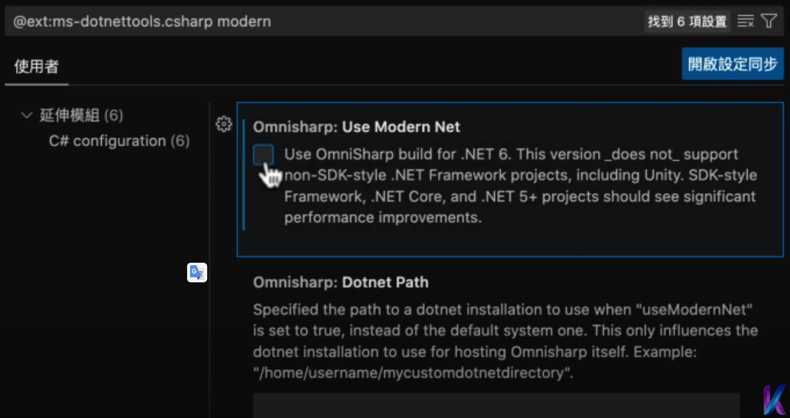
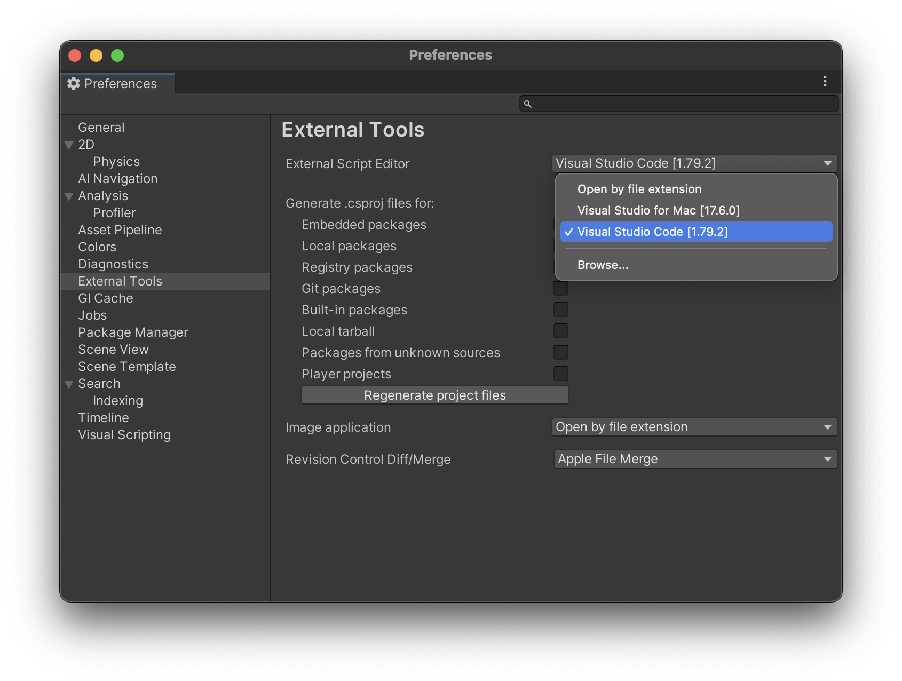

# Unity setup with VScode

## Install 
  1. go to [Unity](https://unity.com/download), download ``Unity hub``
  2. go to [VScode](https://code.visualstudio.com/Download), download ``VScode``
  3. go to [dotnet](https://dotnet.microsoft.com/zh-tw/download),download ``.net`` framework
  4. if using macOS, go to [mono](https://www.mono-project.com/docs/getting-started/install/mac/), download ``Mono`` framework
  
## Setup
  1. open ``Unity hub``, and install ``Unity`` LTS Version
  1. open vscode install the [Unity for Visual Studio Code](https://aka.ms/vscode-unity) extension from the Visual Studio Marketplace.
  1. In vscode, open extension ``c#`` setting, search ``modern``, and disable ``Use Modern Net``
    
    
  1. Open up Unity Preferences, External Tools, then select Visual Studio Code as External Script Editor. 
    
  1.

## Reference
- [Unity Development with VS Code](https://code.visualstudio.com/docs/other/unity)
- [昌哥電腦學院-02 - 從零開始！超詳盡！徹底搞懂 Mac 蘋果 VSCode 和 .NET SDK 和 Mono Framework 設定方式](https://www.youtube.com/watch?v=Xfo3lwADDcw&ab_channel=%E6%98%8C%E5%93%A5%E9%9B%BB%E8%85%A6%E5%AD%B8%E9%99%A2)