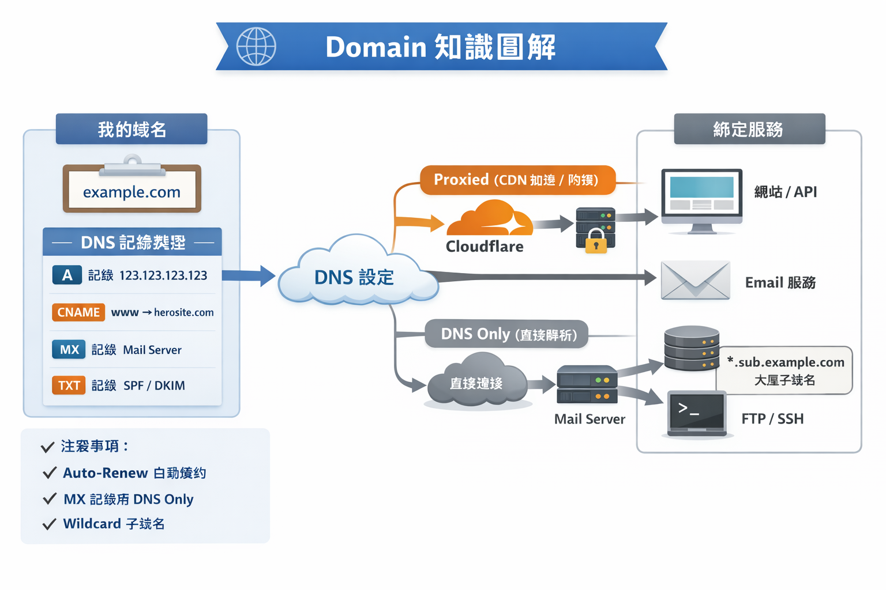

# 🌐 Domain（域名）完整知識整理

---

## 1️⃣ 基本概念

- **Domain（域名）**：網站或服務的名字，例如 `example.com`
- **FQDN（Fully Qualified Domain Name）**：完整域名，例如 `api.example.com`
- **Subdomain（子域名）**：主域名下的分支，例如：
  - `www.example.com`
  - `api.example.com`

- **DNS（Domain Name System）**：將域名解析到 IP 地址的系統
- **Registrar（註冊商）**：提供域名購買與管理服務的公司，例如 Cloudflare、Namecheap、Porkbun

---

## 2️⃣ 購買 domain 後的狀態

- **得到的只是域名管理權**
- **域名本身不包含任何網站或 Email 服務**
- **注意事項**：
  - 確認續約價格（Cloudflare 一般透明，不會加價）
  - 開啟 Auto-Renew 避免過期、產生 Restore Fee
  - 確認域名是否屬於 **Premium** 或特殊 TLD

---

## 3️⃣ DNS 記錄類型（Record Type）

| 記錄類型  | 功能                                      | 範例 / 說明                                                |
| --------- | ----------------------------------------- | ---------------------------------------------------------- |
| **A**     | 指向 IPv4 地址                            | `example.com → 123.123.123.123`                            |
| **AAAA**  | 指向 IPv6 地址                            | `example.com → 2001:db8::1`                                |
| **CNAME** | 指向另一個域名                            | `www.example.com → example.com`（子域名 / CDN / 外部服務） |
| **MX**    | 指定郵件伺服器                            | `MX 10 mail.example.com`（Email）                          |
| **TXT**   | 存文字資訊，用於驗證 / SPF / DKIM / DMARC | `v=spf1 include:_spf.example.com ~all`                     |
| **NS**    | 指定 Nameserver                           | `example.com → ns1.nameserver.com`                         |
| **SRV**   | 特定服務（端口、協議）                    | `_sip._tcp.example.com → 192.168.1.10:5060`                |
| **PTR**   | 反向解析（IP → domain）                   | `123.123.123.10 → mail.example.com`                        |
| **CAA**   | 限制可簽 SSL 的 CA                        | `example.com → 0 issue "letsencrypt.org"`                  |
| **SOA**   | Start of Authority                        | 記錄域名權威資訊，一般不手動修改                           |

---

## 4️⃣ Cloudflare 專用概念

- **Proxied（橘色雲）**：
  - 流量經 Cloudflare
  - 提供 CDN、DDoS 保護、HTTPS 加速

- **DNS Only（灰色雲）**：
  - 只解析 DNS
  - 適合 Email、FTP、SSH、API 等非 HTTP(S) 流量

---

## 5️⃣ 綁定服務到域名流程

1. **準備服務**：
   - 網站 / API / Email Server

2. **DNS 設定**：
   - 網站 → A / AAAA / CNAME
   - Email → MX + TXT
   - 子域名 → CNAME / A / AAAA

3. **設定 SSL / HTTPS**：
   - Cloudflare Proxied 自動管理

4. **測試**：
   - DNS 查詢：`ping example.com`
   - 網站訪問是否正常
   - Email 是否收發正常

---

## 6️⃣ 實務注意事項

- **避免費用暴漲**：
  - 開啟 Auto-Renew
  - 按時續約，避免 Restore Fee

- **子域名管理**：
  - 可用 `*.example.com` wildcard 管理大量子域名

- **Email / 非 Web 流量**：
  - 必須設 DNS Only

- **避免亂改 Nameservers**：
  - 保持域名解析穩定

- **確認 TLD 支援**：
  - 某些國家代碼或特殊 TLD 可能不支援

---

💡 **總結**

- 買域名 = 拿到名字 + DNS 管理權
- 服務綁定 = 透過 DNS 記錄指向你的服務
- Cloudflare 提供 Proxied（加速 / 防護）與 DNS Only（直通）選擇
- 開啟自動續約 + 使用 wildcard subdomain 是長期管理的好策略

---
