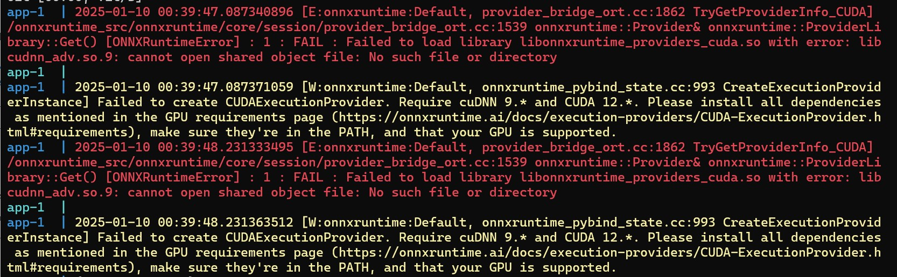

# onnx runtime can't find cuda

when using onnxruntime-gpu the following error occurs, and it will **<font color="red">change to use cpu</font>**

```sh
app-1  | 2025-01-10 00:39:47.087340896 [E:onnxruntime:Default, provider_bridge_ort.cc:1862 TryGetProviderInfo_CUDA] /onnxruntime_src/onnxruntime/core/session/provider_bridge_ort.cc:1539 onnxruntime::Provider& onnxruntime::ProviderLibrary::Get() [ONNXRuntimeError] : 1 : FAIL : Failed to load library libonnxruntime_providers_cuda.so with error: libcudnn_adv.so.9: cannot open shared object file: No such file or directory
app-1  |
app-1  | 2025-01-10 00:39:47.087371059 [W:onnxruntime:Default, onnxruntime_pybind_state.cc:993 CreateExecutionProviderInstance] Failed to create CUDAExecutionProvider. Require cuDNN 9.* and CUDA 12.*. Please install all dependencies as mentioned in the GPU requirements page (https://onnxruntime.ai/docs/execution-providers/CUDA-ExecutionProvider.html#requirements), make sure they're in the PATH, and that your GPU is supported.
app-1  | 2025-01-10 00:39:48.231333495 [E:onnxruntime:Default, provider_bridge_ort.cc:1862 TryGetProviderInfo_CUDA] /onnxruntime_src/onnxruntime/core/session/provider_bridge_ort.cc:1539 onnxruntime::Provider& onnxruntime::ProviderLibrary::Get() [ONNXRuntimeError] : 1 : FAIL : Failed to load library libonnxruntime_providers_cuda.so with error: libcudnn_adv.so.9: cannot open shared object file: No such file or directory
app-1  |
app-1  | 2025-01-10 00:39:48.231363512 [W:onnxruntime:Default, onnxruntime_pybind_state.cc:993 CreateExecutionProviderInstance] Failed to create CUDAExecutionProvider. Require cuDNN 9.* and CUDA 12.*. Please install all dependencies as mentioned in the GPU requirements page (https://onnxruntime.ai/docs/execution-providers/CUDA-ExecutionProvider.html#requirements), make sure they're in the PATH, and that your GPU is supported.
```



## solution

onnxruntime-gpu 有對應的 cuda 與 cudnn 版本，兩者都需要符合才可以正常使用。
ONNX 執行時間推理包的官方 GPU 包相依性。請注意，ONNX 執行時間訓練與 PyTorch CUDA 版本保持一致；

### CUDA 12.x

| ONNX Runtime 版本 | CUDA | cuDNN | 備註                                                      |
| ----------------- | ---- | ----- | --------------------------------------------------------- |
| 1.20.x            | 12.x | 9.x   | 可在 PyPI 中使用。與 CUDA 12.x 的 PyTorch >= 2.4.0 相容。 |
| 1.19.x            | 12.x | 9.x   | 可在 PyPI 中使用。與 CUDA 12.x 的 PyTorch >= 2.4.0 相容。 |
| 1.18.1            | 12.x | 9.x   | 需要 cuDNN 9。沒有 Java 包。                              |
| 1.18.0            | 12.x | 8.x   | 新增了 Java 包。                                          |
| 1.17.x            | 12.x | 8.x   | 僅發布 C++/C# Nuget 和 Python 套件。沒有 Java 包。        |

### CUDA 11.x

| ONNX Runtime 版本 | CUDA   | cuDNN                                | 備註                                                              |
| ----------------- | ------ | ------------------------------------ | ----------------------------------------------------------------- |
| 1.20.x            | 11.8   | 8.x                                  | 在 PyPI 中不可用。與 CUDA 11.8 的 PyTorch <= 2.3.1 相容。         |
| 1.19.x            | 11.8   | 8.x                                  | 在 PyPI 中不可用。與 CUDA 11.8 的 PyTorch <= 2.3.1 相容。         |
| 1.18.x            | 11.8   | 8.x                                  | 在 PyPI 中可用。                                                  |
| 1.17              | 11.8   | 8.2.4（Linux） / 8.5.0.96（Windows） | 使用 CUDA 版本 11.6 至 11.8 以及 cuDNN 版本 8.2 至 8.9 進行測試。 |
| 1.16              | 11.8   | 8.2.4（Linux） / 8.5.0.96（Windows） | 使用 CUDA 版本 11.6 至 11.8 以及 cuDNN 版本 8.2 至 8.9 進行測試。 |
| 1.15              | 11.8   | 8.2.4（Linux） / 8.5.0.96（Windows） | 使用 CUDA 版本 11.6 至 11.8 以及 cuDNN 版本 8.2 至 8.9 進行測試。 |
| 1.14              | 11.6   | 8.2.4（Linux） / 8.5.0.96（Windows） | libcudart 11.4.43, libcufft 10.5.2.100, libcudnn 8.2.4。          |
| 1.13              | 11.6   | 8.2.4（Linux） / 8.5.0.96（Windows） | libcudart 11.4.43, libcufft 10.5.2.100, libcudnn 8.2.4。          |
| 1.12              | 11.4   | 8.2.4（Linux） / 8.2.2.26（Windows） | libcudart 11.4.43, libcufft 10.5.2.100, libcudnn 8.2.4。          |
| 1.11              | 11.4   | 8.2.4（Linux） / 8.2.2.26（Windows） | libcudart 11.4.43, libcufft 10.5.2.100, libcudnn 8.2.4。          |
| 1.10              | 11.4   | 8.2.4（Linux） / 8.2.2.26（Windows） | libcudart 11.4.43, libcufft 10.5.2.100, libcudnn 8.2.4。          |
| 1.9               | 11.4   | 8.2.4（Linux） / 8.2.2.26（Windows） | libcudart 11.4.43, libcufft 10.5.2.100, libcudnn 8.2.4。          |
| 1.8               | 11.0.3 | 8.0.4（Linux） / 8.0.2.39（Windows） | libcudart 11.0.221, libcufft 10.2.1.245, libcudnn 8.0.4。         |
| 1.7               | 11.0.3 | 8.0.4（Linux） / 8.0.2.39（Windows） | libcudart 11.0.221, libcufft 10.2.1.245, libcudnn 8.0.4。         |

### CUDA 10.x

| ONNX Runtime 版本 | CUDA | cuDNN | 備註                                                   |
| ----------------- | ---- | ----- | ------------------------------------------------------ |
| 1.5-1.6           | 10.2 | 8.0.3 | CUDA 11 可以從原始碼構建。                             |
| 1.2-1.4           | 10.1 | 7.6.5 | 需要 cublas10-10.2.1.243。                             |
| 1.0-1.1           | 10.0 | 7.6.4 | CUDA 版本從 9.1 到 10.1 以及 cuDNN 版本從 7.1 到 7.4。 |

[參考解法](https://github.com/microsoft/onnxruntime/issues/22019#issuecomment-2334917274)

[onnxruntime cuda 版本對應](https://onnxruntime.ai/docs/execution-providers/CUDA-ExecutionProvider.html#requirements)

## Reference

- [onnxruntime cuda](https://onnxruntime.ai/docs/execution-providers/CUDA-ExecutionProvider.html#requirements)
- [E:onnxruntime:Default, provider_bridge_ort.cc:1992 onnxruntime::TryGetProviderInfo_CUDA #22019](https://github.com/microsoft/onnxruntime/issues/22019)
- [ONNX Runtime 找不到 CUDA](https://blog.csdn.net/weixin_44212848/article/details/136867538)
