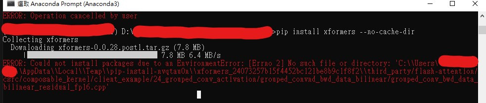
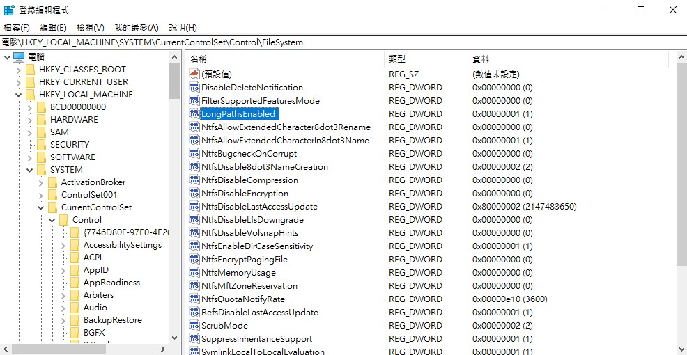

# Python Pip Install Failures

## No such file or directory

try to install xformers on windows:

```sh
pip install xformers --no-cache-dir
```

will get failures and return log below:

```bash
ERROR: Could not install packages due to an EnvironmentError: [Errno 2] No such file or directory: 'C:\\Users\\${USER_NAME}\\AppData\\Local\\Temp\\pip-install-nvqtau0n\\xformers_24073257b15f4452bc121be8b9c1f8f2\\third_party/flash-attention/csrc/composable_kernel/client_example/24_grouped_conv_activation/grouped_convnd_bwd_data_bilinear/grouped_conv_bwd_data_bilinear_residual_fp16.cpp'
```



### how to fix

1. press `Windows + R` and key `regedit` and `enter`
1. Open this path"Computer\HKEY_LOCAL_MACHINE\SYSTEM\CurrentControlSet\Control\FileSystem"
1. Looking for `LongPathsEnabled` : change the value from 0 to 1



## Reference

-[errno-2-no-such-file](https://stackoverflow.com/questions/65980952/python-could-not-install-packages-due-to-an-oserror-errno-2-no-such-file-or) -[errno-2-no-such-file](https://blog.csdn.net/jackhh1/article/details/117948900)
